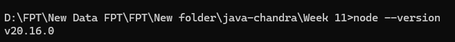
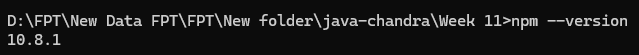
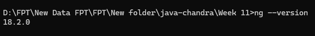
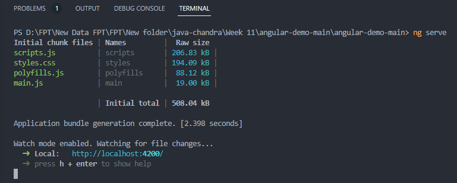
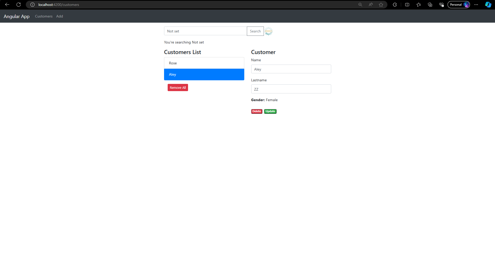
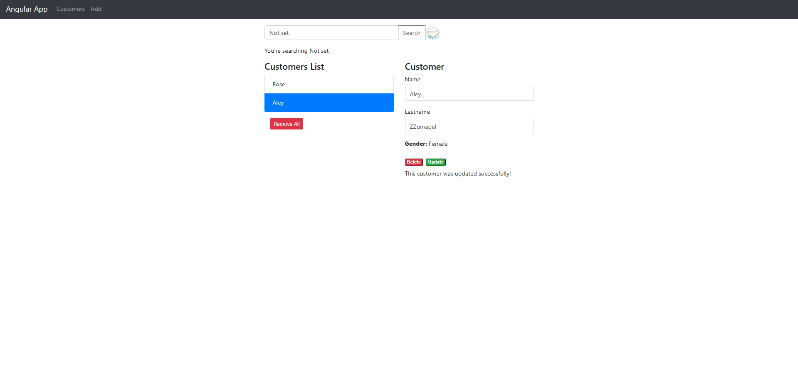

# Front End Using Angular

`Objective: `Deep dive about Angular as a front-end environment.

## Setup Environment

1. Setup Node.js Globally

   

2. Setup NPM Globally

   

3. Setup Angular Globally

   

<br>

### `Learning Angular Structure from Project`

[Angular Demo Project](angular-demo-main/angular-demo-main)

Here is the structure for the project

```
angular-demo-main/
│
├── .angular/
├── node_modules/
├── src/
│   ├── app/
│   │   ├── customer/
│   │   │   ├── customer.component.html
│   │   │   ├── customer.component.scss
│   │   │   ├── customer.component.spec.ts
│   │   │   └── customer.component.ts
│   │   ├── customer-detail/
│   │   │   ├── customer.component.html
│   │   │   ├── customer.component.scss
│   │   │   ├── customer.component.spec.ts
│   │   │   └── customer.component.ts
│   │   ├── models/
│   │   │   └── customer.model.ts
│   │   ├── services/
│   │   │   └── customer.service.ts
│   │   ├── app.component.html
│   │   ├── app.component.scss
│   │   ├── app.component.spec.ts# Root component test
│   │   ├── app.component.ts
│   │   ├── app.config.ts
│   │   └── app.routes.ts
│   ├── assets/
│   ├── favicon.ico
│   ├── index.html
│   ├── main.ts
│   ├── styles.scss
├── .editorconfig
├── .gitignore
├── angular.json
├── db.json
├── package-lock.json
├── package.json
├── README.md
├── tsconfig.app.json
├── tsconfig.json
├── tsconfig.spec.json
```

From that structure there is some important files in Angular Project

| **File/Directory**    | **Description**                                                                                                                                      |
| --------------------- | ---------------------------------------------------------------------------------------------------------------------------------------------------- |
| **angular.json**      | CLI configuration for all projects in the workspace, including configuration options for how to build, serve, and test each project.                 |
| **package.json**      | Configures npm package dependencies that are available to all projects in the workspace. See npm documentation for the specific format and contents. |
| **package-lock.json** | Provides version information for all packages installed into `node_modules` by the npm client. See npm documentation for details.                    |
| **src/**              | Source files for the root-level application project.                                                                                                 |
| **public/**           | Contains image and other asset files to be served as static files by the dev server and copied as-is when you build your application.                |
| **node_modules/**     | Installed npm packages for the entire workspace. Workspace-wide `node_modules` dependencies are visible to all projects.                             |

<br>

After that we tried to Run the project, here is the step by step for running this project.

1. `npm install: `This is to install all the node module that we need to run the project
2. `db.json: `Create this file that contains data about customers.
3. `npx json-server db.json: `This is to use the json server that will mock the data from db.json
4. `ng serve: ` This is to run the angular project it self (usually run in port 4200).

### `The Result`







<br>

## Component Lifecycle

A component's lifecycle is the sequence of steps that happen between the component's creation and its destruction. Each step represents a different part of Angular's process for rendering components and checking them for updates over time.

1. `ngOnInit`
   The ngOnInit method runs after Angular has initialized all the components inputs with their initial values. A component's ngOnInit runs exactly once. This step happens before the component's own template is initialized. This means that you can update the component's state based on its initial input values.

2. `ngOnChanges`
   The ngOnChanges method runs after any component inputs have changed. This step happens before the component's own template is checked. This means that you can update the component's state based on its initial input values.

3. `ngOnDestroy`
   The ngOnDestroy method runs once just before a component is destroyed. Angular destroys a component when it is no longer shown on the page, such as being hidden by NgIf or upon navigating to another page.

4. `ngDoCheck`
   The ngDoCheck method runs before every time Angular checks a component's template for changes. You can use this lifecycle hook to manually check for state changes outside of Angular's normal change detection, manually updating the component's state.

5. `ngAfterContentInit`
   The ngAfterContentInit method runs once after all the children nested inside the component ( its content) have been initialized.During initialization, the first ngOnChanges runs before ngOnInit.

6. `ngAfterContentChecked`
   The ngAfterContentChecked method runs every time the children nested inside the component (its content) have been checked for changes.

7. `ngAfterViewInit`
   The ngAfterViewInit method runs once after all the children in the component's template (its view) have been initialized.

8. `ngAfterViewChecked`
   The ngAfterViewChecked method runs every time the children in the component's template (its view) have been checked for changes.

<br>

## `Differences Using Standalone and non-Standalone`

The Comparations Between;

- [non-Standalone](angularModule)

  In the old approach, Angular webapps were built using `@NgModules`, which works as containers to group dependencies that needs to work together for a very specific purpose.

  ```javascript
   import { Injectable } from '@angular/core';
   import { HttpClient } from '@angular/common/http';
   import { Observable } from 'rxjs';
   import { map } from 'rxjs/operators';
   import { Users } from '../models/users';

   const baseUrl = 'http://localhost:3000/users';
   @Injectable({
   providedIn: 'root'
   })

   export class UsersService {
   constructor(private http: HttpClient) {}

   getAll(): Observable<Users[]> {
      return this.http.get<Users[]>(baseUrl);
   }

   create(user: Users): Observable<Users> {
      return this.http.post<Users>(baseUrl, user);
   }

   checkCredentials(email: string, password: string): Observable<boolean> {
      return this.http.get<Users[]>(`${baseUrl}?email=${email}&password=${password}`)
         .pipe(
         map(users => users.length > 0)
         );
   }
   }
  ```

    <br>

  ```javascript
   import { Component, OnInit } from '@angular/core';
   import { Users } from '../models/users';
   import { UsersService } from '../service/users-service';

   @Component({
   selector: 'app-users-component',
   templateUrl: './users-component.component.html',
   styleUrl: './users-component.component.scss'
   })
   export class UsersComponentComponent implements OnInit{
   users?: Users[];

   constructor(private userService: UsersService) {}

   ngOnInit(): void {
      this.retrieveCustomers();
   }

   retrieveCustomers(): void {
      this.userService.getAll().subscribe({
         next: (data) => {
         this.users = data;
         console.log(data);
         },
         error: (e) => console.error(e)
      });
   }
   }
  ```

     <br>

  ```javascript
  import { NgModule } from "@angular/core";
  import { BrowserModule } from "@angular/platform-browser";
  import { FormsModule } from "@angular/forms";
  import { CommonModule } from "@angular/common";
  import { AppRoutingModule } from "./app-routing.module";
  import { AppComponent } from "./app.component";
  import { LoginComponentComponent } from "./login-component/login-component.component";
  import { SignupComponentComponent } from "./signup-component/signup-component.component";
  import { UsersComponentComponent } from "./users-component/users-component.component";
  import { provideHttpClient } from "@angular/common/http";
  import { provideRouter } from "@angular/router";
  import { provideZoneChangeDetection } from "@angular/core";
  import { UsersService } from "./service/users-service";

  @NgModule({
    declarations: [
      AppComponent,
      LoginComponentComponent,
      SignupComponentComponent,
      UsersComponentComponent,
    ],
    imports: [BrowserModule, AppRoutingModule, FormsModule, CommonModule],
    providers: [
      provideZoneChangeDetection({ eventCoalescing: true }),
      UsersService,
      provideHttpClient(),
    ],
    bootstrap: [AppComponent],
  })
  export class AppModule {}
  ```

  With this approach, UsersComponentComponent can be imported into other modules, allowing the UsersComponent to be used in the template without needing to import the UsersService each time.

  `@NgModule` was the solution to group related code, manage dependency injection, and facilitate lazy loading. Angular developers often found `@NgModule` cumbersome due to the amount of boilerplate code involved. However, it wasn't particularly problematic for everyone.

  Note: The exports property in the `@NgModule` decorator is used to make the UsersComponentComponent available for use in the templates of any component that is part of an `@NgModule`.

<br>

- [Standalone](angularStandalone)

  Standalone components can now declare their own dependencies without the need of an extra file for the `@NgModule.`

  Here's how the same example looks with standalone components:

  ```javascript
   import { Injectable } from '@angular/core';
   import { HttpClient } from '@angular/common/http';
   import { Observable } from 'rxjs';
   import { map } from 'rxjs/operators';
   import { Users } from '../models/users';

   const baseUrl = 'http://localhost:3000/users';
   @Injectable({
   providedIn: 'root'
   })

   export class UsersService {
   constructor(private http: HttpClient) {}

   getAll(): Observable<Users[]> {
      return this.http.get<Users[]>(baseUrl);
   }

   create(user: Users): Observable<Users> {
      return this.http.post<Users>(baseUrl, user);
   }

   checkCredentials(email: string, password: string): Observable<boolean> {
      return this.http.get<Users[]>(`${baseUrl}?email=${email}&password=${password}`)
         .pipe(
         map(users => users.length > 0)
         );
   }
   }
  ```

  <br>

  ```javascript
   import { CommonModule } from '@angular/common';
   import { Component, OnInit } from '@angular/core';
   import { FormsModule } from '@angular/forms';
   import { Users } from '../models/users';
   import { UsersService } from '../service/users.service';

   @Component({
   selector: 'app-users',
   standalone: true,
   imports: [
      CommonModule,
      FormsModule
   ],
   templateUrl: './users.component.html',
   styleUrl: './users.component.scss'
   })
   export class UsersComponent implements OnInit{
   users?: Users[];

   constructor(private userService: UsersService) {}

   ngOnInit(): void {
      this.retrieveCustomers();
   }

   retrieveCustomers(): void {
      this.userService.getAll().subscribe({
         next: (data) => {
         this.users = data;
         console.log(data);
         },
         error: (e) => console.error(e)
      });
   }
   }
  ```

  The UsersComponentComponent now declares its own dependencies for the UsersService and uses the standalone: true property, which tells Angular that this component is a standalone component.

  This allows the UsersComponentComponent to be imported directly into the imports array of other components without the need for an additional module file.
