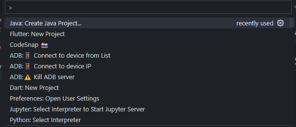
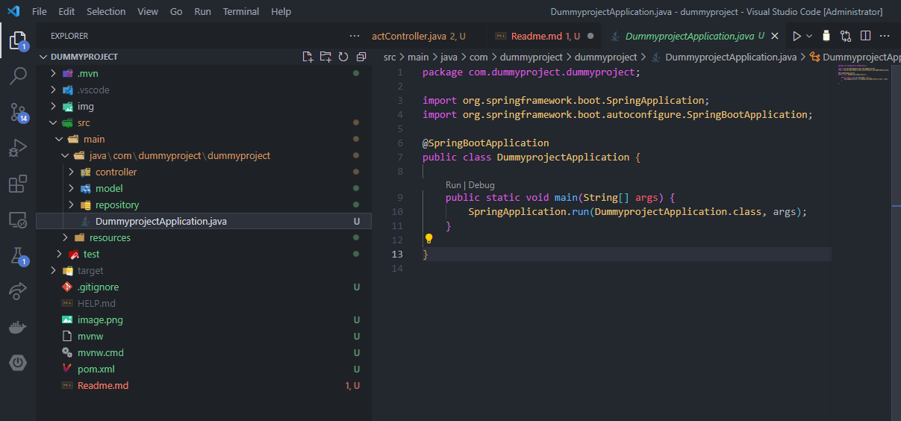
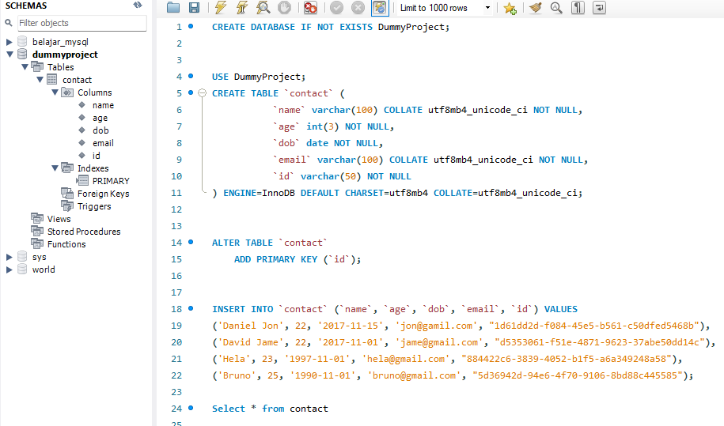
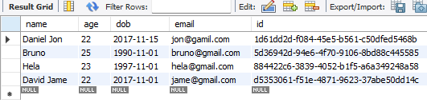
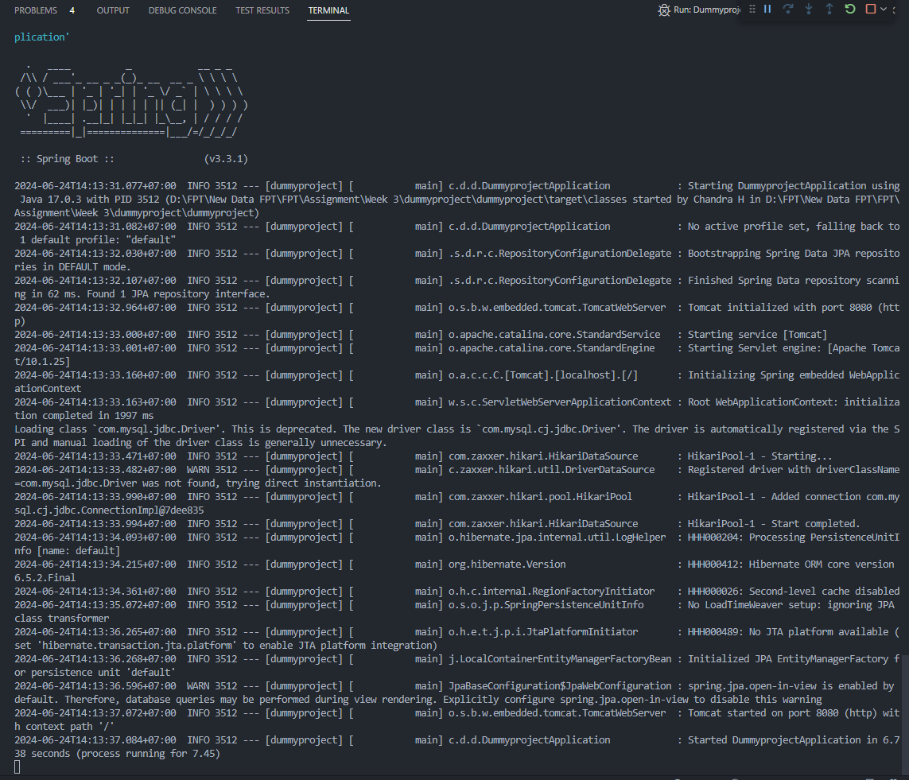
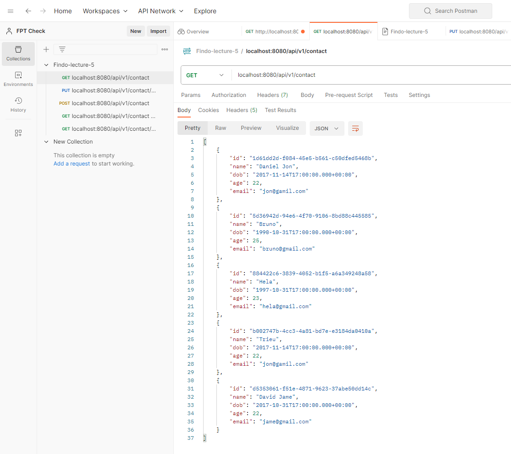

# Assignment 1

## Setup Environment Using Maven

- Setup a maven project using `spring initializer in vscode`.
  

- After that click `Java: Create Java Project` and click these requirements to implements

  - Choose Spring Boot
  - Choose Maven
  - Choose Version (Use 3.3.1)
  - Choose Java
  - Write Name of The project, artifact, and demo.
  - Specify Packaging Type : JAR
  - Specify Java Version : 17
  - Used four dependencies such as, lombok, mysql for spring, spring-boot-starter-data-jpa, spring-boot-starter-web
  - Project created
    <br>

    After folowing those steps, the display should look like this.

    

- After initialize the maven project, prepare the mysql to work with databases, in this I use mysql Workbench to create the schema database called `contact` with the folowing features,

  

<br>

- And after initialize our database, our database will run showing name, age, dob, email, and id.

  

<br>

- Setup the `configure properties` to connect the database like code below,

  ```java
  spring.application.name=dummyproject

  spring.datasource.driver-class-name=com.mysql.jdbc.Driver
  spring.datasource.url=jdbc:mysql://localhost:3306/dummyproject
  spring.datasource.username=root
  spring.datasource.password=Tsel@2020
  ```

<br>

- After create the databases, we create the model to suits the databases by creating Contact Model that require name, age, dob, email, and id, here is code below,

  ```java
  package com.dummyproject.dummyproject.model;

  import jakarta.persistence.Entity;
  import jakarta.persistence.Id;
  import lombok.Getter;
  import lombok.Setter;

  import java.io.Serializable;
  import java.util.Date;

  @Getter
  @Setter
  @Entity
  public class Contact implements Serializable {

      private static final long serialVersionUID = 1L;

      @Id
      private String id;
      private String name;
      private Date dob;
      private Integer age;
      private String email;

  }
  ```

  On code above we use Lombok to make it easier to create a `setter` and `getter`

- After we create a contact model, we create a JPA repository for contact model,

  ```java
  package com.dummyproject.dummyproject.repository;

  import com.dummyproject.dummyproject.model.Contact;
  import org.springframework.data.jpa.repository.JpaRepository;
  import org.springframework.stereotype.Repository;

  @Repository
  public interface ContactRepository extends JpaRepository<Contact, String> {
  }
  ```

  JPA Repository will be used for CRUD Operations and Query Methods with JPA we can focus on the logic and workflow for the applications meanwhile the database operations will be taken care with framework Spring JPA.

- After we create a JPA repository, we make the controller to control the CRUD function, here is the code below,

  ```java
  package com.dummyproject.dummyproject.controller;

  import com.dummyproject.dummyproject.model.Contact;
  import com.dummyproject.dummyproject.repository.ContactRepository;
  import lombok.AllArgsConstructor;
  import org.springframework.beans.factory.annotation.Autowired;
  import org.springframework.http.HttpStatus;
  import org.springframework.http.ResponseEntity;
  import org.springframework.web.bind.annotation.*;

  import java.util.List;
  import java.util.Optional;
  import java.util.UUID;

  @RestController
  @RequestMapping("/api/v1/contact")
  @AllArgsConstructor
  public class ContactController {

      @Autowired
      private final ContactRepository contactRepository;

      @GetMapping
      public ResponseEntity<List<Contact>> listAllContact() {
          List<Contact> listContact = contactRepository.findAll();
          if (listContact.isEmpty()) {
              return ResponseEntity.noContent().build();
          }
          return ResponseEntity.ok(listContact);
      }

      @GetMapping(value = "/{id}")
      public ResponseEntity<Contact> findContact(@PathVariable("id") String id) {
          Optional<Contact> contactOpt = contactRepository.findById(id);
          if (contactOpt.isPresent()) {
              return ResponseEntity.ok(contactOpt.get());
          }
          return ResponseEntity.notFound().build();
      }

      @PostMapping
      public ResponseEntity<Contact> saveContact(@RequestBody Contact contact) {
          Optional<Contact> contactOpt = contactRepository.findById(contact.getId());
          if (contactOpt.isPresent()) {
              return ResponseEntity.badRequest().build();
          }
          return ResponseEntity.ok(contactRepository.save(contact));
      }

      @PutMapping(value = "/{id}")
      public ResponseEntity<Contact> updateContact(@PathVariable(value = "id") String id,
              @RequestBody Contact contactForm) {
          Optional<Contact> contactOpt = contactRepository.findById(id);
          if (contactOpt.isPresent()) {
              Contact contact = contactOpt.get();
              contact.setName(contactForm.getName());
              contact.setAge(contactForm.getAge());
              Contact updatedContact = contactRepository.save(contact);
              return ResponseEntity.ok(updatedContact);
          }
          return ResponseEntity.notFound().build();
      }

      @DeleteMapping(value = "/{id}")
      public ResponseEntity<Contact> deleteContact(@PathVariable(value = "id") String id) {
          Optional<Contact> contactOpt = contactRepository.findById(id);
          if (contactOpt.isPresent()) {
              contactRepository.delete(contactOpt.get());
              return ResponseEntity.ok().build();

          }
          return ResponseEntity.notFound().build();
      }
  }
  ```

<br>

- After create the controller we test the server with Spring and it will shown like below if it works,
  

<br>

- After we create the controller we can test using postman with collection of the get, post, put, and delete.

  Using Postman to check the REST API,
  
