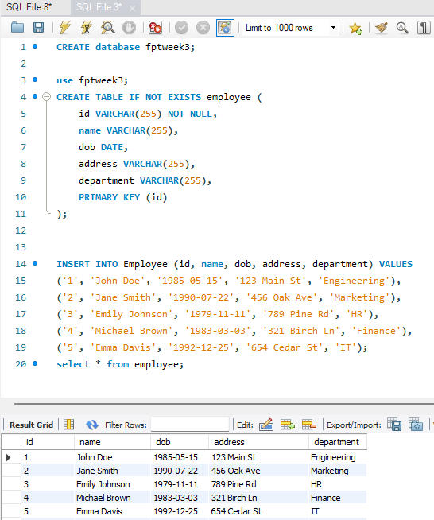
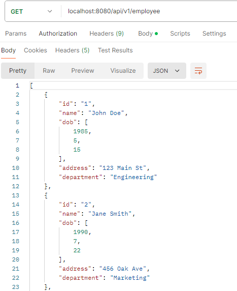
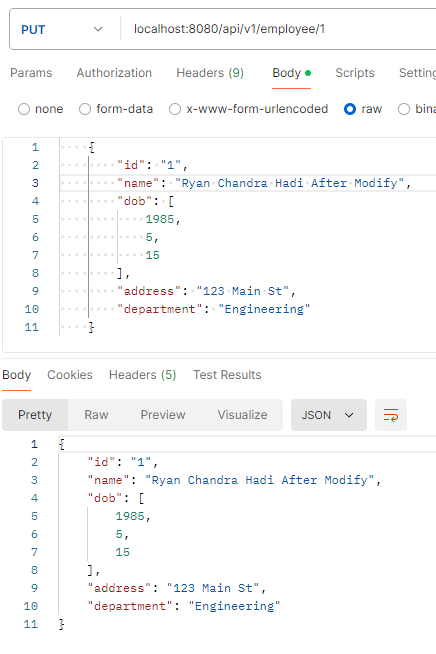
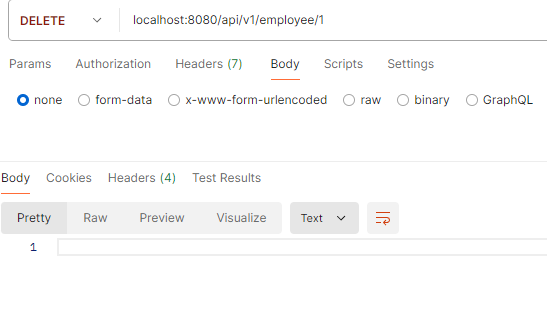
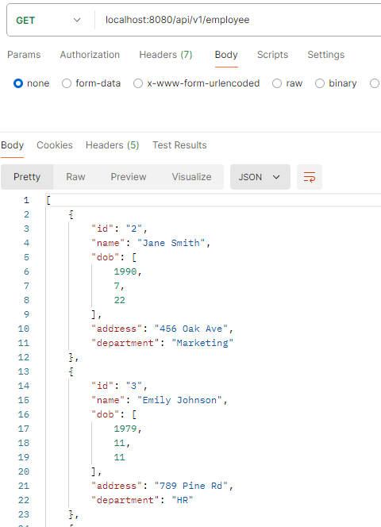
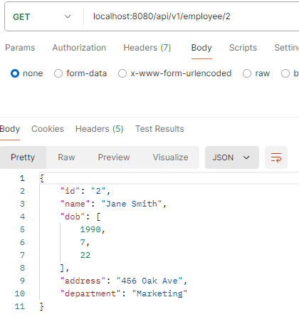
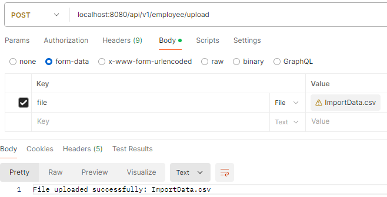
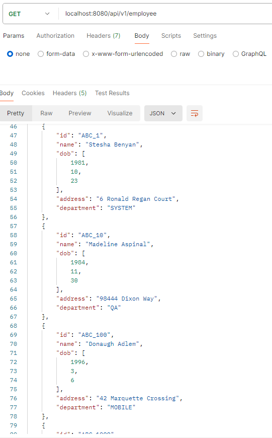
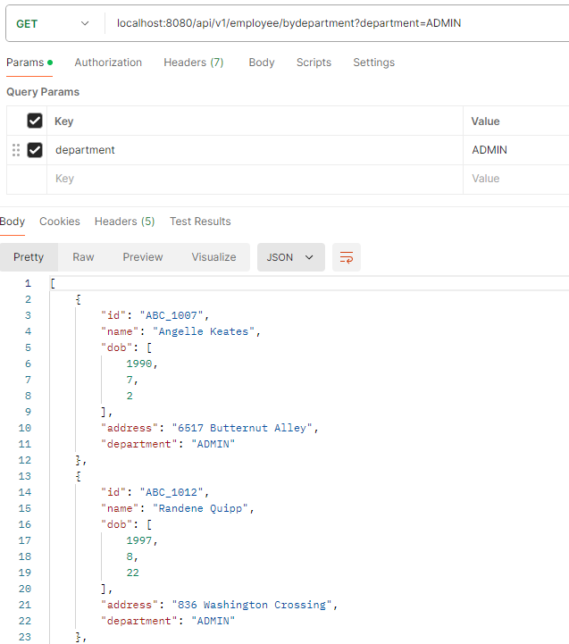

# Spring in Java

In Java, "Spring" typically refers to the Spring Framework, which is an open-source framework that provides comprehensive infrastructure support for developing Java applications. Here are some key aspects of Spring:

- Dependency Injection (DI): One of the core principles of Spring is Dependency Injection, where objects define their dependencies (e.g., other objects they work with) through constructor arguments, setters, or fields. Spring then injects these dependencies at runtime, promoting loose coupling and enhancing testability.

- Inversion of Control (IoC): IoC is closely related to DI. It allows the Spring container to manage the lifecycle of Java objects from creation to destruction. Developers focus on defining how different parts of an application interact, while Spring manages the object lifecycle and wiring.

- Modules and Libraries: Spring provides a wide range of modules that cater to different aspects of enterprise application development, such as data access (Spring JDBC, Spring Data), web applications (Spring MVC, Spring WebFlux), transaction management, security (Spring Security), and more.

- Simplification: Spring aims to simplify development by reducing boilerplate code and promoting good design practices. It encourages the use of plain old Java objects (POJOs) over complex, proprietary frameworks.

- Integration: Spring integrates with other frameworks and libraries, offering compatibility with Java EE standards and various third-party libraries.

## Material This Week

- Maven Project: Maven simplifies Java project management by providing a structured approach to dependency management, build automation, and project configuration. It is widely used in the Java ecosystem and offers benefits in terms of consistency, scalability, and productivity for developers and development teams.

- CRUD Project in Java

  - Create: In CRUD operations, "Create" refers to the operation of inserting new data records (entities) into a database or creating new instances of objects in memory within an application. For example, creating a new user account in a web application involves inserting a new row into the database table that stores user information.

  - Read: "Read" refers to retrieving data from a database or accessing information already present in the application. This operation typically involves querying the database to fetch specific records or retrieving objects from memory. For instance, fetching all products from a database to display on a web page.

  - Update: "Update" involves modifying existing data records in a database or updating attributes of objects within the application. This operation could include changing the values of certain fields in a database row or updating properties of an object. For example, updating a customer's address after they have moved.

  - Delete: Finally, "Delete" refers to removing data records from a database or deleting objects from the application's memory. This operation is used when data or objects are no longer needed or when users want to remove their accounts or entries. For instance, deleting a specific record from a database table or removing an item from a shopping cart.

- API: APIs play a crucial role in enabling communication and integration between different software applications, services, and systems. They facilitate the development of modular, scalable, and interoperable software solutions across various domains and platforms.

### Study Case

    Create CRUD project to manage Employee
    Create API's for the CRUD
    Create API to receive CSV file
    Create API to receive department by query parameter, with list employees as return

`Note: in this study case is important to initialize the controller and also the utils to receive the CSV format`

`First step` Create an employee model, in this case id, name, dob(date of birth), address, and department must be added like shown,

```java
package com.assignment2.assignment2.model;

import jakarta.persistence.Entity;
import jakarta.persistence.Id;
import lombok.Getter;
import lombok.Setter;

import java.io.Serializable;
import java.time.LocalDate;

@Getter
@Setter
@Entity
public class Employee implements Serializable {

    private static final long serialVersionUID = 1L;

    @Id
    private String id;
    private String name;
    private LocalDate dob;
    private String address;
    private String department;

}
```

Code above implement Lombok, so we don't have to create the setter and getter only `@Getter` and `@Setter` need it.

<br>

`Second` is to make the repository of employee to allows used of CRUD, ORM, and manymore and it shown like below code,

```java
package com.assignment2.assignment2.repository;

import com.assignment2.assignment2.model.Employee;
import org.springframework.data.jpa.repository.JpaRepository;
import org.springframework.stereotype.Repository;
import java.util.List;

@Repository
public interface EmployeeRepository extends JpaRepository<Employee, String> {
    List<Employee> findByDepartment(String department);
}
```

<br>

`Third` is to create the controller, in this section we create all the methods regarding the action of every endpoint such as, `GET, POST, PUT, and DELETE`

here is the method that implements to solve this study case

```java
@RequestMapping("/api/v1/employee")
```

We use code above to request access point to our API later on and we implements that access point to these method below,

```java
    @Autowired
    private final EmployeeRepository employeeRepository;

    @GetMapping
    public ResponseEntity<List<Employee>> listAllEmployees() {
        List<Employee> listEmployees = employeeRepository.findAll();
        if (listEmployees.isEmpty()) {
            return ResponseEntity.noContent().build();
        }
        return ResponseEntity.ok(listEmployees);
    }
```

### Explanations

- This controller method fetches all Employee entities from the database using EmployeeRepository.
- It uses ResponseEntity to wrap the list of employees and manage HTTP status codes (204 for empty result, 200 for successful response).
- @Autowired ensures that employeeRepository is automatically injected into the controller, enabling database operations without explicit instantiation or management.

<br>

```java
    @GetMapping(value = "/{id}")
    public ResponseEntity<Employee> findEmployee(@PathVariable("id") String id) {
        Optional<Employee> employeeOpt = employeeRepository.findById(id);
        if (employeeOpt.isPresent()) {
            return ResponseEntity.ok(employeeOpt.get());
        }
        return ResponseEntity.notFound().build();
    }
```

### Explanations

- This controller method fetches a single Employee entity from the database based on the provided id.
- It uses ResponseEntity to wrap the employee object and manage HTTP status codes (200 for successful retrieval, 404 for not found).
- @PathVariable annotation binds the id path variable from the request URL to the method parameter, enabling dynamic retrieval of specific employees based on their ID.
- The use of Optional ensures that the method handles cases where no employee is found with the specified ID gracefully, avoiding potential NullPointerExceptions.

<br>

```java
    @PostMapping
    public ResponseEntity<Employee> saveEmployee(@RequestBody Employee employee) {
        Optional<Employee> employeeOpt = employeeRepository.findById(employee.getId());
        if (employeeOpt.isPresent()) {
            return ResponseEntity.badRequest().build();
        }
        return ResponseEntity.ok(employeeRepository.save(employee));
    }
```

### Explanations

- This controller method handles HTTP POST requests to save a new Employee entity into the database.
- It checks if an employee with the same ID already exists by querying the database using findById(id).
- Uses ResponseEntity to manage HTTP status codes (200 for successful save, 400 for bad request due to duplicate ID).
- @RequestBody annotation binds the JSON or XML request body to the employee parameter, enabling the controller to receive and process data sent by clients.

<br>

```java
    @PutMapping(value = "/{id}")
    public ResponseEntity<Employee> updateEmployee(@PathVariable(value = "id") String id,
            @RequestBody Employee employeeForm) {
        Optional<Employee> employeeOpt = employeeRepository.findById(id);
        if (employeeOpt.isPresent()) {
            Employee employee = employeeOpt.get();
            employee.setName(employeeForm.getName());
            employee.setDob(employeeForm.getDob());
            employee.setAddress(employeeForm.getAddress());
            employee.setDepartment(employeeForm.getDepartment());
            Employee updatedEmployee = employeeRepository.save(employee);
            return ResponseEntity.ok(updatedEmployee);
        }
        return ResponseEntity.notFound().build();
    }
```

### Explanations

- This controller method handles HTTP PUT requests to update an existing Employee entity in the database.
- It retrieves the existing employee by ID using findById(id) and updates its attributes based on the data provided in the request body (employeeForm).
- Uses ResponseEntity to manage HTTP status codes (200 for successful update, 404 for not found).
- @PathVariable annotation binds the id path variable from the request URL to the method parameter, enabling dynamic updating of specific employees based on their ID.
- @RequestBody annotation binds the JSON or XML request body to the employeeForm parameter, enabling the controller to receive and process updated data sent by clients.

<br>

```java
    @DeleteMapping(value = "/{id}")
    public ResponseEntity<Employee> deleteEmployee(@PathVariable(value = "id") String id) {
        Optional<Employee> employeeOpt = employeeRepository.findById(id);
        if (employeeOpt.isPresent()) {
            employeeRepository.delete(employeeOpt.get());
            return ResponseEntity.ok().build();
        }
        return ResponseEntity.notFound().build();
    }
```

### Explanations

- This controller method handles HTTP DELETE requests to delete an existing Employee entity from the database.
- It retrieves the employee by ID using findById(id) and deletes it using delete(employee).
- Uses ResponseEntity to manage HTTP status codes (200 for successful deletion, 404 for not found).
- @PathVariable annotation binds the id path variable from the request URL to the method parameter, enabling dynamic deletion of specific employees based on their ID.

<br>

```java
    @PostMapping("/upload")
    public ResponseEntity<String> uploadCSVFile(@RequestParam("file") MultipartFile file) {
        if (CSVHelper.hasCSVFormat(file)) {
            try {
                List<Employee> employees = CSVHelper.csvToEmployees(file.getInputStream());
                employeeRepository.saveAll(employees);
                return ResponseEntity.ok("File uploaded successfully: " + file.getOriginalFilename());
            } catch (Exception e) {
                return ResponseEntity.status(HttpStatus.INTERNAL_SERVER_ERROR)
                        .body("Could not upload the file: " + file.getOriginalFilename());
            }
        }
        return ResponseEntity.status(HttpStatus.BAD_REQUEST).body("Please upload a CSV file!");
    }
```

### Explanations

- This controller method handles HTTP POST requests to upload a CSV file containing employee data and save it to a database.
- It validates the file format, processes the CSV data into Employee objects, and persists them to the database using EmployeeRepository.
- Uses ResponseEntity to manage HTTP status codes (200 for successful upload, 400 for bad request, 500 for internal server error) and provide appropriate response messages.
- @RequestParam annotation binds the uploaded file to the file parameter, allowing the controller to access and process the uploaded CSV file.

<br>

```java
    @GetMapping("/bydepartment")
    public ResponseEntity<List<Employee>> listEmployeesByDepartment(@RequestParam("department") String department) {
        List<Employee> employees = employeeRepository.findByDepartment(department);
        if (employees.isEmpty()) {
            return ResponseEntity.noContent().build();
        }
        return ResponseEntity.ok(employees);
    }
```

### Explanations

- This controller method handles HTTP GET requests to retrieve employees from the database based on their department.
- It retrieves employees by calling findByDepartment(department) method on EmployeeRepository, which likely queries the database to fetch employees belonging to the specified department.
- Uses ResponseEntity to manage HTTP status codes (200 for successful retrieval with data, 204 for successful retrieval without data).
- @RequestParam annotation binds the department query parameter from the request URL to the method parameter, allowing dynamic filtering of employees based on department.

<br>

`Fourth` is to test all the endpoints that has been created by create database, in this case I use mysql workbench to create the server and the database like shown below,



After we create we test all the endpoint,

`GET ALL DATA`



<br>

`Modify Data`



<br>

`Delete Data`



_After Delete_



<br>

`Get Data by ID`



<br>

`Get Data from CSV`



_After we check all data_



`Get Data Based on Department`


