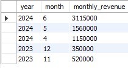
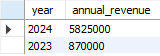
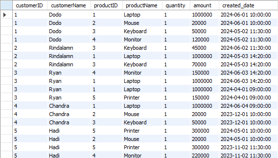
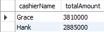

# Normalization

`Data normalization` is the process or stages in database creation that aim to eliminate redundant/duplicate data and inconsistent data. The rule in data normalization is to divide large tables into smaller tables and connect them using relationships.

`Form data normalization` _Edgar Codd_ proposed the theory of data normalization by introducing the practice of the first normal form, followed by the second and third normal forms (Known as 1NF, 2NF, 3NF).

Example for `database` that need to be normalize

| OrderID | CustomerID | CustomerName | ProductID | ProductName | Quantity | Price | OrderDate  | CustomerAddress      |
| ------- | ---------- | ------------ | --------- | ----------- | -------- | ----- | ---------- | -------------------- |
| 1       | 101        | Alice        | P01       | Laptop      | 1        | 1000  | 2024-06-01 | 123 Apple St, CityA  |
| 2       | 102        | Bob          | P02       | Mouse       | 2        | 25    | 2024-06-02 | 456 Orange St, CityB |

- `1NF` (First Normal Form) : requires that the table have a primary key, and that each column contains atomic, indivisible values. From this definition, out example already satisfied the requirements

- `2NF` (Second Normal Form) : 2NF requires that the table is in 1NF and that all non-key attributes are fully dependent on the primary key. We need to remove partial dependencies. In this case, CustomerName and CustomerAddress depend only on CustomerID, and ProductName depends only on ProductID.

  - `Customers Table`
    | CustomerID | CustomerName | CustomerAddress |
    | ---------- | ------------ | -------------------- |
    | 101 | Alice | 123 Apple St, CityA |
    | 102 | Bob | 456 Orange St, CityB |

  - `Products Table`
    | ProductID | ProductName |
    |-----------|-------------|
    | P01 | Laptop |
    | P02 | Mouse |
    | P03 | Keyboard |

  - `Orders Table`
    | OrderID | CustomerID | ProductID | Quantity | Price | OrderDate |
    |---------|------------|-----------|----------|-------|------------|
    | 1 | 101 | P01 | 1 | 1000 | 2024-06-01 |
    | 2 | 102 | P02 | 2 | 25 | 2024-06-02 |

- `3NF` (Third Normal Form) : 3NF requires that the table is in 2NF and that all non-key attributes are not dependent on any other non-key attributes (no transitive dependencies). The tables created in 2NF already satisfy 3NF, as there are no transitive dependencies. The non-key attributes in each table depend only on the primary key of that table.

By normalizing the original Orders table into three separate tables (Customers, Products, and Orders), we have removed redundancy and potential inconsistencies. Now, each piece of information is stored only once, and the database is easier to maintain.

<br>

# Create a Manage Invoices to See Daily, Monthly, and Annual Revenue

- `Initialize Table`

  - Customer Table: Stores customer information with unique id, name, and phone.

    ```sql
    CREATE TABLE IF NOT EXISTS customer (
        id VARCHAR(255) NOT NULL,
        name VARCHAR(255),
        phone VARCHAR(255),
        PRIMARY KEY (id)
    );
    ```

    <br>

  - Cashier Table: Stores cashier information with unique id and name.

    ```sql
    CREATE TABLE IF NOT EXISTS cashier (
        id VARCHAR(255) NOT NULL,
        name VARCHAR(255),
        PRIMARY KEY (id)
    );
    ```

    <br>

  - Product Table: Stores product information with unique id, name, and price.

    ```sql
    CREATE TABLE IF NOT EXISTS product (
        id VARCHAR(255) NOT NULL,
        name VARCHAR(255),
        price BIGINT,
        PRIMARY KEY (id)
    );
    ```

    <br>

  - Invoice Table: Stores invoice information with unique id, references to customerId and cashierId, total amount, and the created_date.

    ```sql
    CREATE TABLE IF NOT EXISTS invoice (
        id VARCHAR(255) NOT NULL,
        customerId VARCHAR(255) NOT NULL,
        cashierId VARCHAR(255) NOT NULL,
        amount INTEGER,
        created_date DATETIME,
        PRIMARY KEY (id),
        FOREIGN KEY (customerId) REFERENCES customer(id),
        FOREIGN KEY (cashierId) REFERENCES cashier(id)
    );
    ```

    <br>

  - Invoice Detail Table: Stores details of each invoice item with unique id, references to invoiceId and productId, the productPrice, amount, and quantity.

    ```sql
        CREATE TABLE IF NOT EXISTS invoiceDetail (
            id VARCHAR(255) NOT NULL,
            invoiceId VARCHAR(255) NOT NULL,
            productId VARCHAR(255) NOT NULL,
            productPrice BIGINT,
            amount INTEGER,
            quantity INTEGER,
            PRIMARY KEY (id),
            FOREIGN KEY (invoiceId) REFERENCES invoice(id),
            FOREIGN KEY (productId) REFERENCES product(id)
        );
    ```

  <br>

- `Inserting Sample Data`

  - Customer Table: Inserted 5 customers.

    ```sql
    INSERT INTO customer (id, name, phone) VALUES
    ('C001', 'Dodo', '123-456-7890'),
    ('C002', 'Rindalamn', '987-654-3210'),
    ('C003', 'Ryan', '555-123-4567'),
    ('C004', 'Chandra', '111-222-3333'),
    ('C005', 'Hadi', '444-555-6666');
    ```

    <br>

  - Cashier Table: Inserted 2 cashiers.

    ```sql
    INSERT INTO cashier (id, name) VALUES
    ('CA001', 'Grace'),
    ('CA002', 'Hank');
    ```

    <br>

  - Product Table: Inserted 5 products.

    ```sql
    INSERT INTO product (id, name, price) VALUES
    ('P001', 'Laptop', 1000000),
    ('P002', 'Mouse', 20000),
    ('P003', 'Keyboard', 50000),
    ('P004', 'Monitor', 150000),
    ('P005', 'Printer', 300000);
    ```

    <br>

  - Invoice Table: Inserted 10 invoices with varying dates and amounts.

    ```sql
    INSERT INTO invoice (id, customerId, cashierId, amount, created_date) VALUES
    ('I001', 'C001', 'CA001', 1020000, '2024-06-01 10:00:00'),
    ('I002', 'C002', 'CA002', 45000, '2024-06-02 11:30:00'),
    ('I003', 'C003', 'CA001', 1050000, '2024-06-03 14:20:00'),
    ('I004', 'C004', 'CA002', 1000000, '2024-06-04 09:00:00'),
    ('I005', 'C005', 'CA001', 320000, '2024-05-01 10:00:00'),
    ('I006', 'C001', 'CA002', 170000, '2024-05-02 11:30:00'),
    ('I007', 'C002', 'CA001', 1070000, '2024-05-03 14:20:00'),
    ('I008', 'C003', 'CA002', 1150000, '2024-04-01 09:00:00'),
    ('I009', 'C004', 'CA001', 350000, '2023-12-01 10:00:00'),
    ('I010', 'C005', 'CA002', 520000, '2023-11-02 11:30:00');
    ```

    <br>

  - Invoice Detail Table: Inserted 18 invoice details, each linking invoices to specific products with quantities and prices.

    ```sql
      INSERT INTO invoiceDetail (id, invoiceId, productId, productPrice, amount, quantity) VALUES
      ('ID001', 'I001', 'P001', 1000000, 1000000, 1),
      ('ID002', 'I001', 'P002', 20000, 20000, 1),
      ('ID003', 'I002', 'P003', 45000, 45000, 1),
      ('ID004', 'I003', 'P004', 150000, 150000, 1),
      ('ID005', 'I003', 'P001', 1000000, 1000000, 1),
      ('ID006', 'I004', 'P001', 1000000, 1000000, 1),
      ('ID007', 'I005', 'P005', 300000, 300000, 1),
      ('ID008', 'I005', 'P002', 20000, 20000, 1),
      ('ID009', 'I006', 'P003', 50000, 50000, 1),
      ('ID010', 'I006', 'P004', 120000, 120000, 1),
      ('ID011', 'I007', 'P001', 1000000, 1000000, 1),
      ('ID012', 'I007', 'P003', 70000, 70000, 1),
      ('ID013', 'I008', 'P001', 1000000, 1000000, 1),
      ('ID014', 'I008', 'P005', 150000, 150000, 1),
      ('ID015', 'I009', 'P002', 20000, 20000, 1),
      ('ID016', 'I009', 'P003', 50000, 50000, 1),
      ('ID017', 'I010', 'P005', 300000, 300000, 1),
      ('ID018', 'I010', 'P004', 220000, 220000, 1);
    ```

    <br>

- `Revenue`

  - The query selects the date from the created_date column and sums the amount for each day. The results are grouped by date, giving the total revenue for each day.

    ```sql
    SELECT DATE(created_date) AS date, SUM(amount) AS daily_revenue
    FROM invoice
    GROUP BY DATE(created_date);
    ```

  <br>

  - The query selects the year and month from the created_date column and sums the amount for each month. The results are grouped by year and month, giving the total revenue for each month.

    ```sql
    SELECT YEAR(created_date) AS year, MONTH(created_date) AS month, SUM(amount) AS monthly_revenue
    FROM invoice
    GROUP BY YEAR(created_date), MONTH(created_date);
    ```

  <br>

  - The query selects the year from the created_date column and sums the amount for each year. The results are grouped by year, giving the total revenue for each year.

    ```sql
    SELECT YEAR(created_date) AS year, SUM(amount) AS annual_revenue
    FROM invoice
    GROUP BY YEAR(created_date);
    ```

- `Result`

  - Daily Revenue

    

  <br>

  - Monthly Revenue

    

  <br>

  - Annual Revenue

    

<br>

# Create a View of List Product's Customer Bought and Function Calculating Revenue

`A view` in SQL is a virtual table that is stored in the database with an associated name. It is actually a composition of a table in the form of a predefined SQL query. A view can contain rows from an existing table (all or selected). A view can be created from one or many tables. Unless indexed, a view does not exist in a database.

### Syntax

```sql
CREATE VIEW view_name AS
SELECT column1, column2....
FROM table_name
WHERE [condition];
```

On this case we need to show list product's customer that will show customerId, customerName, productId, productName, quantity, amount, and created date Which means we have to use join to show all the columns above,

```sql
CREATE VIEW customer_purchases AS
SELECT
    c.id AS customerID,
    c.name AS customerName,
    p.id AS productID,
    p.name AS productName,
    id.quantity,
    id.amount,
    i.created_date
FROM
    customer c
JOIN
    invoice i ON c.id = i.customerId
JOIN
    invoiceDetail id ON i.id = id.invoiceId
JOIN
    product p ON id.productId = p.id;
```

On that query we select all the columns that we need to show. Because we need to show a table that is more than one, we need to use join to make it happen.

- First, we initialize the `VIEW SQL` with the name of view of _customer_puchases_.
  ```sql
  CREATE VIEW customer_purchases AS
  SELECT
      -- c.id AS customerID,
      -- c.name AS customerName,
      -- p.id AS productID,
      -- p.name AS productName,
      -- id.quantity,
      -- id.amount,
      -- i.created_date
  FROM
      customer c
  ```

<br>

- Second, we call all the column from accross the table and use aliases to call the columns such as c.id that calling column id from table customer, p.id calling id from table product, id.quantity calling quantity from table invoiceDetailt. All that aliases will be explained on join query later on.

  ```sql
    CREATE VIEW customer_purchases AS
    SELECT
        c.id AS customerID,
        c.name AS customerName,
        p.id AS productID,
        p.name AS productName,
        id.quantity,
        id.amount,
        i.created_date
    FROM
        customer c
  ```

<br>

- Third, Join Cluses

  - First JOIN clause connects the customer table (aliased as c) with the invoice table (aliased as i). The condition ON c.id = i.customerId specifies that the id column from the customer table must match the customerId column from the invoice table. This join retrieves all invoices associated with each customer.

  - Second JOIN clause connects the invoice table (aliased as i) with the invoiceDetail table (aliased as id). The condition ON i.id = id.invoiceId specifies that the id column from the invoice table must match the invoiceId column from the invoiceDetail table. This join retrieves all details for each invoice, such as individual product purchases.

  - Third JOIN clause connects the invoiceDetail table (aliased as id) with the product table (aliased as p). The condition ON id.productId = p.id specifies that the productId column from the invoiceDetail table must match the id column from the product table. This join retrieves the product information for each item in the invoice details.

    ```sql
    FROM
        customer c
    JOIN
        invoice i ON c.id = i.customerId
    JOIN
        invoiceDetail id ON i.id = id.invoiceId
    JOIN
        product p ON id.productId = p.id;

    ```

Here is the result of that code above

```sql
SELECT * FROM customer_purchases;
```



# Function to Show Revenue by Cashier

```sql
SELECT
    c.name AS cashierName,
    sum(i.amount) AS totalAmount
FROM cashier c
Join invoice i ON c.id = i.cashierId
GROUP BY cashierName;
```

On this case we need two tables to show sum of the amount by their cashier (Table Cashier and Table Invoice).

<br>

```sql
SELECT
    c.name AS cashierName,
    sum(i.amount) AS totalAmount
FROM cashier c
```

- On that query we select the cashierName from cashier table and sum of the amount by cashier from invoice table.

<br>

```sql
Join invoice i ON c.id = i.cashierId
GROUP BY cashierName;
```

- After we select all the columns we need, we have use join clause by joining invoice table and cashier table by joining from `id` from cashier and `cashierId` from invoice. After that we group the result by `cashierName`. Here is the result of that query.

  
