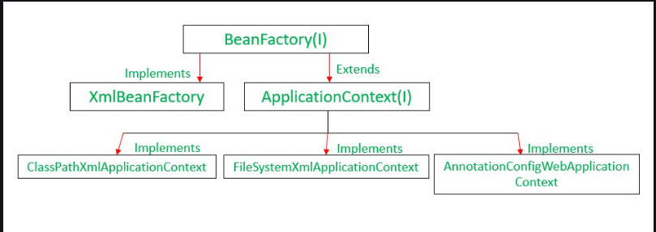

# Implementing Bean Scopes (Singleton, Prototype) and Request Scope From Controller

**`Objective : `** Add Bean Scopes (Singleton, Prototype), print the output of scope of beans.

## EmployeeService.java

```java
package org.assignment1.assignment3.services;

import lombok.Getter;
import lombok.Setter;
import org.springframework.beans.factory.annotation.Autowired;
import org.springframework.beans.factory.annotation.Qualifier;
import org.springframework.context.annotation.Scope;
import org.springframework.stereotype.Service;

@Setter
@Getter
@Service
@Scope("prototype")
public class EmployeeService {
    private String email;

    private EmailService emailServiceSetter;

    @Autowired
    @Qualifier("emailService")
    public void setEmailServiceSetter(EmailService emailServiceSetter) {
        this.emailServiceSetter = emailServiceSetter;
    }
}
```

### Explanations

- `@Service` and `@Scope("prototype"):` Marks this class as a Spring service and configures it with prototype scope, ensuring a new instance is created for each injection point.
- `emailServiceSetter:` This field is injected with EmailService using setter injection, annotated with @Autowired and @Qualifier.

<br>

## EmailService.java

```java
package org.assignment1.assignment3.services;

public interface EmailService {
    void sendEmail(String from, String to, String subject, String body);
}
```

### Explanations

- Defines the `sendEmail` method signature, which implementations will need to provide.

<br>

## EmailServiceImpl

```java
package org.assignment1.assignment3.entity;

import org.assignment1.assignment3.services.EmailService;
import org.springframework.context.annotation.Scope;
import org.springframework.stereotype.Service;

@Service("emailService")
@Scope("singleton")
public class EmailServiceImpl implements EmailService {

    @Override
    public void sendEmail(String from, String to, String subject, String body) {
        System.out.println("From : " + from);
        System.out.println("To : " + to);
        System.out.println("Subject : " + subject);
        System.out.println("Body : " + body);
        System.out.println("email sent ...");
        System.out.println("=========================");
    }
}
```

### Explanations

- `@Service("emailService")` and `@Scope("singleton"):` Marks this class as a Spring service with the name "emailService" and singleton scope.
- Implements the `sendEmail` method to print email details and simulate sending an email.

<br>

##

<br>

## Main.java

```java
package org.assignment1.assignment3;

import org.assignment1.assignment3.services.EmailService;
import org.assignment1.assignment3.services.EmployeeService;
import org.springframework.boot.SpringApplication;
import org.springframework.boot.autoconfigure.SpringBootApplication;
import org.springframework.context.ApplicationContext;

@SpringBootApplication
public class Assignment3Application {

    public static void main(String[] args) {
        ApplicationContext context = SpringApplication.run(Assignment3Application.class, args);

        // Retrieve EmployeeService beans
        EmployeeService employeeService1 = (EmployeeService) context.getBean("employeeService");
        EmployeeService employeeService2 = (EmployeeService) context.getBean("employeeService");

        // Set email for EmployeeService instances
        employeeService1.setEmail("ryanfpt@gmail.com");
        employeeService2.setEmail("chandrafpt@gmail.com");

        // Retrieve EmailService bean
        EmailService emailService1 = (EmailService) context.getBean("emailService");

        // Send test emails
        emailService1.sendEmail(employeeService1.getEmail(), employeeService2.getEmail(), "Test Subject 1", "Test Body 1");
        emailService1.sendEmail(employeeService2.getEmail(), employeeService1.getEmail(), "Test Subject 2", "Test Body 2");

        // Observing scopes
        System.out.println("EmployeeService 1: " + employeeService1);
        System.out.println("EmployeeService 2: " + employeeService2);
        System.out.println("EmailService 1: " + emailService1);
    }

}
```

### Explanations

- `@SpringBootApplication:` This annotation enables Spring Boot's auto-configuration and component scanning features.
- `main method:` This method initializes the Spring application context (ApplicationContext) and retrieves beans (EmployeeService and EmailService) from the context.
- It demonstrates setting email addresses for `EmployeeService` instances and using the EmailService bean to send test emails.
- Prints out instances of `EmployeeService` and `EmailService` to observe their scopes (prototype and singleton, respectively).

<br>

## RequestController.java

```java
package org.assignment1.assignment3.controllers;

import org.assignment1.assignment3.services.RequestService;
import org.springframework.beans.factory.annotation.Autowired;
import org.springframework.web.bind.annotation.GetMapping;
import org.springframework.web.bind.annotation.RestController;

@RestController
public class RequestController {

    private final RequestService requestService;

    @Autowired
    public RequestController(RequestService requestService) {
        this.requestService = requestService;
    }

    @GetMapping("/processRequest")
    public String processRequest() {
        return requestService.processRequest();
    }
}
```

### Explanations

- `Annotations:`
  - _@RestController:_ Indicates that this class defines a REST controller.
  - _@Autowired:_ Injects an instance of RequestService into the controller.
- `Constructor:`
  - Injects `RequestService` dependency via constructor injection.
- `Endpoint:`
  - _@GetMapping("/processRequest"):_ Defines an HTTP GET endpoint `/processRequest`.
  - Calls requestService.processRequest() to handle the request and return a response.

<br>

## RequestController

```java
package org.assignment1.assignment3.controller;

import org.assignment1.assignment3.services.RequestService;
import org.springframework.beans.factory.annotation.Autowired;
import org.springframework.web.bind.annotation.GetMapping;
import org.springframework.web.bind.annotation.RequestMapping;
import org.springframework.web.bind.annotation.RestController;

@RestController
@RequestMapping("/request")
public class RequestController {

    @Autowired
    private RequestService requestService;

    @GetMapping
    public String getRequestMessage() {
        return requestService.getMessage();
    }
}
```

### Explanations

- `Annotations:`
  - @RestController: Indicates that this class is a REST controller that processes incoming HTTP requests.
  - @RequestMapping("/request"): Specifies that all endpoints mapped by this controller will have a base path /request.
  - @Autowired: Injects an instance of RequestService into the controller.

<br>

- `Dependencies:`
  - RequestService: This is a service bean that provides business logic for handling requests.

<br>

- `Endpoint:`
  - @GetMapping: Specifies that the getRequestMessage() method handles HTTP GET requests.
  - /request: This endpoint is relative to the base path set by @RequestMapping.

<br>

- `Method:`
  - getRequestMessage(): Executes business logic from RequestService and returns the result as a response to the client.

<br>

## RequestService.java

```java
package org.assignment1.assignment3.services;

import lombok.Getter;
import lombok.Setter;
import org.springframework.context.annotation.Scope;
import org.springframework.context.annotation.ScopedProxyMode;
import org.springframework.stereotype.Service;

@Getter
@Setter
@Service
@Scope(value = "request", proxyMode = ScopedProxyMode.TARGET_CLASS)
public class RequestService {
    private String message;

    public RequestService() {
        this.message = "Request Service: " + System.currentTimeMillis();
    }
}
```

### Explanations

- Annotations:
  - @Service: Indicates that this class is a Spring service component.
  - @Scope(value = "request", proxyMode = ScopedProxyMode.TARGET_CLASS): Specifies that instances of RequestService are scoped to the lifecycle of an HTTP request (request scope).
    - proxyMode = ScopedProxyMode.TARGET_CLASS: Ensures that a proxy is used to manage the scoped bean, allowing dependency injection into singleton beans correctly.

<br>

- Lombok Annotations:
  - @Getter and @Setter: Automatically generate getter and setter methods for the message field.

<br>

- Constructor:
  - Initializes the message field with a string that includes the current timestamp (System.currentTimeMillis()). This demonstrates that each instance of RequestService will have a unique initialization message based on the time it was created.

<br>

## RequestControllerTest.java

```java
package org.assignment1.assignment3;

import org.junit.jupiter.api.Test;
import org.springframework.beans.factory.annotation.Autowired;
import org.springframework.boot.test.context.SpringBootTest;
import org.springframework.boot.test.web.client.TestRestTemplate;
import org.springframework.http.ResponseEntity;

import static org.assertj.core.api.Assertions.assertThat;

@SpringBootTest(webEnvironment = SpringBootTest.WebEnvironment.RANDOM_PORT)
public class RequestControllerTest {

    @Autowired
    private TestRestTemplate restTemplate;

    @Test
    public void testRequestScope() {
        ResponseEntity<String> response1 = restTemplate.getForEntity("/request", String.class);
        ResponseEntity<String> response2 = restTemplate.getForEntity("/request", String.class);

        assertThat(response1.getBody()).isNotEqualTo(response2.getBody());
    }
}
```

### Explanations

- `Annotations:`
  - @SpringBootTest(webEnvironment = SpringBootTest.WebEnvironment.RANDOM_PORT): This annotation tells Spring Boot to load the entire application context and start a real HTTP server with a randomly assigned port (RANDOM_PORT). This allows testing of the application in a more realistic environment.

<br>

- `Dependencies:`
  - @Autowired private TestRestTemplate restTemplate;: TestRestTemplate is a convenience class provided by Spring Boot for testing RESTful services. It allows you to easily make HTTP requests to your application during tests.

<br>

- `Test Method:`
  - @Test public void testRequestScope() { ... }: This method is a JUnit test method that verifies the behavior of the application.

<br>

- `Testing Approach:`
  - restTemplate.getForEntity("/request", String.class);: Sends a GET request to the /request endpoint of your application and expects a String response.
  - ResponseEntity<String> response1 = restTemplate.getForEntity("/request", String.class);: Executes the first GET request.
  - ResponseEntity<String> response2 = restTemplate.getForEntity("/request", String.class);: Executes the second GET request.

<br>

- `Assertions:`
  - assertThat(response1.getBody()).isNotEqualTo(response2.getBody());: Asserts that the response bodies of the two requests are not equal. This tests the behavior of the RequestService, which is scoped to request scope, ensuring that each request gets a new instance with a unique message.

<br>

## EmailServiceTest

```java
package org.assignment1.assignment3;

import org.assignment1.assignment3.entity.EmailServiceImpl;
import org.assignment1.assignment3.services.EmailService;
import org.junit.jupiter.api.Test;
import org.mockito.InjectMocks;
import org.mockito.Mock;
import org.mockito.Mockito;
import org.springframework.boot.test.context.SpringBootTest;

@SpringBootTest
public class EmailServiceTest {

    @InjectMocks
    private EmailServiceImpl emailService; // Injecting the class under test

    @Mock
    private EmailService emailServiceMock; // Mocking the dependency

    @Test
    public void testSendEmail() {
        // Prepare test data
        String from = "chandrafpt@example.com";
        String to = "hadifpt@example.com";
        String subject = "Test Subject";
        String body = "Test Body";

        // Mock behavior
        emailServiceMock.sendEmail(from, to, subject, body);

        // Verify that sendEmail method was called with correct parameters
        Mockito.verify(emailServiceMock, Mockito.times(1)).sendEmail(from, to, subject, body);
    }
}
```

### Explanations

- Annotations:
  - @SpringBootTest: Indicates that the test is a Spring Boot integration test, and it will load the complete application context.

<br>

- Mocking Setup:
  - @InjectMocks private EmailServiceImpl emailService;: This annotation injects an instance of EmailServiceImpl into the test class (EmailServiceTest). This is the class under test.
  - @Mock private EmailService emailServiceMock;: This annotation creates a mock object for the EmailService interface. This mock is used to simulate the behavior of the real EmailService during the test.

<br>

- Test Method:
  - @Test public void testSendEmail() { ... }: This method is a JUnit test method that verifies the behavior of the sendEmail method.

<br>

- Testing Approach:
  - Prepare Test Data:
    - Defines test data such as from, to, subject, and body.
  - Mock Behavior:
    - emailServiceMock.sendEmail(from, to, subject, body);: Calls the sendEmail method on the mocked emailServiceMock object with the test data.
  - Verification:
    - Mockito.verify(emailServiceMock, Mockito.times(1)).sendEmail(from, to, subject, body);: Verifies that the sendEmail method of emailServiceMock was called exactly once with the specified parameters (from, to, subject, body).

<br>

## Singleton Scope

- `Example:` EmailServiceImpl class is annotated with @Scope("singleton").
- `Function:` Beans scoped as singleton are instantiated once per Spring IoC container (per application context). This means that every time a bean of this type is requested, the same instance is returned.
- `Purpose:` Typically used for stateless beans or beans that maintain global state. It optimizes memory usage by reusing the same instance across the application.

## Prototype Scope

- `Example:` EmployeeService class is annotated with @Scope("prototype").
- `Function:` Beans scoped as prototype are instantiated every time they are requested by Spring IoC. This means that every request for this bean type results in a new instance being created.
- `Purpose:` Useful for stateful beans where each instance needs to maintain its own state. It provides isolation between different instances of the bean.

<br>

# Inject Prototype Bean into Singleton Bean

For example, here is the code below,

```java
@Configuration
public class AppConfig {

    @Bean
    @Scope(ConfigurableBeanFactory.SCOPE_PROTOTYPE)
    public PrototypeBean prototypeBean() {
        return new PrototypeBean();
    }

    @Bean
    public SingletonBean singletonBean() {
        return new SingletonBean();
    }
}
```
Notice that the first bean has a prototype scope, the other one is a singleton.
After that, create a singleton Beam to be inject,

```java
public class SingletonBean {

    // ..

    @Autowired
    private PrototypeBean prototypeBean;

    public SingletonBean() {
        logger.info("Singleton instance created");
    }

    public PrototypeBean getPrototypeBean() {
        logger.info(String.valueOf(LocalTime.now()));
        return prototypeBean;
    }
}
```
On code above, we inject the prototype-scoped bean into the singleton – and then expose if via the `getPrototypeBean()` method.
After that we create the main to test the injection from prototype bean to singleton bean

```java
public static void main(String[] args) throws InterruptedException {
    AnnotationConfigApplicationContext context 
      = new AnnotationConfigApplicationContext(AppConfig.class);
    
    SingletonBean firstSingleton = context.getBean(SingletonBean.class);
    PrototypeBean firstPrototype = firstSingleton.getPrototypeBean();
    
    // get singleton bean instance one more time
    SingletonBean secondSingleton = context.getBean(SingletonBean.class);
    PrototypeBean secondPrototype = secondSingleton.getPrototypeBean();

    isTrue(firstPrototype.equals(secondPrototype), "The same instance should be returned");
}
```

The result will look like this,

    Singleton Bean created
    Prototype Bean created
    11:06:57.894
    // should create another prototype bean instance here
    11:06:58.895

Both beans were initialized only once, at the startup of the application context.

# Difference between BeanFactory and ApplicationContext

| **Feature** | **BeanFactory** | **ApplicationContext** |
|-------------|------------------|------------------------|
| **Type** | Fundamental container that provides the basic functionality for managing beans. | Advanced container that extends BeanFactory, providing all basic functionality and adding advanced features. |
| **Suitability** | Suitable for building standalone applications. | Suitable for building web applications, integrating with AOP modules, ORM, and distributed applications. |
| **Bean Scopes** | Supports only Singleton and Prototype bean scopes. | Supports all types of bean scopes such as Singleton, Prototype, Request, Session, etc. |
| **Annotations** | Does not support Annotations. Bean Autowiring requires configuring properties in an XML file only. | Supports Annotation-based configuration in Bean Autowiring. |
| **Internationalization (i18n)** | Does not provide messaging (i18n or internationalization) functionality. | Extends MessageSource interface, thus provides messaging (i18n or internationalization) functionality. |
| **Event Publication** | Does not support Event publication functionality. | Provides event handling through the ApplicationEvent class and ApplicationListener interface. |
| **BeanPostProcessors** | Requires manual registration of BeanPostProcessors and BeanFactoryPostProcessors. | Automatically registers BeanFactoryPostProcessor and BeanPostProcessor at startup. |
| **Initialization** | Creates a bean object when the getBean() method is called, making it Lazy initialization. | Loads all the beans and creates objects at the time of startup, making it Eager initialization. |
| **Memory Usage** | Provides basic features only, thus requires less memory. Suitable for standalone applications where basic features are sufficient and memory consumption is critical. | Provides all basic and advanced features, including several geared towards enterprise applications, thus requiring more memory. |

<br>

Here is the Hierarchy

