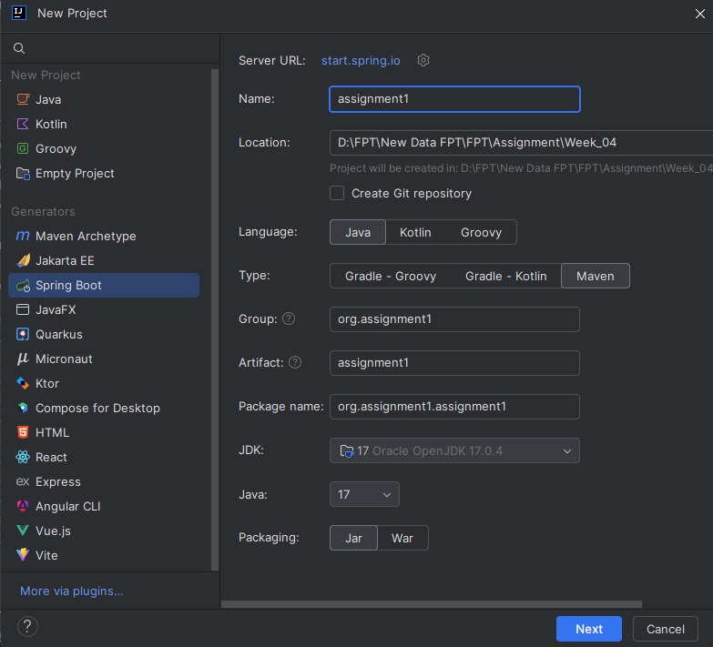
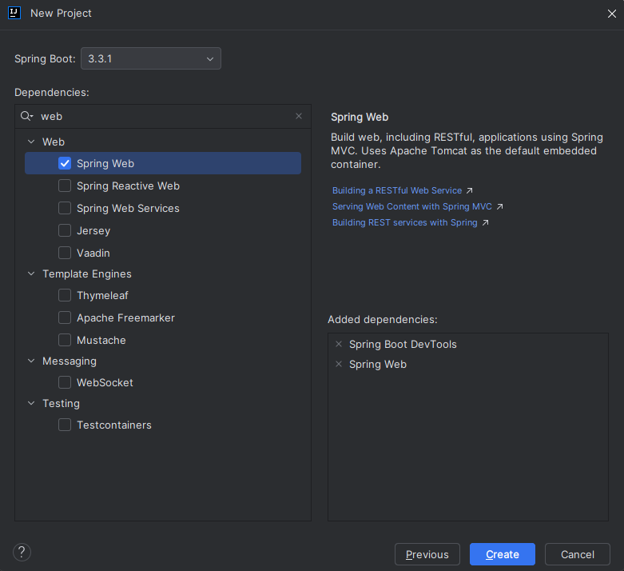
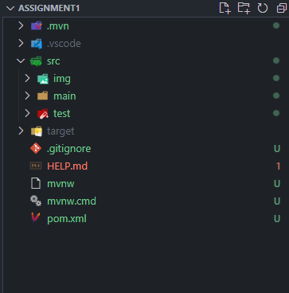
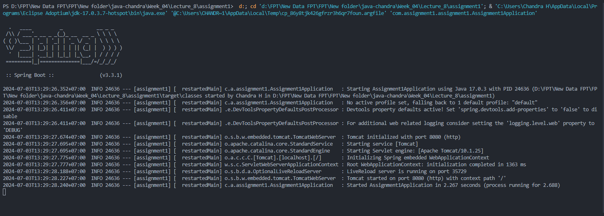
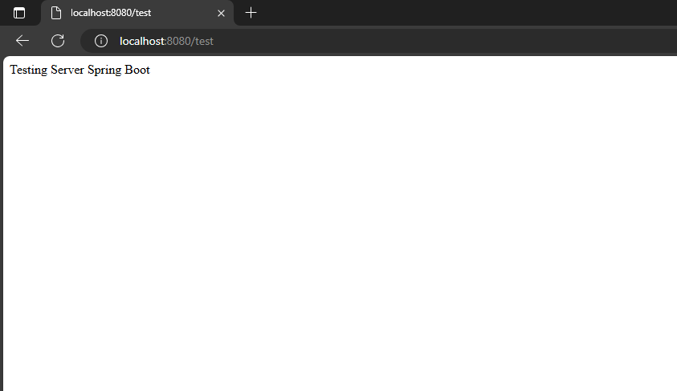
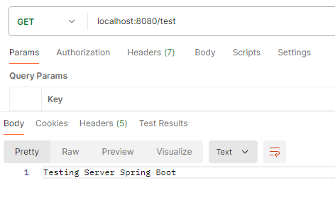

# Spring Boot Project

`Objective:` Create a Spring Boot Project and run it local.

`Spring Boot:` is a Java framework that makes it easier to create and run Java applications. It simplifies the configuration and setup process, allowing developers to focus more on writing code for their applications.

How to `create` and `run a spring boot project` using intellij, here is the step by step.

- Using intellij:

  - Go to intellij.
  - Configure the project metadata:
    - Project: Maven Project
    - Language: Java
    - Spring Boot: Choose the latest stable version
    - Group: e.g., com.example
    - Artifact: e.g., restful-service
    - Name: e.g., restful-service
    - Description: e.g., Demo project for RESTful service
    - Package name: e.g., com.example.restfulservice
    - Packaging: Jar
    - Java: 8 or later

<br>

- Add Dependencies:
  - In this project `Spring Web` is added to test basic `GET` endpoint `/test`.

Here is the pict regarding step by step create spring boot,

- Initiate Spring boot project
  

<br>

- Add `Spring Web` dependencies to test `GET` endpoint
  

- After create the project, the file will look like shown

  

- Create test Controller to test the endpoint (Using RESTFull API)

  ```java
  @RestController
  public class testingController {

      @GetMapping("/test")
      public String test() {
          return "Testing Server Spring Boot";
      }
  }
  ```

- After that we run the project, run `localhost:8080/test`, also with postman to test the endpoint

  
  
  
