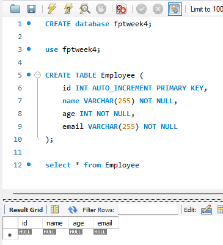
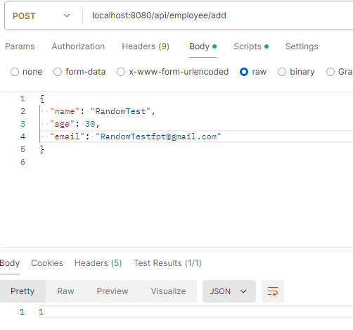
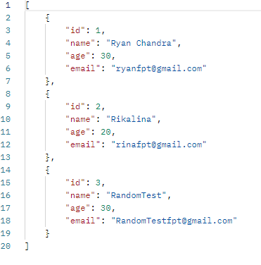
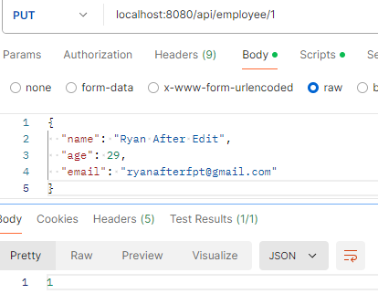
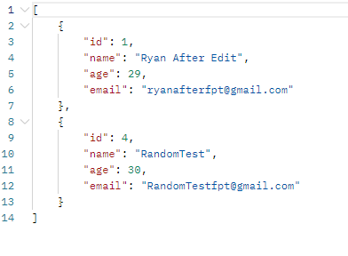
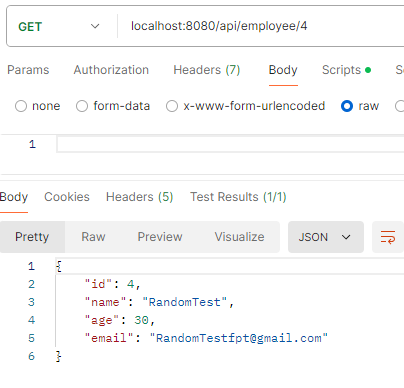
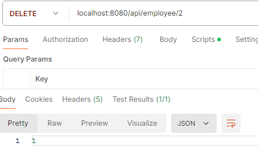
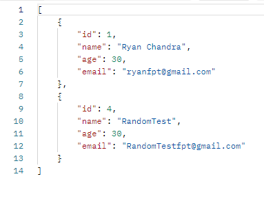
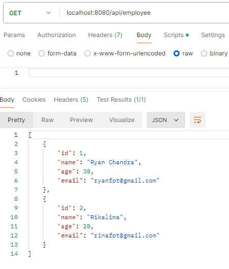

# Setup CRUD using JDBC template

`Objective:` create CRUD to manage employee using JDBC Template and use properties file to manage the DB Connection.

`JDBC (Java Database Connectivity)` is an application programming interface (API) that defines how a client may access a database. It is a data access technology used for Java database connectivity. It provides methods to query and update data in a database and is oriented toward relational databases. JDBC offers a natural Java interface for working with SQL. JDBC is needed to provide a “Pure Java” solution for application development. JDBC API uses JDBC drivers to connect with the database.

Here is the implementation for using JDBC to create a CRUD using RESTApi,

- Setup the properties by creating a Database called `fptweek4` in mysql and create a table in there.

  ```java
  spring.application.name=assignment2

  spring.datasource.url=jdbc:mysql://localhost:3306/fptweek4
  spring.datasource.username=root
  spring.datasource.password=Tsel@2020
  spring.datasource.driver-class-name=com.mysql.cj.jdbc.Driver
  ```

  

<br>

- Create employee model using lombok to make the file more clean (We don't have to create `Setter` and `Getter`, lombok will manage)

  ```java
  @Setter
  @Getter
  @Data
  public class employee {

      @Id
      private int id;
      private String name;
      private int age;
      private String email;

  }
  ```

- After that create a repository class uses JdbcTemplate to perform CRUD operations on the Employee table. On JDBC template, the query need to be execute in sql query mode, so we need all the requirements on CRUD to perform this.

  ```java
  @Repository
  public class employeeRepository {
      @Autowired
      private JdbcTemplate jdbcTemplate;

      public List<employee> getAllEmployees() {
          String sql = "select * from employee";
          return jdbcTemplate.query(sql, new BeanPropertyRowMapper<>(employee.class));
      }

      public employee getEmployeeById(int id) {
          String sql = "select * from employee where id = ?";
          return jdbcTemplate.queryForObject(sql, new Object[]{id}, new BeanPropertyRowMapper<>(employee.class));
      }

      public int addEmployee(employee employee) {
          String sql = "INSERT INTO employee (name, age, email) VALUES (?, ?, ?)";
          return jdbcTemplate.update(sql, employee.getName(), employee.getAge(), employee.getEmail());
      }

      public int updateEmployee(employee employee) {
          String sql = "UPDATE employee SET name = ?, age = ?, email = ? WHERE id = ?";
          return jdbcTemplate.update(sql, employee.getName(), employee.getAge(), employee.getEmail(), employee.getId());
      }

      public int deleteById(int id) {
          String sql = "DELETE FROM Employee WHERE id = ?";
          return jdbcTemplate.update(sql, id);
      }

  }
  ```

- Create a service class to interact with repository to perform CRUD operations

  ```java
  @Service
  public class employeeService {

      @Autowired
      private employeeRepository employeeRepo;

      public List<employee> getAllEmployees() {
          return employeeRepo.getAllEmployees();
      }

      public employee getEmployeeById(int id) {
          return employeeRepo.getEmployeeById(id);
      }

      public int addEmployee(employee employee) {
          return employeeRepo.addEmployee(employee);
      }

      public int updateEmployee(employee employee) {
          return employeeRepo.updateEmployee(employee);
      }

      public int deleteById(int id) {
          return employeeRepo.deleteById(id);
      }
  }
  ```

- Create a REST `controller` to handles HTTP request for manage employee, on this we use `/api/employee` to be set as default `requestMapping`

  ```java
  @RestController
  @RequestMapping("/api/employee")
  @AllArgsConstructor
  public class employeeController {

      @Autowired
      private employeeService employeeService;

      @GetMapping
      public List<employee> getAllEmployee(){
          return employeeService.getAllEmployees();
      }

      @GetMapping("/{id}")
      public employee getEmployeeById(@PathVariable int id){
          return employeeService.getEmployeeById(id);
      }

      @PostMapping("/add")
      public int addEmployee(@RequestBody employee employee){
          return employeeService.addEmployee(employee);
      }

      @PutMapping("/{id}")
      public int updateEmployee(@PathVariable int id, @RequestBody employee employee){
          return employeeService.updateEmployee(employee);
      }

      @DeleteMapping("/{id}")
      public int deleteEmployee(@PathVariable int id) {
          return employeeService.deleteById(id);
      }
  }
  ```

- Run and test the endpoint using postman

  - POST `/employees/add` to create a new employee.
    
    

    <br>

  - PUT `/employees/{id}` to update an existing employee.
    
    

    <br>

  - GET `/employees/{id}` to get an employee by ID.
    

    <br>

  - DELETE `/employees/{id}` to delete an employee by ID.
    
    

    <br>

  - GET `/employees` to get a list of all employees.
    
