# Setup Datasource using Bean (Multiple Datasource)

`Objective:` Change assignment 2 to create datasoure using bean, not application properties (research multiple datasource) and use `Handle Transaction` when `Inser/Update`

`Multiple Datasource:` refer to the configuration and use of more than one database connection within a single application.

To configure multiple data sources in a Spring Boot application, we need to:

- Define Data Source Beans: Create beans for each data source in a configuration class.
- Configure JdbcTemplate or EntityManager Beans: Depending on whether using JDBC or JPA, configure beans for JdbcTemplate or EntityManager for each data source.
- Specify Configuration in application.properties: Provide the necessary configuration for each data source in the application.properties

<br>

- We need to create employee model first [employee.java](src/main/java/org/assignment1/assignment3/model/employee.java)

  - Annotations:
    - @Setter, @Getter, and @Data from Lombok automatically generate common methods like setters, getters, toString(), equals(), and hashCode().

  <br>

  - Fields:
    - @Id: Marks the id field as the primary key.
    - private int id: Unique identifier for the employee. - private String name: Name of the employee.
    - private int age: Age of the employee.
    - private String email: Email address of the employee.

  <br>

  - Constructors:
    - Parameterized constructor: Allows creating an employee with specific values.
    - Default constructor: Required by some frameworks to create an instance without setting initial values.

  <br>

- Create the second database. In this example the second database contains same table as the first database like in assignment 2 database.

  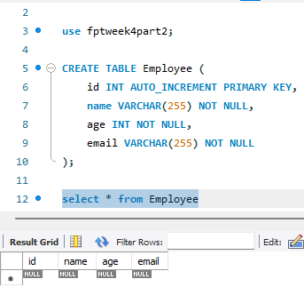

- Setup the configurations class for configures two data sources (primaryDataSource and secondaryDataSource) and two corresponding JdbcTemplate beans (primaryJdbcTemplate and secondaryJdbcTemplate) in [appConvifg](src/main/java/org/assignment1/assignment3/config/appConfig.java).

  - Class Annotation:
    - @Configuration: Indicates that the class declares one or more @Bean methods and may be processed by the Spring container to generate bean definitions and service requests at runtime.

  <br>

  - Bean Definitions:

    - Primary DataSource:
      - @Bean(name = "primaryDataSource"): Defines a bean named primaryDataSource.
      - @ConfigurationProperties(prefix = "primary.datasource"): Binds properties prefixed with primary.datasource in the application.properties file to the DriverManagerDataSource instance.
      - public DataSource primaryDataSource(): Method returns a DriverManagerDataSource instance configured with the properties specified.

    <br>

    - Secondary DataSource:
      - Similar to the primary data source, but for properties prefixed with secondary.datasource.

    <br>

  - JdbcTemplate Beans:

    - Primary JdbcTemplate:
      - @Bean(name = "primaryJdbcTemplate"): Defines a bean named primaryJdbcTemplate.
      - public JdbcTemplate primaryJdbcTemplate(@Qualifier("primaryDataSource") DataSource dataSource): Method takes a DataSource bean (qualified as primaryDataSource) as a parameter and returns a JdbcTemplate configured with it.

    <br>

    - Secondary JdbcTemplate:
      - Similar to the primary JdbcTemplate, but for the secondary data source.

    <br>

- Create Repository class to encapsulates all data access operations (CRUD: Create, Read, Update, Delete) related to the employee entity in the [primary](src/main/java/org/assignment1/assignment3/repository/primaryEmployeeRepository.java) and [secondary](src/main/java/org/assignment1/assignment3/repository/secondaryEmployeeRepository.java) database.

  - Annotations:
    - @Repository: Indicates that this class serves as a repository for storing, retrieving, and manipulating data from databases. In this case, it's used for both the primary and secondary databases.

  <br>

  - Dependencies:
    - @Autowired: Injects the primaryJdbcTemplate bean into the repository, which is configured to interact with the primary data source as defined in the appConfig class.
    - @Qualifier("primaryJdbcTemplate"): Specifies that the primaryJdbcTemplate bean should be injected. This ensures that operations are performed on the primary data source.

  <br>

  - Methods:
    - getAllEmployees():Retrieves all employee records from the primary data or secondary source (select \* from employee).
    - getEmployeeById(int id): Retrieves a specific employee record from the primary data or secondary source based on the provided id.
    - addEmployee(employee employee): Inserts a new employee record into the primary or secondary data source.
    - updateEmployee(employee employee): Updates an existing employee record in the primary or secondary data source based on the provided employee object.
    - deleteById(int id): Deletes an employee record from the primary or secondary data source based on the provided id.

  <br>

- Create [employee service](src/main/java/org/assignment1/assignment3/service/employeeService.java) to encapsulates business logic for managing employees across two different data sources (primary and secondary).

  - Annotations:

    - @Service: Marks this class as a service component in Spring, responsible for containing business logic.

    <br>

  - Dependencies:

    - @Autowired: Injects instances of primaryEmployeeRepository and secondaryEmployeeRepository, allowing access to data access methods defined in these repository classes.

    <br>

  - Primary Data Source Operations:

    - Methods (primaryEmployeeRepo):
      - getAllEmployeesFromPrimary(): Retrieves all employees from the primary data source.
      - getEmployeeByIdFromPrimary(int id): Retrieves a specific employee by ID from the primary data source.
      - addEmployeeToPrimary(employee employee): Adds a new employee to the primary data source.
      - updateEmployeeFromPrimary(employee employee): Updates an existing employee in the primary data source.
      - deleteByIdFromPrimary(int id): Deletes an employee from the primary data source by ID.

    <br>

    - Transactional Management:
      - Operations (addEmployeeToPrimary, updateEmployeeFromPrimary, deleteByIdFromPrimary) are annotated with @Transactional("primaryTransactionManager") to ensure atomicity and consistency within transactions managed by primaryTransactionManager.

    <br>

  - Secondary Data Source Operations:

    - Methods (secondaryEmployeeRepo):
      - getAllEmployeesFromSecondary(): Retrieves all employees from the secondary data source.
      - getEmployeeByIdFromSecondary(int id): Retrieves a specific employee by ID from the secondary data source.
      - addEmployeeToSecondary(employee employee): Adds a new employee to the secondary data source.
      - updateEmployeeInSecondary(employee employee): Updates an existing employee in the secondary data source.
      - deleteByIdFromSecondary(int id): Deletes an employee from the secondary data source by ID.

    <br>

    - Transactional Management:
      - Operations (addEmployeeToSecondary, updateEmployeeInSecondary, deleteByIdFromSecondary) are annotated with @Transactional("secondaryTransactionManager") to ensure atomicity and consistency within transactions managed by secondaryTransactionManager.

- Setup the properties based on the appConfig

  ```java
  spring.application.name=assignment3

  primary.datasource.url=jdbc:mysql://localhost:3306/fptweek4
  primary.datasource.username=root
  primary.datasource.password=Tsel@2020
  primary.datasource.driver-class-name=com.mysql.cj.jdbc.Driver

  secondary.datasource.url=jdbc:mysql://localhost:3306/fptweek4part2
  secondary.datasource.username=root
  secondary.datasource.password=Tsel@2020
  secondary.datasource.driver-class-name=com.mysql.cj.jdbc.Driver
  ```

  - Test Endpoint Primary Datasource

    - GET `/employees/primary` to get a list of all employees.
      <br>
      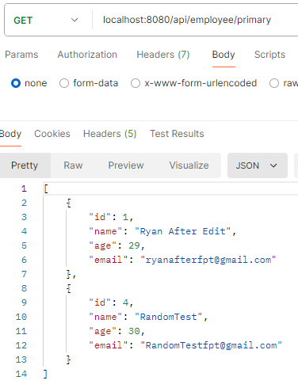

    <br>

    - POST `/employees/primary/add` to create a new employee.
      <br>
      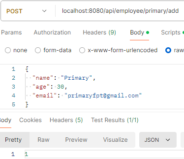
      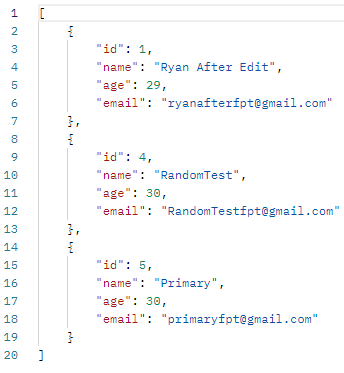

    <br>

    - PUT `/employees/primary/{id}` to update an existing employee.
      <br>
      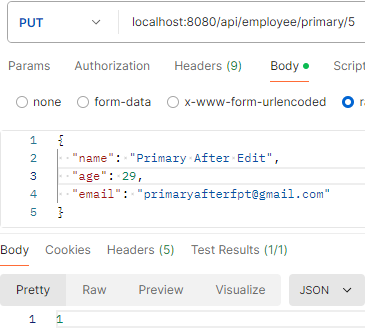
      

    <br>

    - GET `/employees/primary/{id}` to get an employee by ID.
      <br>
      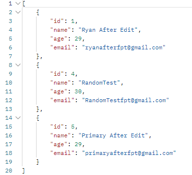

    <br>

    - DELETE `/employees/primary/{id}` to delete an employee by ID.
      <br>
      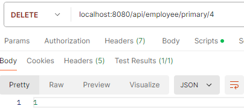
      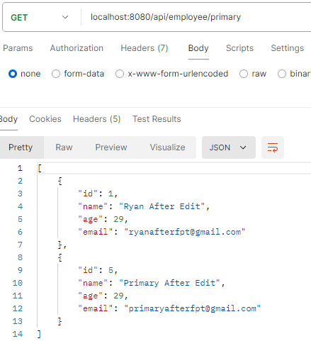

    <br>

  - Test Endpoint Secondary Datasource

    - GET `/employees/secondary` to get a list of all employees.
      <br>
      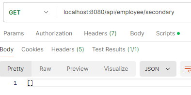

    <br>

    - POST `/employees/secondary/add` to create a new employee.
      <br>
      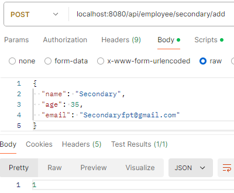
      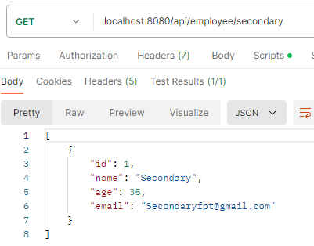

    <br>

    - PUT `/employees/secondary/{id}` to update an existing employee.
      <br>
      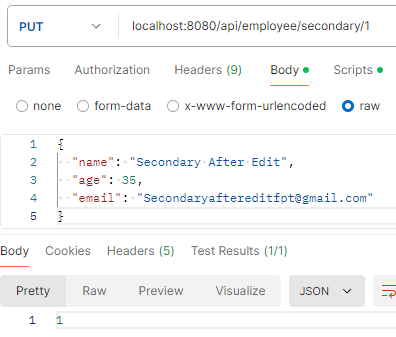
      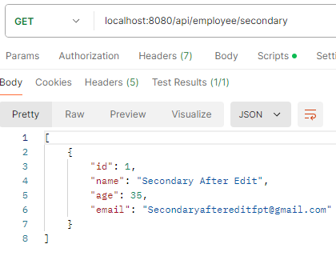

    <br>

    - GET `/employees/secondary/{id}` to get an employee by ID.
      <br>
      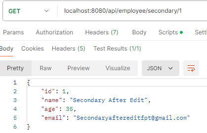

    <br>

    - DELETE `/employees/secondary/{id}` to delete an employee by ID.
      <br>
      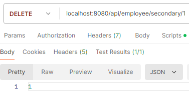
      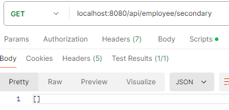

    <br>

<br>

- Handle Transaction When Insert/Update data
  In order to use transaction we have to specify what method that will be used to handle(insert and update date) so, the impelementations will look like code below,

```java
@Service
@Transactional
public class employeeService {
    @Transactional("primaryTransactionManager")
    public int addEmployeeToPrimary(employee employee) {
        return primaryEmployeeRepo.addEmployee(employee);
    }

    @Transactional("primaryTransactionManager")
    public int updateEmployeeFromPrimary(employee employee) {
        return primaryEmployeeRepo.updateEmployee(employee);
    }

    @Transactional("secondaryTransactionManager")
    public int addEmployeeToSecondary(employee employee) {
        return secondaryEmployeeRepo.addEmployee(employee);
    }

    @Transactional("secondaryTransactionManager")
    public int updateEmployeeInSecondary(employee employee) {
        return secondaryEmployeeRepo.updateEmployee(employee);
    }
}
```

- `@Transactional("primaryTransactionManager"):` This specifies that the method should use the primaryTransactionManager for transaction management. It ensures that the method's operations are part of a transaction managed by the primary data source's transaction manager.

- `@Transactional("secondaryTransactionManager"):` This specifies that the method should use the secondaryTransactionManager for transaction management.

- Test with Mockito

```java
@Service
@Transactional
public class employeeService {

    @Autowired
    private primaryEmployeeRepository primaryEmployeeRepo;

    @Autowired
    private secondaryEmployeeRepository secondaryEmployeeRepo;

    @Transactional("primaryTransactionManager")
    public int addEmployeeToPrimary(employee employee) {
        return primaryEmployeeRepo.addEmployee(employee);
    }

    @Transactional("primaryTransactionManager")
    public int updateEmployeeFromPrimary(employee employee) {
        return primaryEmployeeRepo.updateEmployee(employee);
    }

    @Transactional("secondaryTransactionManager")
    public int addEmployeeToSecondary(employee employee) {
        return secondaryEmployeeRepo.addEmployee(employee);
    }

    @Transactional("secondaryTransactionManager")
    public int updateEmployeeInSecondary(employee employee) {
        return secondaryEmployeeRepo.updateEmployee(employee);
    }
}
```

**`Class-Level Annotations`**

- @ExtendWith(MockitoExtension.class): This annotation integrates Mockito with JUnit 5, allowing the use of Mockito's annotations (@Mock, @InjectMocks, etc.) and features within the test class.

<br>

**`Fields`**

- @InjectMocks: This annotation is used on the employeeService field to inject mock dependencies (annotated with @Mock) into the employeeService instance.
- @Mock: These annotations create mock instances of primaryEmployeeRepository and secondaryEmployeeRepository. Mocks are used to simulate the behavior of these dependencies without requiring actual database operations.

<br>

**`Setup Method`**

- @BeforeEach public void setUp(): This method is annotated with @BeforeEach, meaning it runs before each test method. The MockitoAnnotations.openMocks(this) call initializes the mock objects annotated with @Mock and injects them into the employeeService instance.

<br>

**`Test Methods`**

- testAddEmployeeToPrimary:
  - Purpose: Tests the addEmployeeToPrimary method.
  - Annotations: Annotated with @Transactional("primaryTransactionManager") and @Rollback(true) to ensure the test method runs within a transaction and rolls back the changes afterward.
  - Mock Setup: Configures primaryEmployeeRepo.addEmployee(emp) to return 1.
  - Assertions: Verifies that the method returns 1.

<br>

- testUpdateEmployeeFromPrimary:
  - Purpose: Tests the updateEmployeeFromPrimary method.
  - Annotations: Same as the previous test.
  - Mock Setup: Configures primaryEmployeeRepo.updateEmployee(emp) to return 1.
  - Assertions: Verifies that the method returns 1.

<br>

- testAddEmployeeToSecondary:
  - Purpose: Tests the addEmployeeToSecondary method.
  - Annotations: Annotated with @Transactional("secondaryTransactionManager") and @Rollback(true) to ensure the test method runs within a transaction and rolls back the changes afterward.
  - Mock Setup: Configures secondaryEmployeeRepo.addEmployee(emp) to return 1.
  - Assertions: Verifies that the method returns 1.

<br>

- testUpdateEmployeeInSecondary:
  - Purpose: Tests the updateEmployeeInSecondary method.
  - Annotations: Same as the previous test.
  - Mock Setup: Configures secondaryEmployeeRepo.updateEmployee(emp) to return 1.
  - Assertions: Verifies that the method returns 1.

    <br>
    
    Here is the result test,
    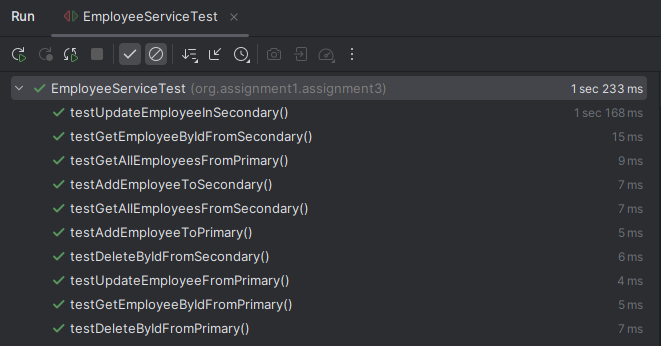

# Research Lombok and add to project

Lombok is a Java library that helps reduce boilerplate code by automatically generating common methods like getters, setters, constructors, equals(), hashCode(), and toString() through annotations. It simplifies code and makes it more readable and maintainable.

- Step 1: Add Lombok Dependency
  ```java
  <dependency>
      <groupId>org.projectlombok</groupId>
      <artifactId>lombok</artifactId>
      <version>1.18.26</version>
      <scope>provided</scope>
  </dependency>
  ```
- Step 2: Use Lombok Annotations

  - @Getter and @Setter: Generates getters and setters for all fields.
  - @Data: Generates getters, setters, toString(), equals(), and hashCode() methods.
  - @NoArgsConstructor: Generates a no-argument constructor.
  - @AllArgsConstructor: Generates a constructor with one parameter for each field.
  - @Builder: Implements the builder pattern.

- Step 3: the already used in this project in [employee model](src/main/java/org/assignment1/assignment3/model/employee.java) and [employee controller](src/main/java/org/assignment1/assignment3/controller/employeeController.java)
