# Spring Boot Project

`Objective: `Manage Crud Employee management with these requirements,

- Project structure follow standard
- Use id by uuid
- Use dto and mapstruct
- Handle exception
- Validate email, name (notnull, only text), phone as your country format phone

<br>

- Create [`Employee.java`](src/main/java/org/assignment1/assignment1/model/Employee.java)
  - Purpose: Represents the Employee entity, mapped to a database table using JPA annotations (@Entity, @Id, @Column).
  - Attributes: Includes fields (id, name, dob, address, department, email, nphone) representing employee data, with Lombok annotations (@Getter, @Setter) for generating getter and setter methods.
  - Persistence: Represents a persistent entity managed by the ORM framework (likely Hibernate), facilitating CRUD operations and database interactions.

<br>

- Create [`EmployeeDTO.java`](src/main/java/org/assignment1/assignment1/dto/EmployeeDTO.java)
  - Purpose: Represents a Data Transfer Object (DTO) that mirrors the Employee entity but is tailored for transferring data between layers (e.g., controller and service layers).
  - Fields: Includes fields corresponding to employee attributes (id, name, dob, address, department, email, nphone) with validation annotations (@NotBlank, @Email, @Pattern) to enforce data integrity.
  - Usage: Acts as a standardized format for exchanging data, ensuring separation of concerns and decoupling from the persistence layer (Employee entity).

<br>

- Create [`EmployeeRepository.java`](src/main/java/org/assignment1/assignment1/repository/EmployeeRepository.java)
  - Purpose: Interface extending JpaRepository to provide standard CRUD operations for the Employee entity.
  - Methods:
    - findByDepartment(String department): Custom query method to retrieve a list of employees based on their department.
    - Inherited methods: Includes methods (findAll, findById, save, delete) from JpaRepository for basic CRUD operations.
  - Usage: Enables seamless interaction with the underlying database through Spring Data JPA, reducing boilerplate code and promoting abstraction.

<br>

- Create [`EmployeeService.java`](src/main/java/org/assignment1/assignment1/service/EmployeeService.java)
  - Purpose: Implements business logic operations related to employee management, acting as an intermediary between the controller and repository layers.
  - Methods:
    - CRUD Operations: Includes methods (getAllEmployees, getEmployeeById, saveEmployee, updateEmployee, deleteEmployee) for managing employee data.
    - Bulk Operations: Provides methods (uploadEmployees, saveAllEmployees) for handling CSV file uploads and batch saving of employees.
    - Querying: Includes getEmployeesByDepartment to fetch employees based on department.
  - Dependencies: Injects EmployeeRepository for data access and EmployeeMapper for mapping between DTOs and entities.
  - Error Handling: Implements exception handling for managing errors during data operations (uploadEmployees).

<br>

- Create [`EmployeeMapper.java`](src/main/java/org/assignment1/assignment1/mapper/EmployeeMapper.java)
  - Purpose: Interface defined with MapStruct for generating mapping implementations between Employee entity and EmployeeDTO.
  - Mappings:
    - employeeDTOToEmployee: Converts an EmployeeDTO object into an Employee entity, ignoring the id field during conversion.
    - employeeToEmployeeDTO: Converts an Employee entity into an EmployeeDTO.
    - updateEmployeeFromDTO: Updates an existing Employee entity using data from an EmployeeDTO.
  - Use: Enables automatic mapping between DTOs and entities, reducing boilerplate code and ensuring consistent data transformations.

<br>

- Create [`GlobalException.java`](src/main/java/org/assignment1/assignment1/exception/GlobalException.java)
  - Purpose: Implements a global exception handler using Spring's @ControllerAdvice and @ExceptionHandler annotations to centralize exception handling across the application.
  - Handling:
    - Exception.class: Handles generic exceptions by returning a 500 Internal Server Error status along with the exception message.
    - IllegalArgumentException.class: Handles specific exceptions (e.g., when an invalid argument is passed) by returning a 400 Bad Request status along with the exception message.
  - Benefits: Promotes code reuse and simplifies error handling across different controllers and service methods.

<br>

- Create [`CSVUtils.java`](src/main/java/org/assignment1/assignment1/utils/CSVUtils.java)
  - Purpose: Utility class for parsing CSV files containing employee data.
  - Functionality: Utilizes Apache Commons CSV (CSVParser) to read and parse CSV data from an input stream (InputStream), converting each CSV record into an EmployeeDTO.
  - Error Handling: Throws a RuntimeException if parsing fails, providing details about the error encountered (Failed to parse CSV file).

<br>

- Create [`DateUtils.java`](src/main/java/org/assignment1/assignment1/utils/DateUtils.java)
  - Purpose: Utility class for parsing date strings into LocalDate objects using DateTimeFormatter.
  - Functionality: Defines a static method (parseDate) that accepts a date string and parses it into a LocalDate object using a predefined date format (dd/MM/yyyy).
  - Usage: Used within CSVUtils for converting date strings from CSV records into LocalDate objects.

<br>

- Create [`EmployeeController.java`](src/main/java/org/assignment1/assignment1/controller/EmployeeController.java)

  - Purpose: This class serves as a REST controller responsible for handling HTTP requests related to employee management.
  - Endpoints:
    - Defines endpoints for CRUD operations (GET, POST, PUT, DELETE).
    - Handles CSV file uploads for bulk employee data insertion.
    - Dependencies: Relies on EmployeeService for business logic operations related to employees.
  - Special Features: Utilizes Spring annotations (@RestController, @RequestMapping, @PostMapping, @PutMapping, @DeleteMapping, @GetMapping) for defining endpoints and handling HTTP requests.

- Setup Applications properties

  ```java
  spring.application.name=assignment1

  spring.datasource.driver-class-name=com.mysql.jdbc.Driver
  spring.datasource.url=jdbc:mysql://localhost:3306/fptweek5part2
  spring.datasource.username=root
  spring.datasource.password=Tsel@2020
  ```

- Create the database in mysql workbench
  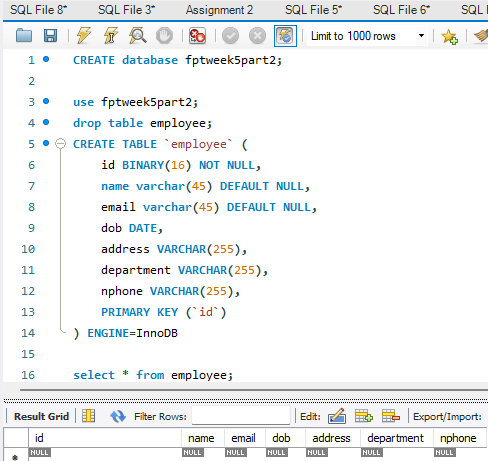

<br>

## `Result for Every Endpoints`

- `/GET All Data`

  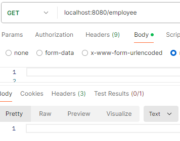

<br>

- `Post Data Employee`

  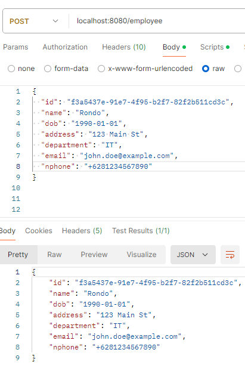

<br>

- `GET Data by ID`

  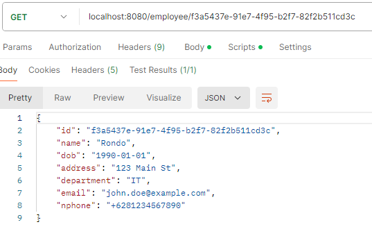

<br>

- `Put for modify data by ID employee`

  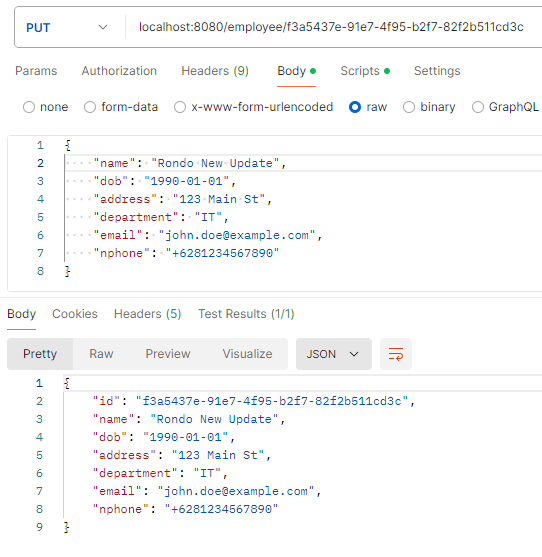

  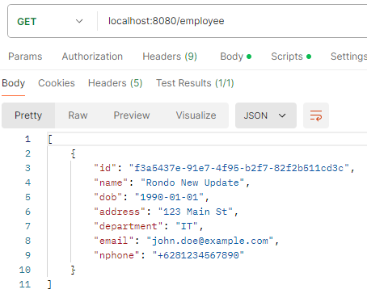

<br>

- `Delete data by ID employee (Delete table Raissa)`

  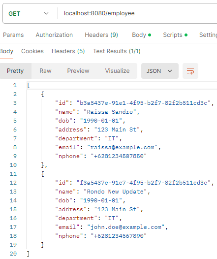

  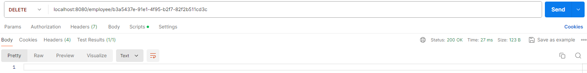

  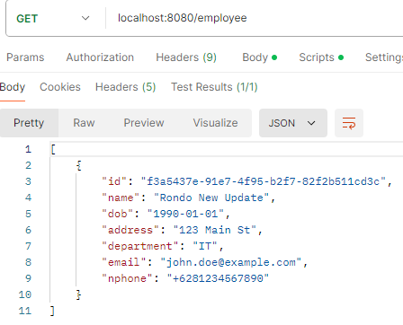

<br>

- `POST Upload data CSV`

  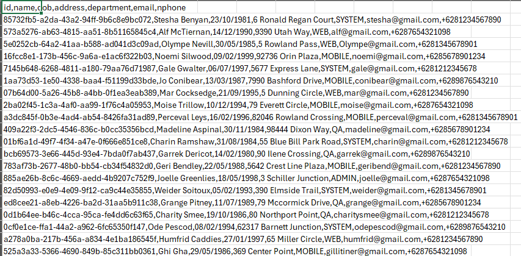

  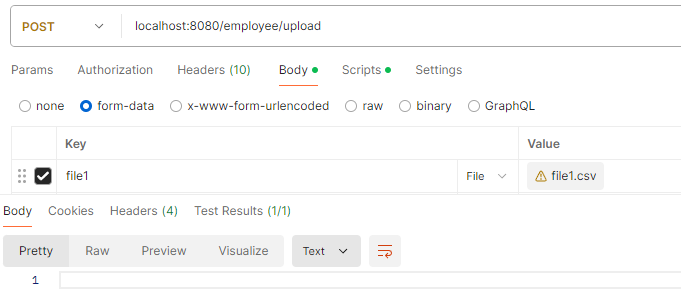

  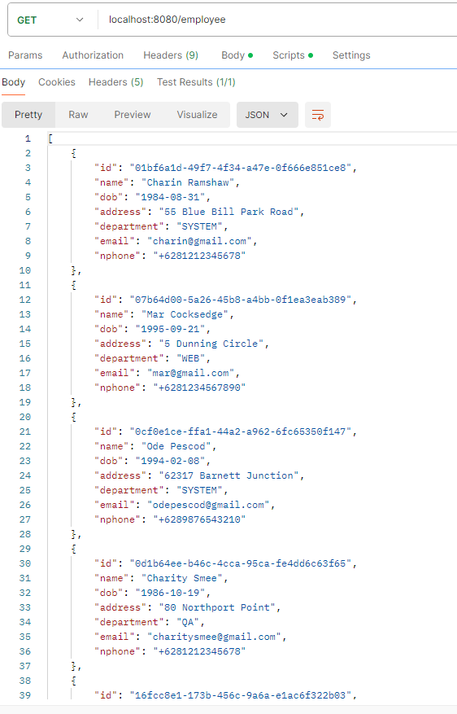

<br>

- `POST employee with wrong input (name, id, email)`

  `Wrong Email type`
  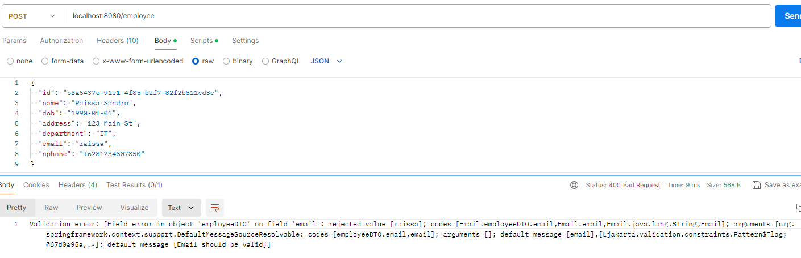

  <br>

  `Wrong name (Contain number or Blank)`
  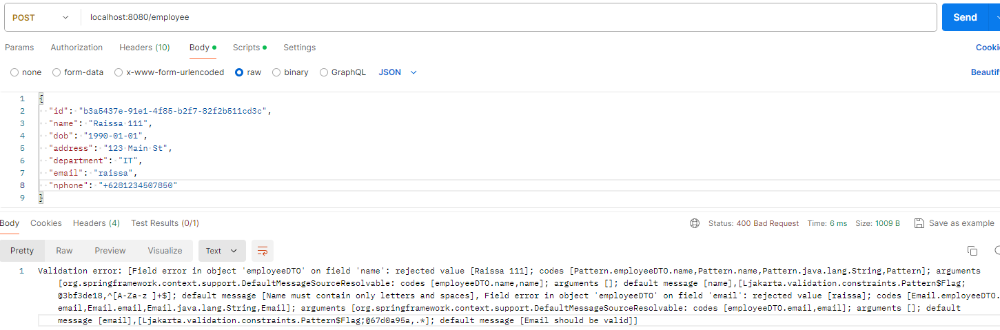

  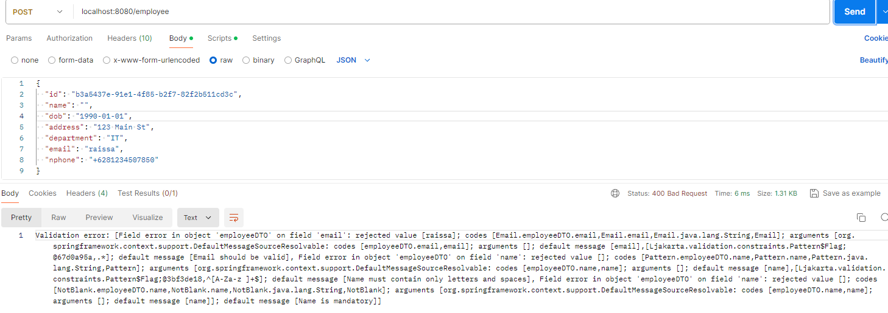

  <br>
