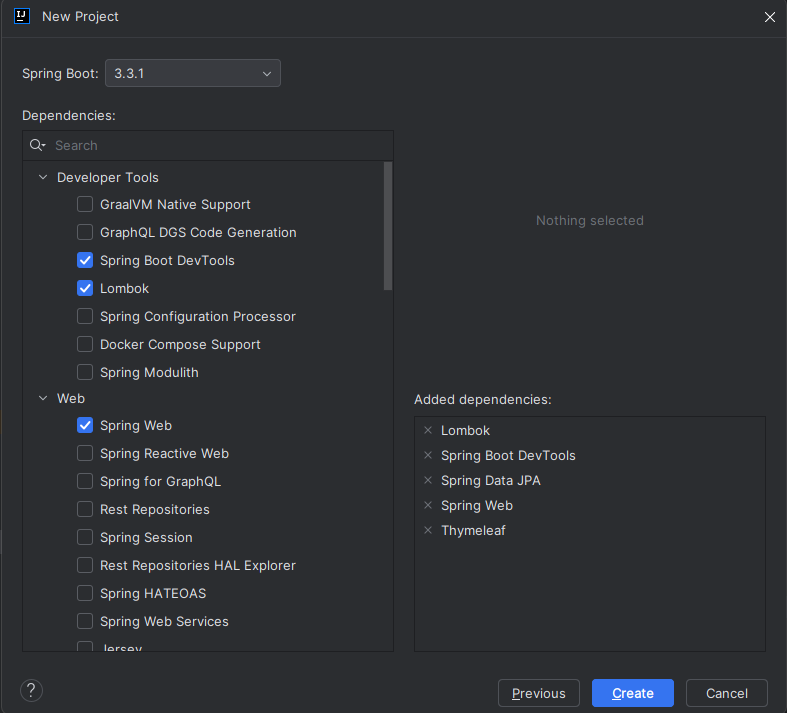
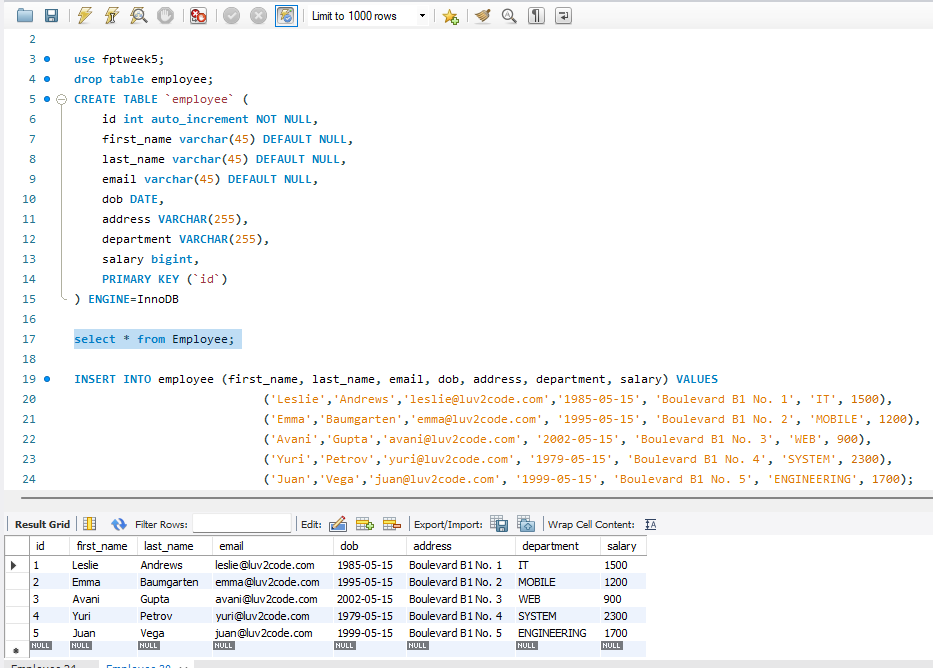
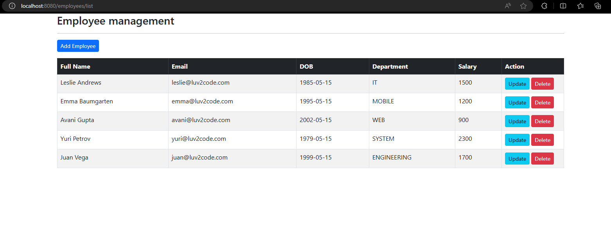
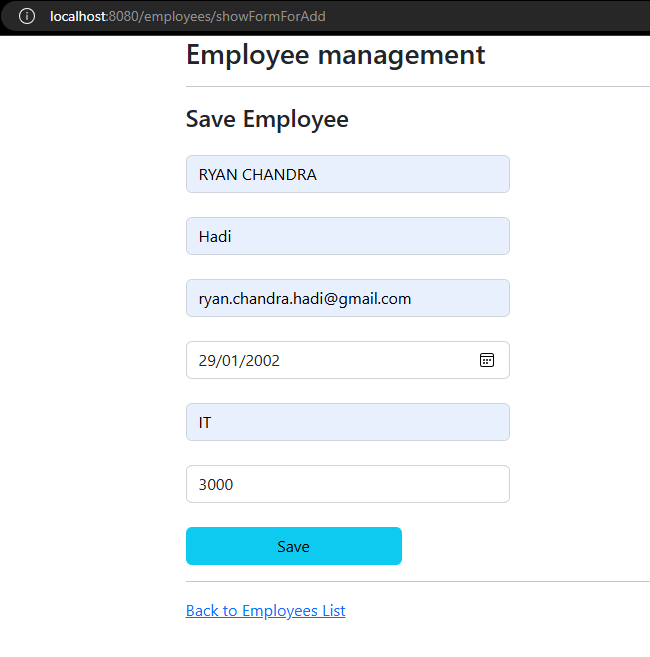
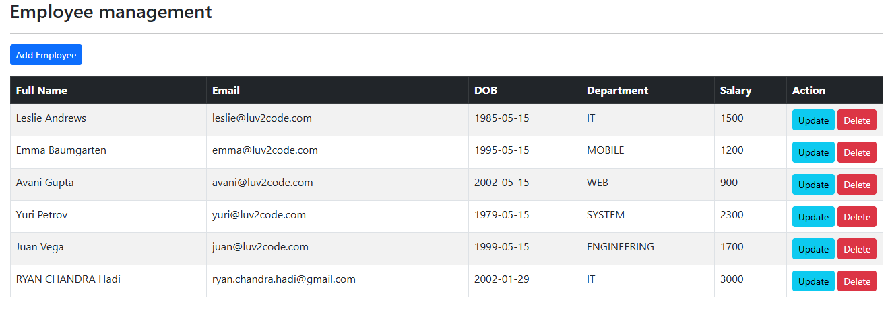
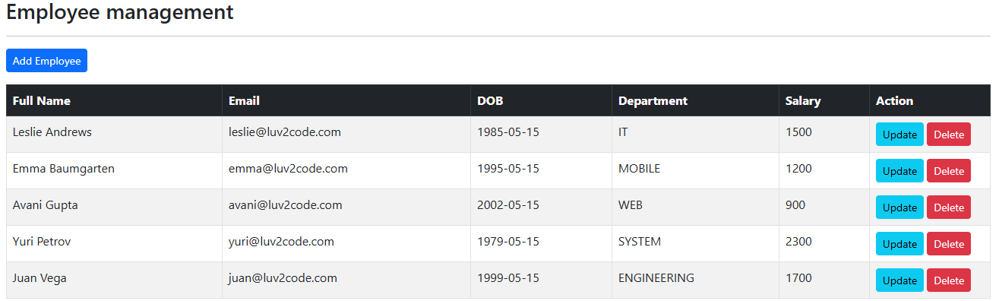
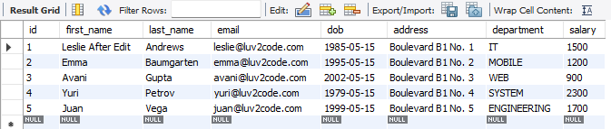

# Running Spring Boot Thymeleaf

`Objective: `Running spring boot project with thymeleaf.

## Initialize Spring Boot Project

- Choose `Java, Maven, Java Version 17, and Jar`
  

  <br>

- Add `Lombok, Spring Boot DevTools, Spring Data JPA, Spring Web, and Thymeleaf` as our dependencies
  

  <br>

- Create a Database for Employee in `Mysql Workbench`
  

  <br>

- Configure our database ini applications properties like shown

  ```java
  spring.application.name=assignment1

  spring.datasource.driver-class-name=com.mysql.jdbc.Driver
  spring.datasource.url=jdbc:mysql://localhost:3306/fptweek5
  spring.datasource.username=root
  spring.datasource.password=Tsel@2020
  ```

  <br>

- Create [`employee Model`](src/main/java/org/assignment1/assignment1/model/Employee.java) to receive employee entities (id,firstname,lastname,email, etc)

  - `@Entity` and `@Table(name = "employee")`

    - @Entity: Marks this class as an entity, representing a table in the database.
    - @Table(name = "employee"): Specifies the name of the database table where this entity's data will be stored (employee in this case).

    <br>

  - Fields and Annotations:

    - Primary Key (id):
      - @Id: Marks the id field as the primary key of the employee table.
      - @GeneratedValue(strategy = GenerationType.IDENTITY): Specifies that the id field is auto-generated by the database (using an identity column).
      - @Column(name = "id"): Maps the id field to the id column in the database table.

    <br>

  - Lombok Annotations (`@Getter and @Setter`)

    - @Getter and @Setter: These annotations are from Lombok library.
    - @Getter: Automatically generates getter methods for all fields.
    - @Setter: Automatically generates setter methods for all non-final fields.

<br>

- Create [EmployeeRepository](src/main/java/org/assignment1/assignment1/repository/EmployeeRepository.java) for providing JPA Spring data

  - extends JpaRepository<Employee, Integer>

    - Purpose:

      - JpaRepository is an interface provided by Spring Data JPA.
      - Employee: Specifies the entity type that this repository manages (Employee in this case).
      - Integer: Specifies the type of the primary key of the Employee entity (int in the Employee class).

    <br>

    - Inheritance:
      - By extending JpaRepository<Employee, Integer>, EmployeeRepository inherits several methods for working with Employee entities, such as saving, deleting, and querying. 2. List<Employee> findAllByOrderByLastNameAsc()

    <br>

    - List<Employee> findAllByOrderByLastNameAsc()
      - Method Declaration:
        - findAllByOrderByLastNameAsc: This method follows Spring Data JPA's naming convention for query methods.
        - Functionality:
          - findAll: Retrieves all Employee entities from the database.
          - OrderByLastNameAsc: Orders the results by the lastName attribute in ascending order.
        - Return Type:
          - Returns a list (List<Employee>) of Employee entities ordered by last name in ascending order.

<br>

- Create [`EmployeeService`](src/main/java/org/assignment1/assignment1/service/EmployeeService.java) and [`EmployeeServiceImpl`](src/main/java/org/assignment1/assignment1/service/impl/EmployeeServiceImpl.java) to defining the contract for managing Employee entities. Implementations of EmployeeService would typically interact with a repository (e.g., EmployeeRepository) to perform such as `findAll`, `findBy` operations on the database.

  - List<Employee> `findAll()`

    - Purpose: Retrieves all employees from the database.
    - Return Type: List<Employee>: A list containing all Employee entities stored in the database.
    - Usage: Typically used to fetch and display a list of all employees in the UI or to perform operations that require accessing all employees.

    <br>

  - Employee `findById(int id)`

    - Purpose: Retrieves an employee by their unique identifier (id).
    - Parameters: int id: The unique identifier of the employee to retrieve.
    - Return Type: Employee: The Employee entity with the specified id, or null if no employee with that id exists.
    - Usage: Used when displaying detailed information about a specific employee or when performing operations specific to an individual employee.

    <br>

  - void `save(Employee employee)`

    - Purpose: Saves or updates an employee entity in the database.
    - Parameters: Employee employee: The Employee object to be saved or updated.
    - Return Type: void: Typically, no return value is expected (void method).
    - Usage: Used when adding a new employee (if employee.id is null) or updating an existing employee (if employee.id is not null).

    <br>

  - void `deleteById(int id)`
    - Purpose: Deletes an employee from the database by their unique identifier (id).
    - Parameters: int id: The unique identifier of the employee to delete.
    - Return Type: void: Typically, no return value is expected (void method).
    - Usage: Used when removing an employee from the system or database.

<br>

- Create the [`EmployeeController`](src/main/java/org/assignment1/assignment1/controller/EmployeeController.java) that uses EmployeeService to perform CRUD operations on Employee entities. EmployeeController class is a Spring MVC controller that handles web requests related to employee management.

  - Annotations and Imports
    - @AllArgsConstructor:
      - Automatically generates a constructor with one parameter for each field in the class.
      - Used here to generate a constructor for EmployeeController that takes EmployeeService as a parameter.
    - @Controller:
      - Indicates that this class is a Spring MVC controller.
      - It is used to handle web requests and return views.
    - @RequestMapping("/employees"):
      - Specifies that all request mappings in this controller will be prefixed with /employees.
      - E.g., /list will map to /employees/list.

  <br>

  - Dependency Injection
    - private final EmployeeService employeeService:
      - Dependency injected via constructor (due to @AllArgsConstructor).
      - This service is used to handle business logic related to employees.

  <br>

  - Request Handlers

    - @GetMapping("/list")
      - Purpose: Handles GET requests to /employees/list.
      - Process:
        - Retrieves a list of all employees from the employeeService.
        - Adds this list to the model with the key "employees".
        - Returns the view name "list-employees" to display the list.

    <br>

    - @GetMapping("/showFormForAdd")
      - Purpose: Handles GET requests to /employees/showFormForAdd.
      - Process:
        - Creates a new Employee object.
        - Adds this object to the model with the key "employee".
        - Returns the view name "employee-form" to display a form for adding a new employee.

    <br>

    - @PostMapping("/showFormForUpdate")
      - Purpose: Handles POST requests to /employees/showFormForUpdate.
      - Parameters:
        - @RequestParam("employeeId") int id: Retrieves the employeeId from the request parameters.
        - Model theModel: Model to pass data to the view.
      - Process:
        - Retrieves the employee with the given id from the employeeService.
        - Adds this employee to the model with the key "employee".
        - Returns the view name "employee-form" to display a form pre-populated with the employee's data for updating.

    <br>

    - @PostMapping("/save")
      - Purpose: Handles POST requests to /employees/save.
      - Parameters:
        - @ModelAttribute("employee") Employee theEmployee: Binds form data to an Employee object.
      - Process:
        - Saves the employee using the employeeService.
        - Redirects to /employees/list to display the updated list of employees (prevents duplicate form submissions).

    <br>

    - @PostMapping("/delete")
      - Purpose: Handles POST requests to /employees/delete.
      - Parameters:
        - @RequestParam("employeeId") int id: Retrieves the employeeId from the request parameters.
      - Process:
        - Deletes the employee with the given id using the employeeService.
        - Redirects to /employees/list to display the updated list of employees.

<br>

- Create the page to display [`list`](src/main/resources/templates/list-employees.html) of employees and page [`form`](src/main/resources/templates/employee-form.html) to update and add employees.

  - Display to see all list of employees
    

  <br>

  - Display to add employee and the result after

     

  <br>

  - Display after Delete one employee

     

  <br>

  - Display form Update and after update

     

  <br>

  - Result on database

    
