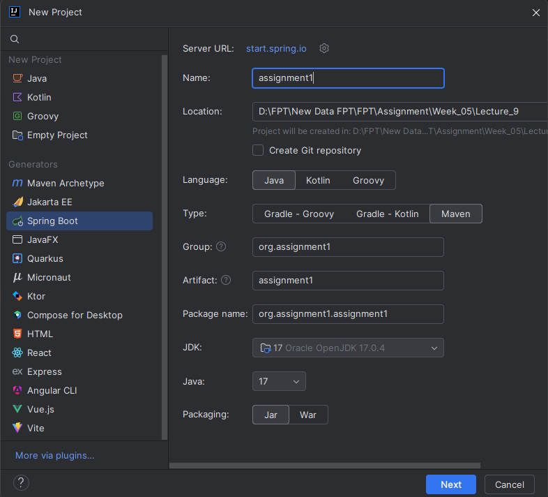
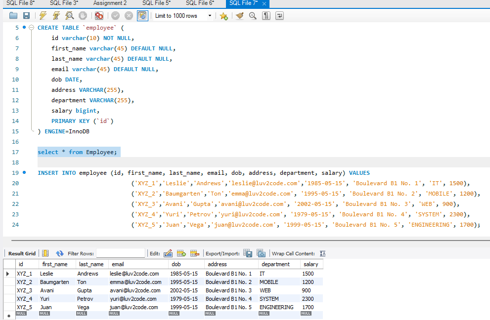
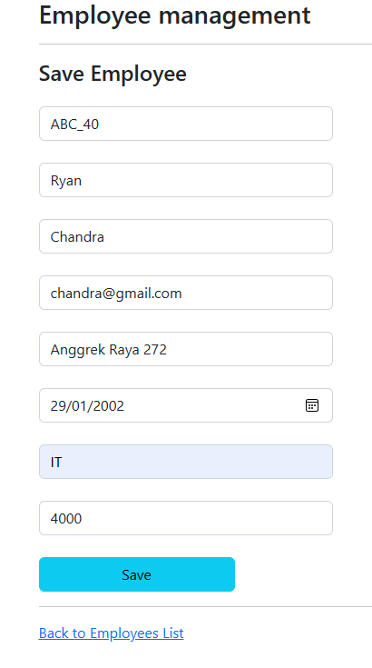
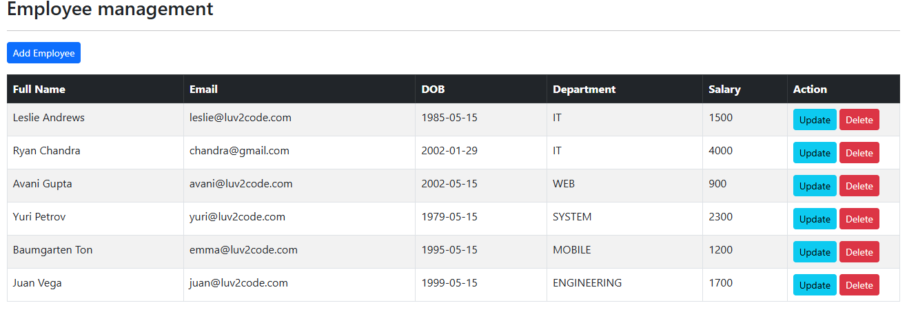
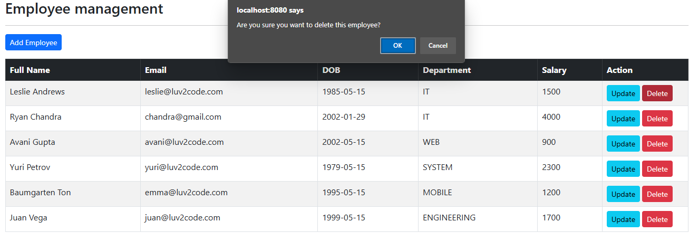
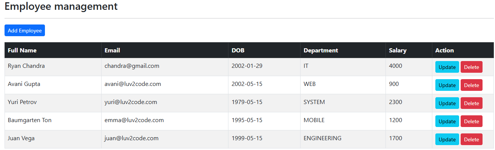
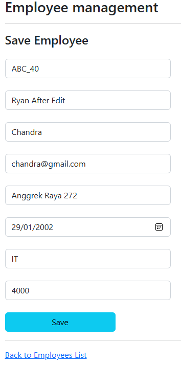
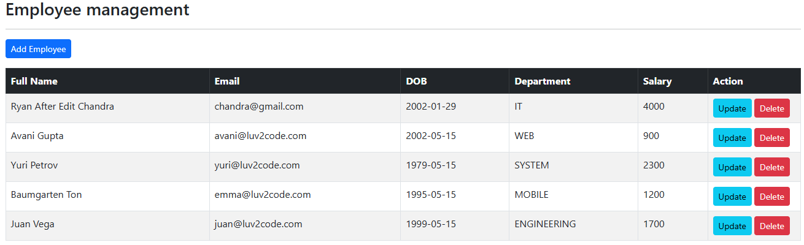
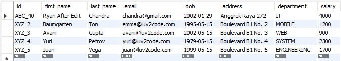
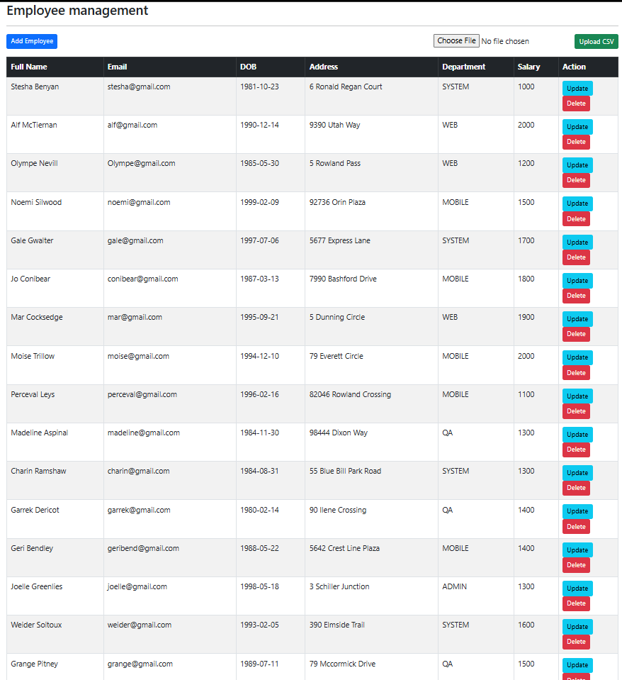

# Running Spring Boot Thymeleaf

`Objective: `Add Feature for apply employee from data csv.

## Initialize Spring Boot Project

- Choose `Java, Maven, Java Version 17, and Jar`
  

  <br>

- Add `Lombok, Spring Boot DevTools, Spring Data JPA, Spring Web, and Thymeleaf` as our dependencies
  

  <br>

- Create a Database for Employee in `Mysql Workbench`
  

  <br>

- Configure our database ini applications properties like shown

  ```java
  spring.application.name=assignment1

  spring.datasource.driver-class-name=com.mysql.jdbc.Driver
  spring.datasource.url=jdbc:mysql://localhost:3306/fptweek5
  spring.datasource.username=root
  spring.datasource.password=Tsel@2020
  ```

  <br>

- Create [`employee Model`](src/main/java/org/assignment1/assignment2/model/Employee.java) to receive employee entities (id,firstname,lastname,email, etc)

  - `@Entity` and `@Table(name = "employee")`

    - @Entity: Marks this class as an entity, representing a table in the database.
    - @Table(name = "employee"): Specifies the name of the database table where this entity's data will be stored (employee in this case).

    <br>

  - Fields and Annotations:

    - Primary Key (id):
      - @Id: Marks the id field as the primary key of the employee table.
      - @GeneratedValue(strategy = GenerationType.IDENTITY): Specifies that the id field is auto-generated by the database (using an identity column).
      - @Column(name = "id"): Maps the id field to the id column in the database table.

    <br>

  - Lombok Annotations (`@Getter and @Setter`)

    - @Getter and @Setter: These annotations are from Lombok library.
    - @Getter: Automatically generates getter methods for all fields.
    - @Setter: Automatically generates setter methods for all non-final fields.

<br>

- Create [EmployeeRepository](src/main/java/org/assignment1/assignment2/repository/EmployeeRepository.java) for providing JPA Spring data

  - extends JpaRepository<Employee, String>

    - Purpose:

      - JpaRepository is an interface provided by Spring Data JPA.
      - Employee: Specifies the entity type that this repository manages (Employee in this case).
      - String: Specifies the type of the primary key of the Employee entity (String in the Employee class).

    <br>

    - Inheritance:
      - By extending JpaRepository<Employee, String>, EmployeeRepository inherits several methods for working with Employee entities, such as saving, deleting, and querying. 2. List<Employee> findAllByOrderByLastNameAsc()

    <br>

    - List<Employee> findAllByOrderByLastNameAsc()
      - Method Declaration:
        - findAllByOrderByLastNameAsc: This method follows Spring Data JPA's naming convention for query methods.
        - Functionality:
          - findAll: Retrieves all Employee entities from the database.
          - OrderByLastNameAsc: Orders the results by the lastName attribute in ascending order.
        - Return Type:
          - Returns a list (List<Employee>) of Employee entities ordered by last name in ascending order.

<br>

- Create [`EmployeeService`](src/main/java/org/assignment1/assignment2/service/EmployeeService.java) and [`EmployeeServiceImpl`](src/main/java/org/assignment1/assignment2/service/impl/EmployeeServiceImpl.java) to defining the contract for managing Employee entities. Implementations of EmployeeService would typically interact with a repository (e.g., EmployeeRepository) to perform such as `findAll`, `findBy` operations on the database.

  - List<Employee> `findAll()`

    - Purpose: Retrieves all employees from the database.
    - Return Type: List<Employee>: A list containing all Employee entities stored in the database.
    - Usage: Typically used to fetch and display a list of all employees in the UI or to perform operations that require accessing all employees.

    <br>

  - Employee `findById(String id)`

    - Purpose: Retrieves an employee by their unique identifier (id).
    - Parameters: String id: The unique identifier of the employee to retrieve.
    - Return Type: Employee: The Employee entity with the specified id, or null if no employee with that id exists.
    - Usage: Used when displaying detailed information about a specific employee or when performing operations specific to an individual employee.

    <br>

  - void `save(Employee employee)`

    - Purpose: Saves or updates an employee entity in the database.
    - Parameters: Employee employee: The Employee object to be saved or updated.
    - Return Type: void: Typically, no return value is expected (void method).
    - Usage: Used when adding a new employee (if employee.id is null) or updating an existing employee (if employee.id is not null).

    <br>

  - void `deleteById(String id)`
    - Purpose: Deletes an employee from the database by their unique identifier (id).
    - Parameters: String id: The unique identifier of the employee to delete.
    - Return Type: void: Typically, no return value is expected (void method).
    - Usage: Used when removing an employee from the system or database.

<br>

- Create [`CSVUtils`](src/main/java/org/assignment1/assignment2/utils/CSVUtils.java) and [`DateUtils`](src/main/java/org/assignment1/assignment2/utils/DateUtils.java) to manage di csv and date parsing date from data `csv`

  - Methods

    - public static boolean hasCSVFormat(MultipartFile file)

      - Purpose: Checks if the given file is in CSV format.
      - Parameters: MultipartFile file: The file to check.
      - Returns:
        - true if the file's content type matches text/csv.
        - false otherwise.
      - Logic: Compares the file's content type with the TYPE field to determine if it is a CSV file.

      <br>

    - public static List<Employee> csvToEmployees(InputStream is) throws CsvValidationException

      - Purpose: Parses a CSV file input stream and converts it into a list of Employee objects.
      - Parameters: InputStream is: The input stream of the CSV file to parse.
      - Returns: A list of Employee objects created from the CSV file.
      - Logic:
        - Open CSV Reader: Initializes a CSVReader to read the input stream.
        - Initialize List: Creates an empty list to hold Employee objects.
        - Read CSV Line by Line:
          - For each line (record) in the CSV:
            - Create a new Employee object.
            - Set the Employee object's fields (id, firstName, lastName, dob, address, department, salary, email) using the corresponding values from the CSV record.
            - Add the Employee object to the list.
        - Return List: After processing all records, returns the list of Employee objects.
        - Exception Handling: If an IOException occurs, throws a RuntimeException with a relevant message.

      <br>

      - DateUtils
        - Class and Field
          - Class: DateUtils
          - Field: DATE_FORMATTER
          - Type: DateTimeFormatter
          - Purpose: Defines the date format pattern "dd/MM/yyyy" which is used to parse date strings.
        - Method
          - Method: parseDate
          - Parameters: String dateString - A string representing a date.
          - Returns: LocalDate - The parsed LocalDate object.
          - Logic:
            - Uses LocalDate.parse(dateString, DATE_FORMATTER) to convert the dateString into a LocalDate object based on the defined pattern.

<br>

- Create the [`EmployeeController`](src/main/java/org/assignment1/assignment2/controller/EmployeeController.java) that uses EmployeeService to perform CRUD operations on Employee entities. EmployeeController class is a Spring MVC controller that handles web requests related to employee management.

  - Annotations and Imports
    - @AllArgsConstructor:
      - Automatically generates a constructor with one parameter for each field in the class.
      - Used here to generate a constructor for EmployeeController that takes EmployeeService as a parameter.
    - @Controller:
      - Indicates that this class is a Spring MVC controller.
      - It is used to handle web requests and return views.
    - @RequestMapping("/employees"):
      - Specifies that all request mappings in this controller will be prefixed with /employees.
      - E.g., /list will map to /employees/list.

  <br>

  - Dependency Injection
    - private final EmployeeService employeeService:
      - Dependency injected via constructor (due to @AllArgsConstructor).
      - This service is used to handle business logic related to employees.

  <br>

  - Request Handlers

    - @GetMapping("/list")
      - Purpose: Handles GET requests to /employees/list.
      - Process:
        - Retrieves a list of all employees from the employeeService.
        - Adds this list to the model with the key "employees".
        - Returns the view name "list-employees" to display the list.

    <br>

    - @GetMapping("/showFormForAdd")
      - Purpose: Handles GET requests to /employees/showFormForAdd.
      - Process:
        - Creates a new Employee object.
        - Adds this object to the model with the key "employee".
        - Returns the view name "employee-form" to display a form for adding a new employee.

    <br>

    - @PostMapping("/showFormForUpdate")
      - Purpose: Handles POST requests to /employees/showFormForUpdate.
      - Parameters:
        - @RequestParam("employeeId") String id: Retrieves the employeeId from the request parameters.
        - Model theModel: Model to pass data to the view.
      - Process:
        - Retrieves the employee with the given id from the employeeService.
        - Adds this employee to the model with the key "employee".
        - Returns the view name "employee-form" to display a form pre-populated with the employee's data for updating.

    <br>

    - @PostMapping("/save")
      - Purpose: Handles POST requests to /employees/save.
      - Parameters:
        - @ModelAttribute("employee") Employee theEmployee: Binds form data to an Employee object.
      - Process:
        - Saves the employee using the employeeService.
        - Redirects to /employees/list to display the updated list of employees (prevents duplicate form submissions).

    <br>

    - @PostMapping("/delete")
      - Purpose: Handles POST requests to /employees/delete.
      - Parameters:
        - @RequestParam("employeeId") String id: Retrieves the employeeId from the request parameters.
      - Process:
        - Deletes the employee with the given id using the employeeService.
        - Redirects to /employees/list to display the updated list of employees.

    <br>

    - @PostMapping("/saveAll")
      - Purpose: The uploadCsv method handles the upload and processing of a CSV file containing employee data. It reads the data from the CSV file, converts it into Employee objects, and saves them to the database. If any errors occur during this process, appropriate error messages are displayed.
      - Parameters: MultipartFile file: The CSV file uploaded by the user. It contains the employee data to be processed and saved. Model model: The Spring Model object used to pass attributes to the view, such as error messages.
      - Process:
        - Validate the file format.
        - Convert CSV content to Employee objects.
        - Save the Employee objects to the database.
        - Handle any errors during processing and display appropriate error messages.
        - Redirect to the employee list page upon success

<br>

- Create the page to display [`list page`](src/main/resources/templates/list-employees.html) of employees and page [`form`](src/main/resources/templates/employee-form.html) to update and add employees.

  - Display to see all list of employees
    

  <br>

  - Display to add employee and the result after

     

  <br>

  - Display after Delete one employee

     

  <br>

  - Display form Update and after update

     

  <br>

  - Result on database

    

<br>

- Create add employee button via `csv` on [`list page`](src/main/resources/templates/list-employees.html)

     
