# Hibernate Cache in Java Spring Boot

Hibernate caching in Java is an optimization technique used to improve the performance of applications by reducing the number of database queries. It involves storing objects or query results in memory so that subsequent requests can be served more quickly. Hibernate supports two levels of caching:

- First-Level Cache: Hibernate uses a session-level cache, also known as a first-level cache, to store the data that is currently being used by a specific session. When an entity is loaded or updated for the first time in a session, it is stored in the session-level cache. Any subsequent request to fetch the same entity within the same session will be served from the cache, avoiding a database round-trip. The session-level cache is enabled by default and cannot be disabled.
- Second-Level Cache: Hibernate also supports a second-level cache, which is a shared cache across multiple sessions. This cache stores data that is frequently used across different sessions, reducing the number of database queries and improving the overall performance of the application. The second-level cache can be configured with various caching providers, such as Ehcache, Infinispan, and Hazelcast.

<br>

| `Feature `             | `First-Level Cache`                                     | `Second-Level Cache`                                                                               |
| ---------------------- | ------------------------------------------------------- | -------------------------------------------------------------------------------------------------- |
| **Scope**              | Session-level (per Hibernate session)                   | SessionFactory-level (shared across sessions)                                                      |
| **Enabled by Default** | Yes                                                     | No (must be explicitly configured)                                                                 |
| **Cache Provider**     | Internal to Hibernate                                   | External providers (e.g., EhCache, Infinispan, Redis)                                              |
| **Configuration**      | No additional configuration needed                      | Requires configuration in `hibernate.cfg.xml` or `application.properties` and cache provider setup |
| **Usage**              | Automatically used by Hibernate within the same session | Must be annotated and configured on entities or collections                                        |
| **Entity Caching**     | Yes                                                     | Yes                                                                                                |
| **Query Caching**      | No                                                      | Yes (must be explicitly enabled)                                                                   |
| **Performance Impact** | Reduces database hits within the same session           | Reduces database hits across multiple sessions                                                     |
| **Memory Consumption** | Low (limited to a single session's lifecycle)           | Higher (shared across sessions and must be managed)                                                |
| **Eviction Policy**    | Not applicable (cache lives as long as the session)     | Configurable eviction policies based on cache provider                                             |
| **Consistency**        | Consistent within the session                           | Requires proper configuration to avoid stale data                                                  |
| **Typical Use Case**   | Repeated access to the same entity within a session     | Applications with multiple sessions needing to share cached entities and query results             |

<br>

Benefits of Using `Hibernate Caching`

- `Improved Performance:` Reduces database access time by serving frequently accessed data from the cache.
- `Reduced Database Load:` Minimizes the number of database queries, lowering the load on the database server.
- `Scalability:` Helps in scaling the application by efficiently managing memory and reducing I/O operations.

<br>
<br>

# Create the entities based on ERD

`Objective:` Create the project that shows employees with their relationship with another entities.

Here is the projective of my project.

```plaintext
spring-boot-project
├── src
│ ├── main
│ │ ├── java
│ │ │ ├── org
│ │ │ │ ├── assignment1
│ │ │ │ │ ├── assignment1
│ │ │ │ │ │ ├── controller
│ │ │ │ │ │ │ ├── DepartmentController.java
│ │ │ │ │ │ │ ├── EmployeeController.java
│ │ │ │ │ │ │ ├── SalaryController.java
│ │ │ │ │ │ │ ├── TitleController.java
│ │ │ │ │ │ │ ├── DeptEmployController.java
│ │ │ │ │ │ │ ├── DeptManagerController.java
│ │ │ │ │ │ ├── dto
│ │ │ │ │ │ │ ├── DepartmentDTO.java
│ │ │ │ │ │ │ ├── DeptEmploysDTO.java
│ │ │ │ │ │ │ ├── DeptManagerDTO.java
│ │ │ │ │ │ │ ├── EmployeeDTO.java
│ │ │ │ │ │ │ ├── SalaryDTO.java
│ │ │ │ │ │ │ ├── TitleDTO.java
│ │ │ │ │ │ │ ├── SearchEmployeeDynamicDTO.java
│ │ │ │ │ │ ├── entity
│ │ │ │ │ │ │ ├── Department.java
│ │ │ │ │ │ │ ├── DeptEmploy.java
│ │ │ │ │ │ │ ├── DeptEmployId.java
│ │ │ │ │ │ │ ├── DeptManager.java
│ │ │ │ │ │ │ ├── DeptManagerId.java
│ │ │ │ │ │ │ ├── Employee.java
│ │ │ │ │ │ │ ├── Gender.java
│ │ │ │ │ │ │ ├── Salary.java
│ │ │ │ │ │ │ ├── SalaryId.java
│ │ │ │ │ │ │ ├── Title.java
│ │ │ │ │ │ │ ├── TitleId.java
│ │ │ │ │ │ ├── mapper
│ │ │ │ │ │ │ ├── DepartmentMapper.java
│ │ │ │ │ │ │ ├── DeptEmploysMapper.java
│ │ │ │ │ │ │ ├── DeptManagerMapper.java
│ │ │ │ │ │ │ ├── EmployeeMapper.java
│ │ │ │ │ │ │ ├── SalaryMapper.java
│ │ │ │ │ │ │ ├── TitleMapper.java
│ │ │ │ │ │ ├── repository
│ │ │ │ │ │ │ ├── DepartmentRepository.java
│ │ │ │ │ │ │ ├── DeptEmployRepository.java
│ │ │ │ │ │ │ ├── DeptManagerRepository.java
│ │ │ │ │ │ │ ├── EmployeeRepository.java
│ │ │ │ │ │ │ ├── SalaryRepository.java
│ │ │ │ │ │ │ ├── TitleRepository.java
│ │ │ │ │ │ ├── service
│ │ │ │ │ │ │ ├── DepartmentService.java
│ │ │ │ │ │ │ ├── DeptEmployService.java
│ │ │ │ │ │ │ ├── DeptManagerService.java
│ │ │ │ │ │ │ ├── EmployeeService.java
│ │ │ │ │ │ │ ├── SalaryService.java
│ │ │ │ │ │ │ ├── TitleService.java
│ │ │ │ │ │ ├── specification
│ │ │ │ │ │ │ ├── EmployeeSpecification.java
├── pom.xml (or build.gradle)
```

<br>

- `Entity:` Represents database tables with JPA annotations.
  - [`Department.java`](src/main/java/org/assignment1/assignment1/entity/Department.java)
  - [`DeptEmploy.java`](src/main/java/org/assignment1/assignment1/entity/DeptEmploy.java)
  - [`DeptEmployId.java`](src/main/java/org/assignment1/assignment1/entity/DeptEmployId.java)
  - [`DeptManager.java`](src/main/java/org/assignment1/assignment1/entity/DeptManager.java)
  - [`DeptManagerId.java`](src/main/java/org/assignment1/assignment1/entity/DeptManagerId.java)
  - [`Employee.java`](src/main/java/org/assignment1/assignment1/entity/Employee.java)
  - [`Gender.java`](src/main/java/org/assignment1/assignment1/entity/Gender.java)
  - [`Salary.java`](src/main/java/org/assignment1/assignment1/entity/Salary.java)
  - [`SalaryId.java`](src/main/java/org/assignment1/assignment1/entity/SalaryId.java)
  - [`Title.java`](src/main/java/org/assignment1/assignment1/entity/Title.java)
  - [`TitleId.java`](src/main/java/org/assignment1/assignment1/entity/TitleId.java)

On this entity I declare @Table and @Column to create the Database directly from our entity using this on my [applications properties](src/main/resources/application.properties)

```java
spring.jpa.properties.hibernate.dialect=org.hibernate.dialect.MySQL8Dialect
spring.jpa.hibernate.ddl-auto=create-drop
spring.jpa.show-sql=true
spring.jpa.properties.hibernate.formate_sql=true;
```

<br>

- `spring.jpa.properties.hibernate.dialect=org.hibernate.dialect.MySQL8Dialect:`
  - This property sets the SQL dialect for Hibernate to use. The dialect is a configuration setting that tells Hibernate how to generate SQL for the specific database you're using. In this case, it's set to MySQL8Dialect, which means Hibernate will generate SQL optimized for MySQL 8.

<br>

- `spring.jpa.hibernate.ddl-auto=create-drop:`
  - This property defines the behavior of the database schema management. The value create-drop means that Hibernate will drop the existing database schema and create a new one each time the application starts. This is useful for development and testing but should not be used in production as it will erase all data on each restart.

<br>

- `spring.jpa.show-sql=true:`
  - This property enables the logging of SQL statements generated by Hibernate. When set to true, Hibernate will print the generated SQL statements to the console, which can be useful for debugging and understanding what SQL queries are being executed.

<br>

- `spring.jpa.properties.hibernate.format_sql=true:`
  - This property ensures that the SQL statements printed by Hibernate are formatted nicely. When set to true, the SQL statements will be easier to read in the logs, as they will be printed in a more structured and indented format.

Here is the result seeing from mySql Workbench ERD
<br>

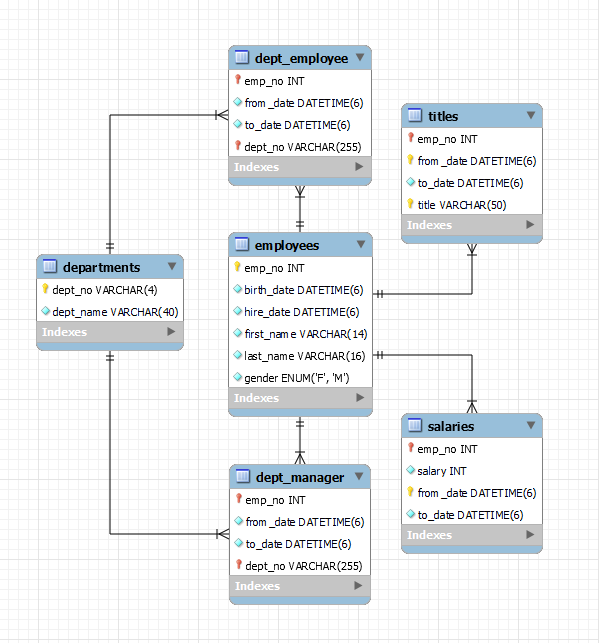
<br>

- `Controller:` Handles HTTP requests and maps them to service layer methods.
  - [`DepartmentController.java`](src/main/java/org/assignment1/assignment1/controller/DepartmentController.java)
  - [`EmployeeController.java`](src/main/java/org/assignment1/assignment1/controller/EmployeeController.java)
  - [`SalaryController.java`](src/main/java/org/assignment1/assignment1/controller/SalaryController.java)
  - [`TitleController.java`](src/main/java/org/assignment1/assignment1/controller/TitleController.java)
  - [`DeptManagerController.java`](src/main/java/org/assignment1/assignment1/controller/DeptManagerController.java)
  - [`DeptEmployController.java`](src/main/java/org/assignment1/assignment1/controller/DeptEmployController.java)

<br>

- `DTO:` Data Transfer Objects used for transferring data between layers.
  - [`DepartmentDTO.java`](src/main/java/org/assignment1/assignment1/dto/DepartmentDTO.java)
  - [`DeptEmploysDTO.java`](src/main/java/org/assignment1/assignment1/dto/DeptEmploysDTO.java)
  - [`DeptManagerDTO.java`](src/main/java/org/assignment1/assignment1/dto/DeptManagerDTO.java)
  - [`EmployeeDTO.java`](src/main/java/org/assignment1/assignment1/dto/EmployeeDTO.java)
  - [`SalaryDTO.java`](src/main/java/org/assignment1/assignment1/dto/SalaryDTO.java)
  - [`TitleDTO.java`](src/main/java/org/assignment1/assignment1/dto/TitleDTO.java)
  - [`SearchEmployeeDynamicDTO.java`](src/main/java/org/assignment1/assignment1/dto/SearchEmployeeDynamicDTO.java)

<br>

- `Mapper:` Uses MapStruct to map between entity and DTO objects.
  - [`DepartmentMapper.java`](src/main/java/org/assignment1/assignment1/mapper/DepartmentMapper.java)
  - [`DeptEmploysMapper.java`](src/main/java/org/assignment1/assignment1/mapper/DeptEmploysMapper.java)
  - [`DeptManagerMapper.java`](src/main/java/org/assignment1/assignment1/mapper/DeptManagerMapper.java)
  - [`EmployeeMapper.java`](src/main/java/org/assignment1/assignment1/mapper/EmployeeMapper.java)
  - [`SalaryMapper.java`](src/main/java/org/assignment1/assignment1/mapper/SalaryMapper.java)
  - [`TitleMapper.java`](src/main/java/org/assignment1/assignment1/mapper/TitleMapper.java)

<br>

- `Repository:` Extends JpaRepository to provide CRUD operations.
  - [`DepartmentRepository.java`](src/main/java/org/assignment1/assignment1/repository/DepartmentRepository.java)
  - [`DeptEmployRepository.java`](src/main/java/org/assignment1/assignment1/repository/DeptEmployRepository.java)
  - [`DeptManagerRepository.java`](src/main/java/org/assignment1/assignment1/repository/DeptManagerRepository.java)
  - [`EmployeeRepository.java`](src/main/java/org/assignment1/assignment1/repository/EmployeeRepository.java)
  - [`SalaryRepository.java`](src/main/java/org/assignment1/assignment1/repository/SalaryRepository.java)
  - [`TitleRepository.java`](src/main/java/org/assignment1/assignment1/repository/TitleRepository.java)

<br>

- `Service:` Contains business logic and calls repository methods.

  - [`DepartmentService.java`](src/main/java/org/assignment1/assignment1/service/DepartmentService.java)
  - [`DeptEmployService.java`](src/main/java/org/assignment1/assignment1/service/DeptEmployService.java)
  - [`DeptManagerService.java`](src/main/java/org/assignment1/assignment1/service/DeptManagerService.java)
  - [`EmployeeService.java`](src/main/java/org/assignment1/assignment1/service/EmployeeService.java)
  - [`SalaryService.java`](src/main/java/org/assignment1/assignment1/service/SalaryService.java)
  - [`TitleService.java`](src/main/java/org/assignment1/assignment1/service/TitleService.java)

<br>

- `Specification:` Defines criteria for queries using the Specification pattern.
  - [`EmployeeSpecification.java`](src/main/java/org/assignment1/assignment1/specifications/EmployeeSpecifications.java)

## Test the endpoints

In this project we add a data directly from [`SQL Query`](src/main/resources/fptweek6.sql) to test `getData`

- `GETAllData` Employee

  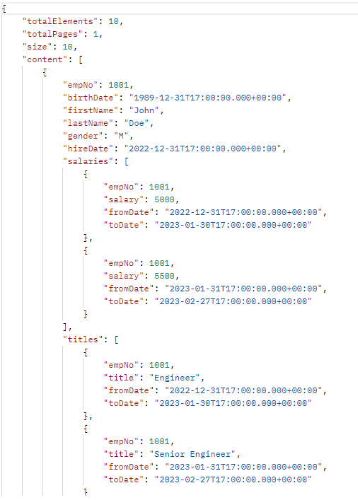

<br>

- `GETAllData` Departments

  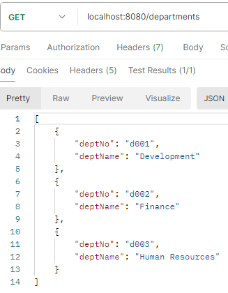

<br>

- `GETAllData` Titles

  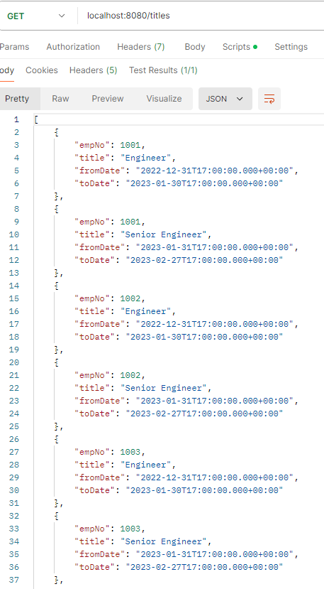

<br>

- `GETAllData` Salary

  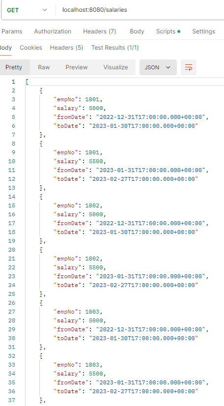

<br>

- `GETAllData` Department Employees

  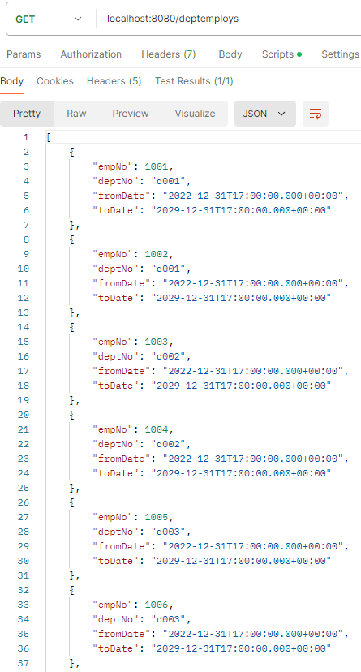

<br>

- `GETAllData` Department Managers

  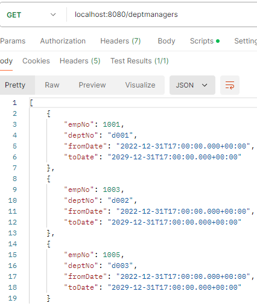

<br>

- `POSTData` Employee

  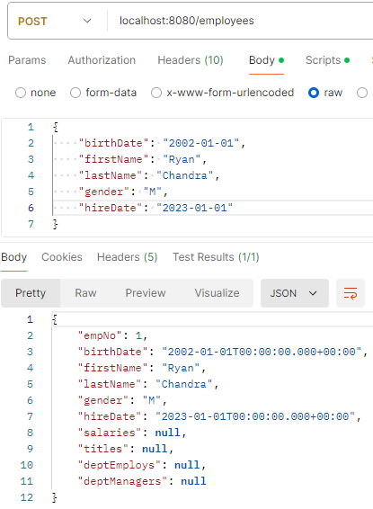

<br>

- `POSTData` Department

  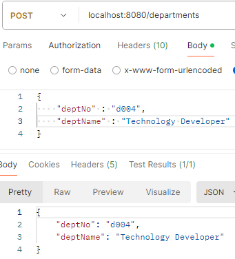

<br>

- `POSTData` Title

  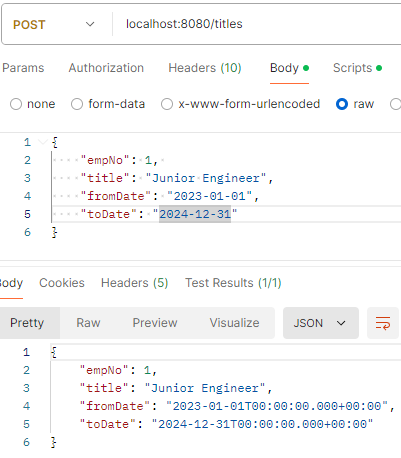

<br>

- `POSTData` Salary

  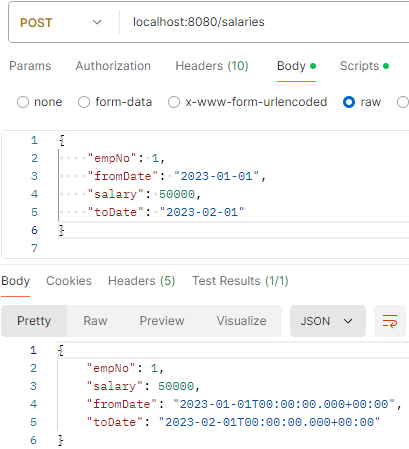

<br>

- `POSTData` Department Employee

  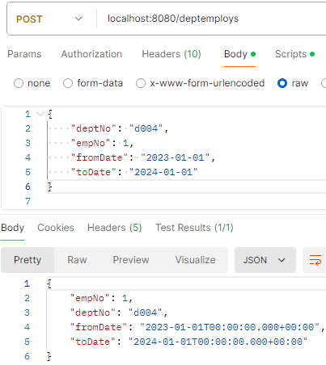

<br>

- `DELETEData and GETFindByID` Employee

  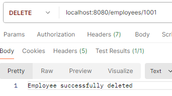
  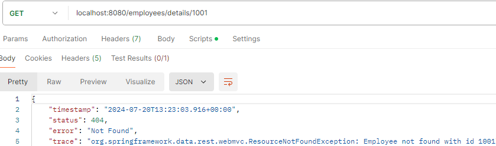

- `DELETEData and GETFindByID` Department

  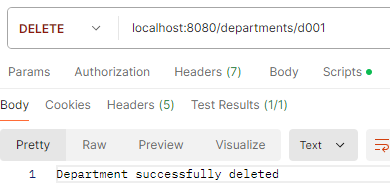
  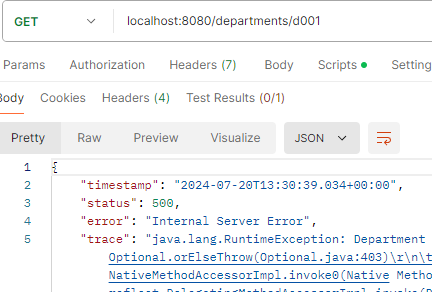

<br>

- `GETAllData Using Dynamical Criteria`

  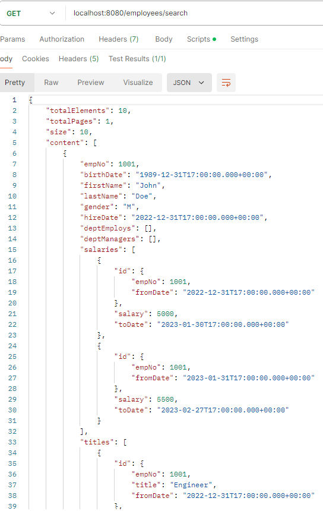

<br>

# `Composite Key`

In JPA (Java Persistence API), a composite key (or compound key) is a primary key that consists of two or more columns. Composite keys are used when a single column is not sufficient to uniquely identify a record in a table.

## Defining Composite Keys in JPA

There are two main approaches to defining composite keys in JPA:

- Using @EmbeddedId
- Using @IdClass

1. Using @EmbeddedId
   The @EmbeddedId annotation is used to mark a field as a composite primary key. This approach involves creating an embeddable class that represents the composite key.
   for example,

   - Create the Embeddable Key Class: [SalaryId.java](src/main/java/org/assignment1/assignment1/entity/SalaryId.java)
   - Use the Embeddable Key in the Entity: [Salary.java](src/main/java/org/assignment1/assignment1/entity/Salary.java)

<br>

2. Using @IdClass
   The @IdClass annotation is used to specify a separate class that contains the composite key fields. This approach involves creating a primary key class and using it in the entity.

   - Create the Primary Key Class

     ```java
     import java.io.Serializable;
     import java.util.Objects;

     public class CompositeKey implements Serializable {
         private String keyPart1;
         private String keyPart2;

         // Default constructor
         public CompositeKey() {}

         // Getters and Setters

         @Override
         public boolean equals(Object o) {
             if (this == o) return true;
             if (o == null || getClass() != o.getClass()) return false;
             CompositeKey that = (CompositeKey) o;
             return Objects.equals(keyPart1, that.keyPart1) && Objects.equals(keyPart2, that.keyPart2);
         }

         @Override
         public int hashCode() {
             return Objects.hash(keyPart1, keyPart2);
         }
     }
     ```

     <br>

   - Use the Primary Key Class in the Entity

     ```java
     import javax.persistence.*;

     @Entity
     @IdClass(CompositeKey.class)
     public class ExampleEntity {
         @Id
         private String keyPart1;
         @Id
         private String keyPart2;

         // Other fields

         // Getters and Setters
     }
     ```

<br>

Differences between `@EmbeddedId` and `@IdClass`

- `@EmbeddedId:`
  1. Uses an embedded class to represent the composite key.
  2. The embeddable class can be reused in multiple entities.
  3. More concise and often easier to understand.

<br>

- `@IdClass:`
  1. Uses a separate primary key class.
  2. The primary key class must have a default constructor, implement Serializable, equals(), and hashCode().
  3. More flexible for complex composite keys that involve relationships between entities.
