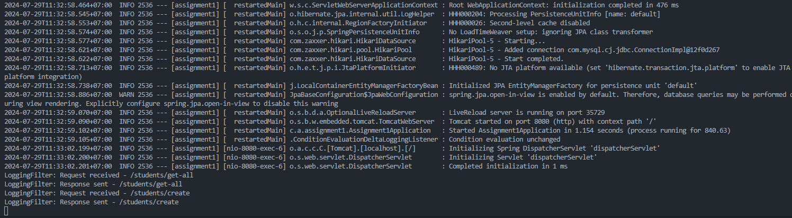

# Once Per Request Filter in Spring Boot

`OncePerRequestFilter` is a specialized filter in the Spring Framework that ensures a filter’s logic is executed only once per request. This prevents the filter from being invoked multiple times, even if the request is forwarded or dispatched multiple times within the server. It is particularly useful for tasks that should not be repeated within a single request, such as logging, authentication, or adding headers.

 

## Example with `Student` Entity

First we need [Student Entity](src/main/java/com/assignment1/assignment1/entity/Student.java), [Repository](src/main/java/com/assignment1/assignment1/repository/StudentRepository.java), and [Service](src/main/java/com/assignment1/assignment1/service/StudentService.java) with JPA.

In this example, a [LoggingFilter](src/main/java/com/assignment1/assignment1/filter/LoggingFilter.java) class extends OncePerRequestFilter to log request and response details.

`Explanations`

- `Extending OncePerRequestFilter:` By extending OncePerRequestFilter, the filter guarantees that doFilterInternal is called only once per request, even if the request is dispatched or forwarded multiple times.
- `doFilterInternal Method:` This method contains the filter’s main logic:
  - _Pre-Processing:_ The request URI is logged before passing control to the next filter or servlet in the chain.
  - _Filter Chain Continuation:_ filterChain.doFilter(request, response) allows the request to continue through the chain.
  - _Post-Processing:_ The response URI is logged after the request has been processed.

 

Next we can create the [config](src/main/java/com/assignment1/assignment1/config/FilterConfig.java) to register the Filter if it’s not being picked up automatically.

- FilterRegistrationBean is used to register the LoggingFilter with the Spring context.
- addUrlPatterns("/\*") specifies that the filter should apply to all incoming requests.

 

After that we can run the project and see the logging on terminal to check that our filter logic is executed only per request. On this project we try to create and get-all data of the student.

Picture above indicates that the LoggingFilter is working correctly. This log shows that the filter is invoked for each request and logs messages before and after the request is processed.

 

## Understanding `OncePerRequestFilter`

The OncePerRequestFilter ensures that the filter logic is executed only once per request, even if the request is dispatched to multiple servlets, filters, or includes. Here's how it works:

- Request Received Log: The log entry "LoggingFilter: Request received - /students/create" indicates that the filter has been applied once when the request is received for the /students/create endpoint.
- Response Sent Log: The log entry "LoggingFilter: Response sent - /students/create" indicates that the filter has also been applied once when the response is sent back after processing.

## Key Points About `OncePerRequestFilter`

- Single Execution Per Request: OncePerRequestFilter guarantees that its doFilterInternal method is only called once per request. This is particularly useful for tasks like logging, authentication, or adding headers, which should not be executed multiple times per request.

- Filter Chain: The filter does not get executed multiple times if there are multiple filters or servlets. Each request goes through the filter chain, and OncePerRequestFilter ensures that the filter's logic is processed exactly once in that chain.

- Purpose: This design avoids issues such as double processing, duplicate logging, or multiple header additions, which could occur if the filter logic were invoked multiple times.
