# Simple Filter With API Key

`Objective: `

1. Make a simple CRUD project
2. Store Api Key in Database
3. Verify all requests into system having header “api-key” that is configured in database, if not return error​
4. All response return to client including header “source” : “fpt-software”

<br>

## Filter in Java

A `filter in Java`, particularly in the context of web applications using the Java Servlet API, is an object that performs filtering tasks on either the request to a resource (a servlet or static content), or on the response from a resource, or both.

`How Filter Works?`
Filters are configured to intercept requests and responses in a web application. They are chained together such that the output of one filter can be passed as the input to the next filter. Filters do not generate responses directly; they process the request and/or response and pass control to the next filter or resource in the chain.

`Key Methods of the Filter Interface`

1. `init(FilterConfig filterConfig):`

   - This method is called by the web container to initialize the filter. It is called once when the filter is instantiated. You can use this method to set up any resources needed by the filter.

<br>

2. `doFilter`(ServletRequest request, ServletResponse response, FilterChain chain):

   - This method is called for each request/response pair that the filter is configured to intercept. You can use this method to inspect and modify the request and response objects, and to pass control to the next filter in the chain using chain.doFilter(request, response).

<br>

3. `destroy():`
   - This method is called by the web container to indicate to the filter that it is being taken out of service. You can use this method to clean up any resources held by the filter.

<br>

## Spring Boot Project

```java
spring.application.name=assignment2
spring.datasource.url=jdbc:mysql://localhost:3306/week8a2
spring.datasource.username=root
spring.datasource.password=Tsel@2020
spring.jpa.hibernate.ddl-auto=create-drop
```

Code above is the `applications-properties` to configure and store the data to the database we use JPA hibernate to create the entity from java. This project we use two entity, [Student](src/main/java/com/assignment2/assignment2/entity/Student.java) and [APIKey](src/main/java/com/assignment2/assignment2/entity/APIKey.java). The result for creating attribute from those two entities like pict below.

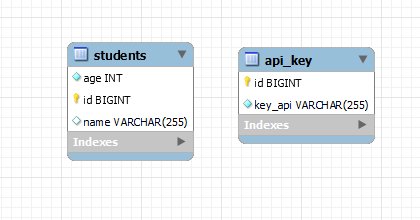

<br>

After we set the databases we set the student with these requirements,

- Create the [repository](src/main/java/com/assignment2/assignment2/repository/StudentRepository.java) for interacts directly with the database. It contains methods for CRUD (Create, Read, Update, Delete) operations.
- [Service](src/main/java/com/assignment2/assignment2/service/StudentService.java), service layer contains the business logic of the application. It orchestrates the operations by calling the repository methods and applying any necessary business rules.
- [Controller](src/main/java/com/assignment2/assignment2/controller/StudentController.java), handles incoming HTTP requests and sends responses to the client. It acts as the entry point for the client to interact with the application.

<br>

Next step is to configure the [API repository](src/main/java/com/assignment2/assignment2/repository/ApiRepository.java) to set the method for findByKey which later on will be used in [ApiKeyFilter](src/main/java/com/assignment2/assignment2/filter/ApiKeyFilter.java)

<br>

Finally we create the filter for `verify all requests into system having header “api-key” that is configured in database, if not return error` also `All response return to client including header “source” : “fpt-software”​`.

Here is the explanations for implementation [simple filter](src/main/java/com/assignment2/assignment2/filter/ApiKeyFilter.java)

### Explanations

- `The ApiKeyFilter` class extends OncePerRequestFilter to ensure the filter runs only once per request.
- It defines a `private final variable apiKeyRepository` of type ApiRepository to interact with the repository that contains the API keys.
- The constructor is annotated with @Autowired to enable `dependency injection`, injecting an instance of ApiRepository.
- `Method Signature:`
  - doFilterInternal is an abstract method from OncePerRequestFilter that needs to be overridden.
  - It takes HttpServletRequest, HttpServletResponse, and FilterChain as parameters.
- `API Key Extraction:`
  - Extracts the value of the "api-key" header from the incoming request.
- Logging Request and Response:
  - Logs the URI of the incoming request for debugging purposes.
  - Logs the URI of the outgoing response for debugging purposes.
- `API Key Validation:`
  - Checks if the API key is present and valid.
  - If the API key is missing or invalid (i.e., not found in apiKeyRepository), sends a 401 Unauthorized error response and exits.
- `Continue Filter Chain:`
  - If the API key is valid, the filter chain is continued, allowing the request to proceed to the next filter or the target resource.

<br>

After that we create the [FilterConfig](src/main/java/com/assignment2/assignment2/config/FilterConfig.java) to

- The method creates an instance of FilterRegistrationBean and sets the ApiKeyFilter as the filter to be registered.
- It specifies that the filter should apply to all URL patterns ("/\*"), ensuring that every incoming HTTP request is subjected to the filter's logic.

<br>

Finally we can test the output by inserting one apiKey to be tested using SQL Query,

```SQL
INSERT INTO api_key (id, key_api) VALUES (1, 'fptapikey');
```

After insert the key, we try to test our CRUD management in postman

- POST Student

  - Without API Key

    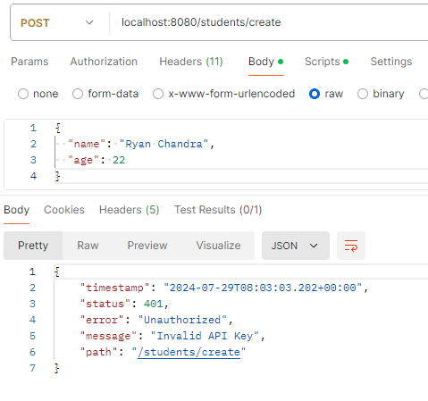

  - With API Key use `api-key` as Key and `fptapikey` for the Value

    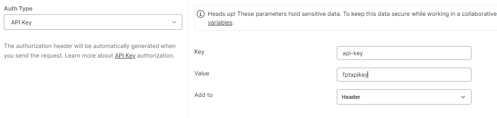

    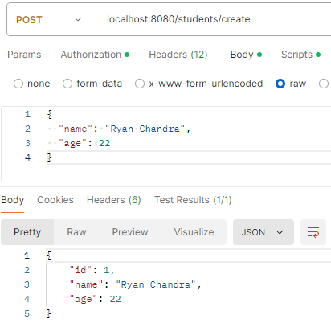

    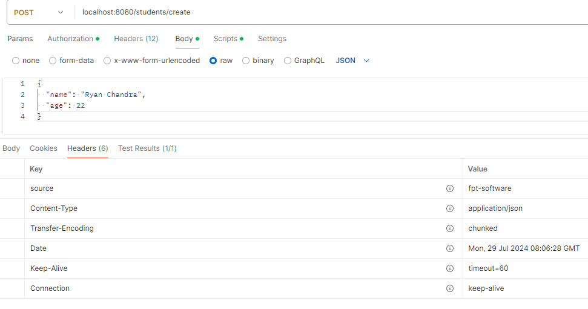

<br>

- GET Student With Api Key

  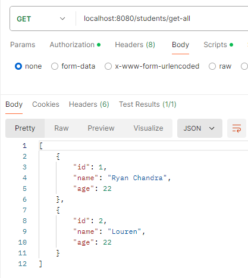

  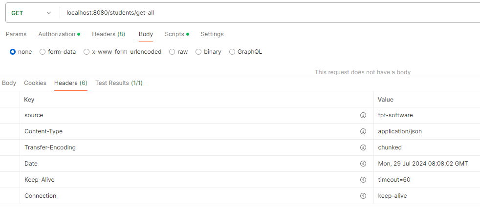

<br>

- PUT Student With Api Key

  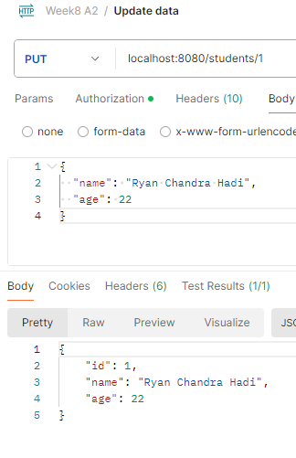

  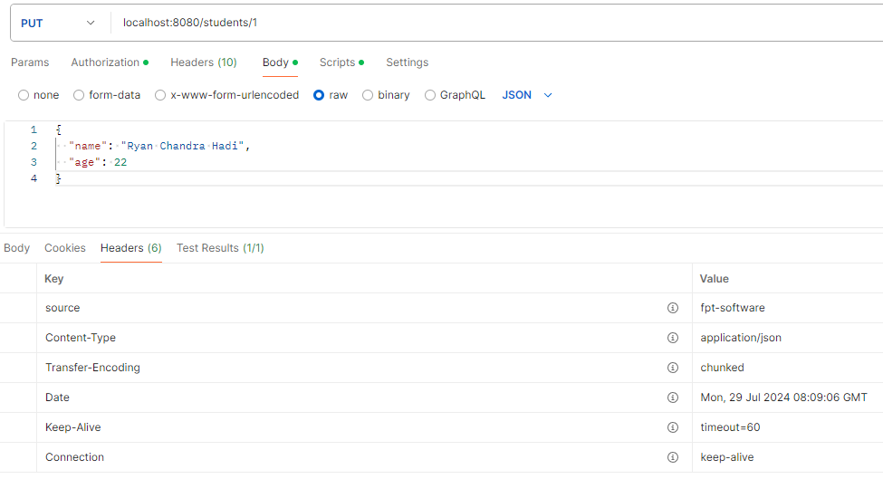

<br>

- Delete Student

  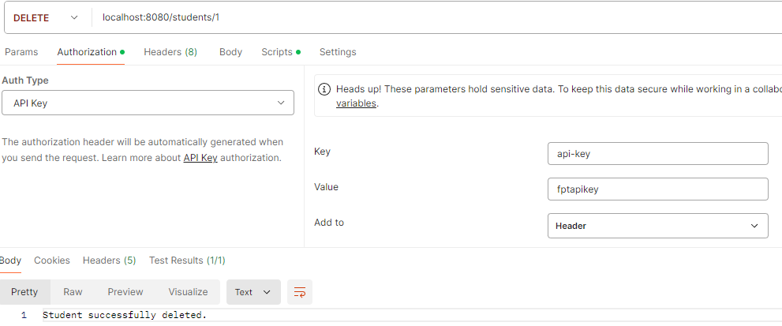

  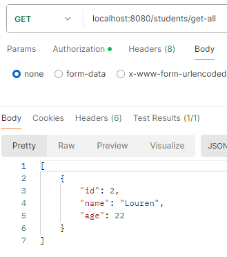
