# Simple Interceptor With API Key

`Objective:`

1. Store username for each api-key, add the use-name to header and print it in a function in controller​
2. All response return to client including header “timestamp” : {{current time}}​
3. Store the lastime the api-key was used

## Interceptor in Java

`Interceptors` in Java, particularly in the context of web applications using Spring Framework, are objects that allow you to intercept HTTP requests and responses to perform various tasks such as logging, authentication, authorization, and more. Interceptors are part of the Spring MVC framework and are similar to filters but offer more fine-grained control and are specific to the Spring ecosystem.

<br>

`Key Consept`

- `Pre-processing:` Intercept and manipulate the request before it reaches the controller.
- `Post-processing:` Intercept and manipulate the response after the controller has processed the request but before the view is rendered.
- `After Completion:` Perform actions after the complete request has finished, including rendering the view.

<br>

Methods of the `HandlerInterceptor` Interface

1. `boolean preHandle`(HttpServletRequest request, HttpServletResponse response, Object handler):
   - This method is called before the request is processed by the controller.
   - It returns true to proceed with the request or false to abort the request.
   - It can be used to perform tasks like authentication, authorization, logging, or request validation.

<br>

2. `void postHandle`(HttpServletRequest request, HttpServletResponse response, Object handler, ModelAndView modelAndView):
   - This method is called after the controller has processed the request but before the view is rendered.
   - It can be used to add additional data to the model or manipulate the response.

<br>

3. `void afterCompletion`(HttpServletRequest request, HttpServletResponse response, Object handler, Exception ex):
   - This method is called after the complete request has finished, including rendering the view.
   - It can be used for cleanup activities, logging, or handling exceptions.

<br>

## Spring Boot Project

```java
spring.application.name=assignment3
spring.datasource.url=jdbc:mysql://localhost:3306/week8a3
spring.datasource.username=root
spring.datasource.password=Tsel@2020
spring.jpa.hibernate.ddl-auto=create-drop
```

Code above is the `applications-properties` to configure and store the data to the database we use JPA hibernate to create the entity from java. This project we use two entity, [Student](src/main/java/com/assignment3/assignment3/entity/Student.java) and [APIKey](src/main/java/com/assignment3/assignment3/entity/APIKey.java) we add username to check later on the header and also add last_used to store the datetime every endpoint are getting accessed. The result for creating attribute from those two entities like pict below.

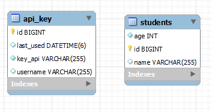

<br>

After we set the databases we set the student with these requirements,

- Create the [repository](src/main/java/com/assignment3/assignment3/repository/StudentRepository.java) for interacts directly with the database. It contains methods for CRUD (Create, Read, Update, Delete) operations.
- [Service](src/main/java/com/assignment3/assignment3/service/StudentService.java), service layer contains the business logic of the application. It orchestrates the operations by calling the repository methods and applying any necessary business rules.
- [Controller](src/main/java/com/assignment3/assignment3/controller/StudentController.java), handles incoming HTTP requests and sends responses to the client. It acts as the entry point for the client to interact with the application.

<br>

Next step is to configure the [API repository](src/main/java/com/assignment3/assignment3/repository/ApiRepository.java) to set the method for findByKey which later on will be used in [ApiKeyInterceptor](src/main/java/com/assignment3/assignment3/interceptor/ApiKeyInterceptor.java)

<br>

Finally we create the interceptor for `Store username for each api-key, add the use-name to header and print it in a function in controller​, All response return to client including header “timestamp” : {{current time}}, and also ​Store the lastime the api-key was used`.

Here is the explanations for implementation [simple interceptor](src/main/java/com/assignment3/assignment3/interceptor/ApiKeyInterceptor.java)

### Explanations

- Class Declaration:
  - `ApiKeyInterceptor` is annotated with @Component to indicate that it is a Spring bean.
  - The class `implements HandlerInterceptor`, which provides methods to intercept requests and responses in the Spring MVC lifecycle.

<br>

- Constructor:
  - The `constructor` uses @Autowired to inject an instance of ApiRepository, which is a repository interface for accessing API key data.

<br>

- preHandle Method:

  - This method is executed `before the request reaches` the controller.
  - Extract API Key:
    - `Retrieves` the api-key header from the request.
    - If the `API key is missing or empty`, an SC_UNAUTHORIZED (401) response is sent, and the request processing is aborted.
      <br>
  - Validate API Key:
    - The apiKeyRepository.`findByKey(apiKeyValue)` method is used to find the API key in the repository.
    - If the API key is `invalid` (i.e., not found), an SC_UNAUTHORIZED (401) response is sent, and the request processing is aborted.
      <br>
  - Store Username:
    - The username associated with the API key is `stored as a request attribute, username.`
      <br>
  - Update Last Used Time:
    - The lastUsed attribute of the API key `is updated to the current time.`
    - The updated API key is `saved back` to the repository.
      <br>
  - Add Timestamp Header:
    - `Adds a timestamp header` to the response.

<br>

After that we create the [interceptor config](src/main/java/com/assignment3/assignment3/config/InterceptorConfig.java) to

- The addInterceptors method is called during the initialization phase of the Spring MVC context.
- The ApiKeyInterceptor is added to the InterceptorRegistry and configured to intercept requests matching /students/\*\*.

<br>

Finally we can test the output by inserting one apiKey to be tested using SQL Query,

```sql
INSERT INTO api_key (id, key_api, username, last_used) VALUES (1,'fptapikey', 'testuser', NULL);
```

<br>

After insert the key, we try to test our CRUD management in postman with adding not only the `key` and `value` but also the `username` in header.

- Setup Header and API Key

  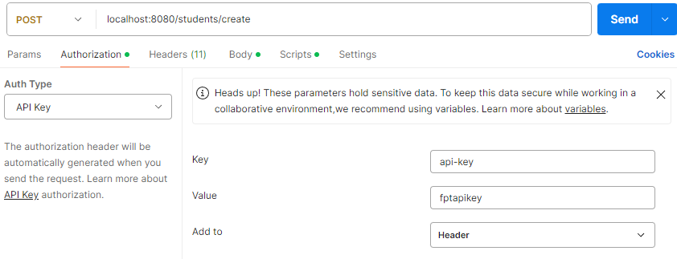

  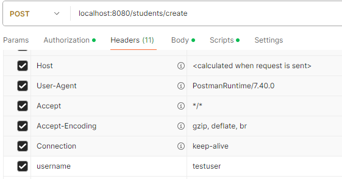

<br>

- POST Student (With API Key use `api-key` as Key and `fptapikey` for the Value also the `testuser` as a `username` in header)

  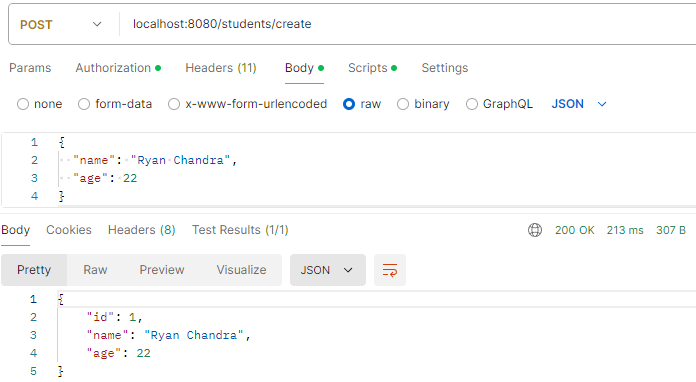

  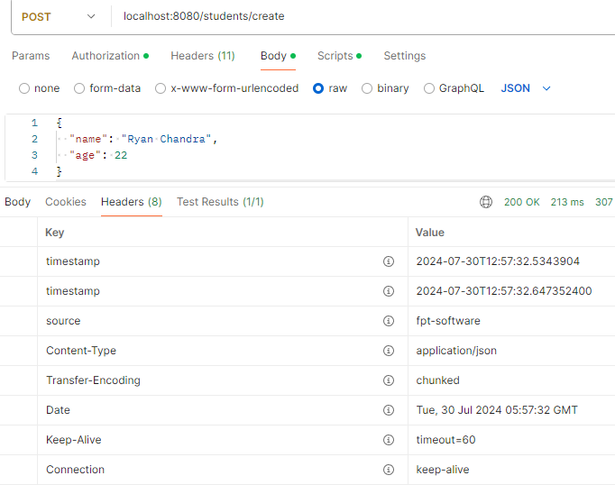

  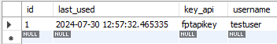

- GET Student (With API Key use `api-key` as Key and `fptapikey` for the Value also the `testuser` as a `username` in header)

  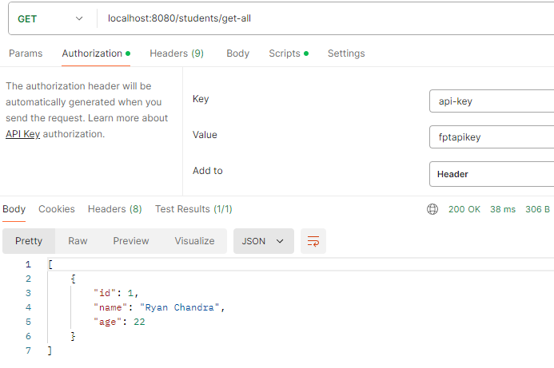

  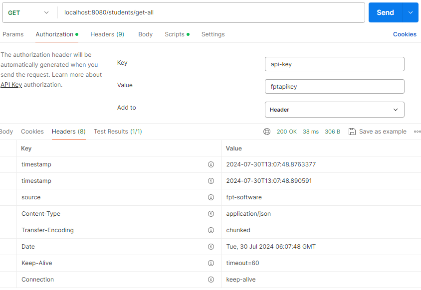

  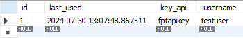

<br>

- PUT Student (With API Key use `api-key` as Key and `fptapikey` for the Value also the `testuser` as a `username` in header)

  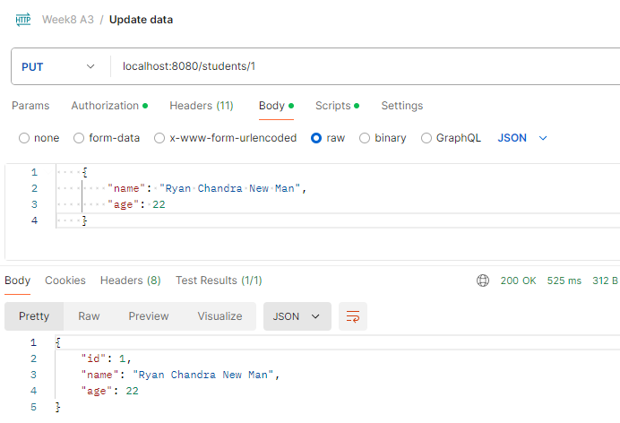

  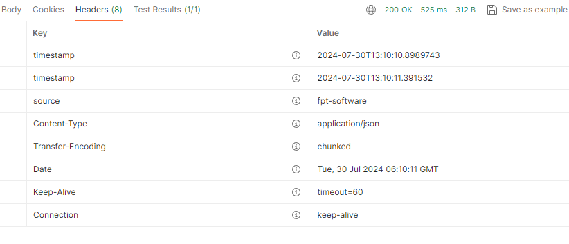

  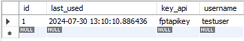

<br>

- DELETE Student

  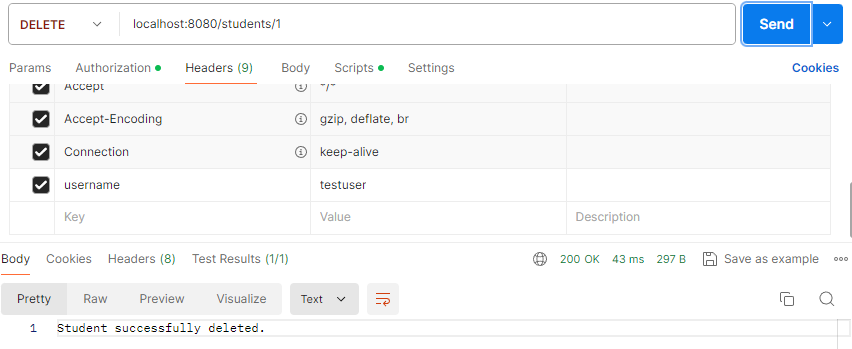

  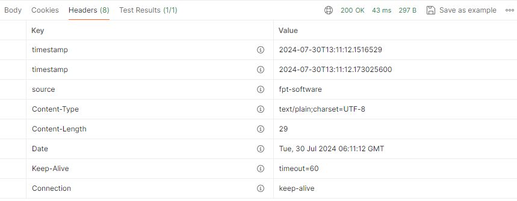

  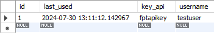
