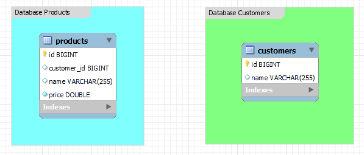
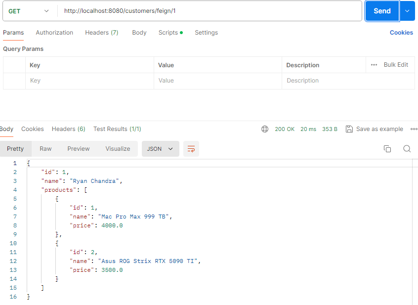
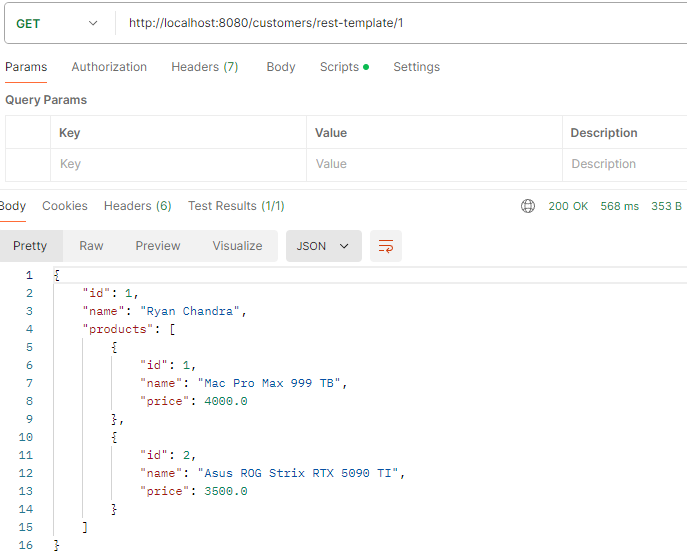
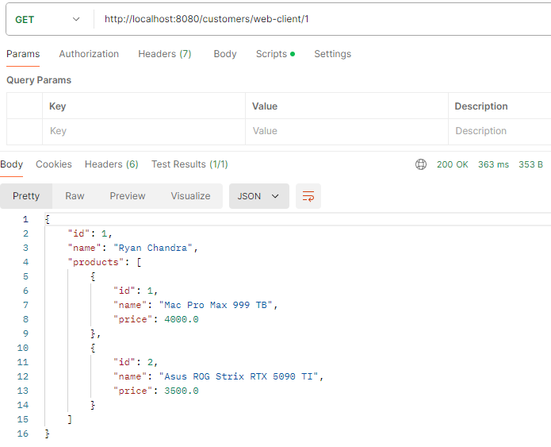

# FeignClient, RestTemplate, WebClient​ in Spring Boot

`Objective:` Implements

## Preparations Two Project

In this case I use `two project`, project service [`Products`](products) and project service [`Customers`](customers). Using seperate project (using Microservices Architecture) has ability to,

- Scalability:
  - Independent Scaling: Each service can be scaled independently based on its load. This allows for more efficient use of resources.
  - Performance Optimization: Services can be optimized for their specific tasks, leading to better overall performance.

<br>

- Fault Isolation:
  - Resilience: Failure in one service does not directly impact other services. This improves the overall resilience of the system.
  - Easier Debugging: With smaller, focused services, identifying and fixing bugs becomes easier.

<br>

- Technology Diversity:
  - Tech Stack Flexibility: Different services can use different technologies or programming languages best suited to their requirements.
  - Incremental Adoption: New technologies can be adopted incrementally in different services without a complete overhaul.

<br>

- Independent Deployment:
  - Continuous Deployment: Services can be deployed independently, facilitating continuous deployment and continuous integration practices.
  - Reduced Downtime: Updates to one service do not require taking down the entire system, leading to reduced downtime.

<br>

- Improved Maintainability:
  - Smaller Codebases: Each service has a smaller, more manageable codebase, which is easier to understand and maintain.
  - Clear Boundaries: Clear service boundaries enforce better separation of concerns, leading to cleaner code.

<br>

Beside using seperate project I also `seperate the databases` so they have database who is responsible only for products service and the other one is responsible from the customers service and it usefull for,

- Data Autonomy:
  - Independent Schema Management: Each service can manage its own database schema, allowing teams to evolve their data models independently without affecting other services.
  - Isolation of Changes: Schema changes in one service do not impact the databases of other services, reducing the risk of unintended side effects.

<br>

- Maintainability:
  - Smaller Databases: Managing smaller, focused databases is often easier than managing a single large monolithic database.
  - Clear Data Ownership: Ownership and responsibilities for data management are clear, reducing the complexity of database maintenance.

<br>

- Fault Isolation:
  - Enhanced Resilience: A failure in one service’s database (e.g., due to data corruption or overload) does not directly affect the databases of other services.
  - Simplified Recovery: Each database can be backed up and restored independently, simplifying disaster recovery processes.

<br>

- Maintainability:
  - Smaller Databases: Managing smaller, focused databases is often easier than managing a single large monolithic database.
  - Clear Data Ownership: Ownership and responsibilities for data management are clear, reducing the complexity of database maintenance.

The result will look like pict below,



<br>

### Customer and Product Service

First step is initialize the database

```sql
spring.application.name=customers
spring.datasource.url=jdbc:mysql://localhost:3306/week8customers
spring.datasource.username=root
spring.datasource.password=Tsel@2020
spring.jpa.hibernate.ddl-auto=update
server.port=8080
```

On database above is the configuration database for customer service, we set the port as default = `8080` with `jpa hibernate auto=update` to create the model from the entity. In this service the aim is to show the customer with certain products that they have.

<br>

```sql
spring.application.name=products
spring.datasource.url=jdbc:mysql://localhost:3306/week8products
spring.datasource.username=root
spring.datasource.password=Tsel@2020
spring.jpa.hibernate.ddl-auto=update
server.port=8081
```

Meanwhile this properties is the configuration for the product service, the difference between them is only the datasource, since we have two project and databases seperated.

1. Entity: [Customer](customers/src/main/java/com/service/customers/entity/Customer.java) and [Product](products/src/main/java/com/service/products/entity/Product.java)

   - Data Representation: Entities represent the data structure of the application, often mirroring the database tables.
   - Persistence Management: They are used by JPA (Java Persistence API) to interact with the database, managing CRUD operations automatically.

<br>

2. DTO: [CustomerDTO](customers/src/main/java/com/service/customers/dto/CustomerDTO.java) and [ProductDTO](customers/src/main/java/com/service/customers/dto/ProductDTO.java)

   - Data Transfer: DTOs are used to transfer data between different layers of the application, particularly between the client and server.
   - Abstraction: They provide a way to abstract the internal structure of entities, exposing only the necessary fields to clients.

   One of the reason we need ProductDTO in customer service is to simplified client interaction: Clients (e.g., front-end applications) can retrieve all necessary information with a single API call, simplifying the interaction and reducing the number of requests needed.

<br>

3. Repository: [Customer Repository](customers/src/main/java/com/service/customers/repository/CustomerRepository.java) and [Product Repository](products/src/main/java/com/service/products/repository/ProductRepository.java)

   - Data Access: Repositories provide an abstraction layer for CRUD operations and database interactions, typically extending JPA repositories.
   - Query Methods: They offer methods to perform database queries, either through method names or custom JPQL/SQL queries.

   We add more method in product repository `findByCustomerId(Long customerId)` to find a customer with Id stored in database.

<br>

4. Service: [CustomerService Feign](customers/src/main/java/com/service/customers/service/CustomerServiceFeign.java), [CustomerService REST-Template](customers/src/main/java/com/service/customers/service/CustomerServiceRestTemplate.java), [CustomerService Web-Client](customers/src/main/java/com/service/customers/service/CustomerServiceWebClient.java), and [Product Service](products/src/main/java/com/service/products/service/ProductService.java)

   - Business Logic: Services contain the core business logic of the application, orchestrating operations between different components.
   - Transaction Management: They often handle transactions, ensuring data consistency and integrity across multiple operations.

     In this project, the service is seperated to gain more accessibility to split between the `feign`, `rest-template`, and `web-client`

<br>

5. Controller: [CustomerController](customers/src/main/java/com/service/customers/controller/CustomerController.java) and [Product Controller](products/src/main/java/com/service/products/controller/ProductController.java)

   - Request Handling: Controllers handle incoming HTTP requests, process them, and return appropriate HTTP responses.
   - Routing: They map request URLs to specific methods, often using annotations like @GetMapping, @PostMapping, etc.

   In Customer Controller we have three method with the same return but had a different approach (Feign-Client, RESTTemplate, and Web-Client)

<br>

### Feign Client

Feign is a declarative web service client in the Java Spring ecosystem that simplify the process of making HTTP requests to external services. Instead of writing a lot of boilerplate code to handle HTTP connections, Feign allows to define interfaces for my HTTP requests, and it takes care of the implementation details. This makes working with RESTful web services much easier and cleaner.

<br>

`Why Use Feign:`

1. Declarative Approach: With Feign, I can define HTTP requests in a simple interface using annotations. Feign automatically generates the implementation, which saves me from writing repetitive and error-prone code.
2. Spring Cloud Integration: Feign integrates seamlessly with Spring Cloud, allowing me to leverage other features like Eureka for service discovery, Ribbon for load balancing, and Hystrix for circuit breakers.
3. Reduced Boilerplate Code: By abstracting the HTTP client implementation, Feign reduces the amount of boilerplate code I have to write. This makes my codebase cleaner and more maintainable.

<br>

Setup `Feign` in `customer project`

1. `Add Dependencies:` First, I include the necessary dependencies in my pom.xml.

   ```xml
           <dependency>
               <groupId>org.springframework.cloud</groupId>
               <artifactId>spring-cloud-starter-openfeign</artifactId>
           </dependency>
       <dependencyManagement>
           <dependencies>
               <dependency>
                   <groupId>org.springframework.cloud</groupId>
                   <artifactId>spring-cloud-dependencies</artifactId>
                   <version>${spring-cloud.version}</version>
                   <type>pom</type>
                   <scope>import</scope>
               </dependency>
           </dependencies>
       </dependencyManagement>
   ```

2. `Enable Feign Clients:` Then, I enable Feign clients in my [Spring Boot application](customers/src/main/java/com/service/customers/CustomersApplication.java) using the @EnableFeignClients annotation.

3. Define a Feign Client Interface: I create an interface for my [Feign client](customers/src/main/java/com/service/customers/feign/ProductClientF.java), defining the endpoints I want to consume and this time we use `getProductsByCustomerId` to access endpoint on product which products belongs to some Id's.

4. Use the Feign Client: I inject and use the Feign client in my [feign service](customers/src/main/java/com/service/customers/service/CustomerServiceFeign.java).

   - The CustomerServiceFeign class is a Spring service that leverages dependency injection to use CustomerRepository and a Feign client (ProductClientF).
   - It provides a method getCustomerById that retrieves a customer by their ID, fetches associated products from an external service using Feign, and returns a CustomerDTO containing the customer's details and their products.
   - This class demonstrates how to combine data from a database and an external service to form a comprehensive response for a client.

#### Testing Endpoint

Initialize the database from customers and products, we use three products that chained with customerId 1 and 2.

```sql
use week8customers;
use week8products;

INSERT INTO products (name, price, customer_id) VALUES ('Mac Pro Max 999 TB', 4000.0, 1);
INSERT INTO products (name, price, customer_id) VALUES ('Asus ROG Strix RTX 5090 TI', 3500.0, 1);
INSERT INTO products (name, price, customer_id) VALUES ('Logitech G-502 Lightspeed', 80.0, 2);

INSERT INTO customers (name) VALUES ('Ryan Chandra');
INSERT INTO customers (name) VALUES ('Jumbo Wumbo');
```

<br>

**Tested on Postman**


<br>

### REST-Template

RestTemplate is a synchronous client to perform HTTP requests in Spring. It simplifies the process of interacting with RESTful web services by providing a higher-level abstraction over low-level HTTP client libraries. RestTemplate is part of the Spring Framework and allows you to send HTTP requests and handle HTTP responses with ease.

`Why use REST-Template`

- Calling External APIs: When your application needs to communicate with external RESTful services, RestTemplate provides a simple and effective way to make those HTTP requests and handle responses.

- Microservices Communication: In a microservices architecture, services often need to call each other. RestTemplate is a convenient tool for making HTTP calls between microservices.

- Consuming RESTful Web Services: If you need to consume third-party RESTful web services, RestTemplate makes it easy to send requests and process the responses.

<br>

Setup `REST-Template` in `customer project`

1. Add Dependencies: Include the necessary Spring dependencies in your pom.xml.

```xml
<dependency>
    <groupId>org.springframework.boot</groupId>
    <artifactId>spring-boot-starter-web</artifactId>
</dependency>
```

2. Create a RestTemplate Bean: Configure a [RestTemplate](customers/src/main/java/com/service/customers/config/RestTemplateConfig.java) to initialize the bean in Spring configuration class.

3. Use [RestTemplate](customers/src/main/java/com/service/customers/resttemplate/ProductClientRT.java) in [Service](customers/src/main/java/com/service/customers/service/CustomerServiceRestTemplate.java): Inject and use the RestTemplate bean in service class. On that restTemplate we use `getForObject`, a method to retrieve a representation by doing a GET on the specified URL. Converts the response body to the specified Java type.

<br>

On REST-Template I initialize to,

- `Component Annotation:` The @Component annotation makes the ProductClientRT class a Spring-managed bean.
- `Constructor Injection:` The @AllArgsConstructor annotation from Lombok automatically generates a constructor that injects the RestTemplate dependency.
- `URL Formation:` The PRODUCT_SERVICE_URL field holds the base URL for the product service, and the method appends the customerId to this URL.
- `HTTP Request:` The restTemplate.getForObject method sends an HTTP GET request to the product service and expects an array of ProductDTO objects in the response.
- `Conversion and Return:` The method converts the array to a list and returns it.

<br>

#### Testing Endpoint

Initialize the database from customers and products, we use three products that chained with customerId 1 and 2.

```sql
use week8customers;
use week8products;

INSERT INTO products (name, price, customer_id) VALUES ('Mac Pro Max 999 TB', 4000.0, 1);
INSERT INTO products (name, price, customer_id) VALUES ('Asus ROG Strix RTX 5090 TI', 3500.0, 1);
INSERT INTO products (name, price, customer_id) VALUES ('Logitech G-502 Lightspeed', 80.0, 2);

INSERT INTO customers (name) VALUES ('Ryan Chandra');
INSERT INTO customers (name) VALUES ('Jumbo Wumbo');
```

<br>

**Tested on Postman**


<br>

### Web-Client

WebClient is a non-blocking, reactive client for performing HTTP requests in Java Spring applications. It is part of the Spring WebFlux framework and provides a modern, flexible approach to making HTTP calls. Unlike RestTemplate, which is synchronous and blocking, WebClient is designed for asynchronous and non-blocking communication, making it suitable for reactive programming and applications that require high concurrency and scalability.

`Why use Web-Client`

- Asynchronous and Non-Blocking I/O:
  - WebClient supports asynchronous and non-blocking I/O operations, allowing your application to handle many requests concurrently without being blocked waiting for responses. This leads to better resource utilization and scalability.

<br>

- Reactive Programming Support:
  - WebClient integrates seamlessly with the reactive programming model provided by Project Reactor. This allows you to build reactive and event-driven applications that are more responsive and resilient to high loads.

<br>

- Scalability:
  - Because WebClient is non-blocking, it is particularly well-suited for microservices and cloud-native applications that need to scale efficiently. It helps to manage high levels of concurrency without exhausting system resources.

<br>

- Advanced Customization:
  - WebClient allows extensive customization of HTTP requests, including setting headers, cookies, query parameters, and body content. You can also configure timeouts, retries, and error handling strategies.

<br>

Setup `Web-Client` in `customer project`

1. Add Dependencies: Include the necessary Spring WebFlux dependencies in pom.xml.

```xml
<dependency>
    <groupId>org.springframework.boot</groupId>
    <artifactId>spring-boot-starter-webflux</artifactId>
</dependency>
```

2. Create a [WebClient](customers/src/main/java/com/service/customers/config/WebClientConfig.java) Bean: Configure a WebClient bean in Spring configuration class.

3. Use [WebClient](customers/src/main/java/com/service/customers/webclient/ProductClientWC.java) in [Service](customers/src/main/java/com/service/customers/service/CustomerServiceWebClient.java): Inject and use the WebClient bean in service class.

<br>

On Web-Client I initialize to,

- Component Annotation: The @Component annotation ensures the ProductClientWC class is detected and managed by Spring's dependency injection container.
- Constructor Injection: The @AllArgsConstructor annotation from Lombok generates a constructor to inject the WebClient dependency.
- URL Formation: The PRODUCT_SERVICE_URL field holds the base URL for the product service, and the uri method appends the customerId to form the complete URL.
- HTTP Request: The webClient.get() initiates an HTTP GET request, retrieve() triggers the request, and bodyToMono(ProductDTO[].class) converts the response to a Mono<ProductDTO[]>.
- Blocking for Simplicity: The productsMono.block() call blocks the execution until the Mono completes, converting the asynchronous call to synchronous for simplicity. This approach should be used cautiously as it can negate the benefits of non-blocking I/O.
- Conversion and Return: The method converts the array of ProductDTO objects to a list and returns it.

<br>

#### Testing Endpoint

Initialize the database from customers and products, we use three products that chained with customerId 1 and 2.

```sql
use week8customers;
use week8products;

INSERT INTO products (name, price, customer_id) VALUES ('Mac Pro Max 999 TB', 4000.0, 1);
INSERT INTO products (name, price, customer_id) VALUES ('Asus ROG Strix RTX 5090 TI', 3500.0, 1);
INSERT INTO products (name, price, customer_id) VALUES ('Logitech G-502 Lightspeed', 80.0, 2);

INSERT INTO customers (name) VALUES ('Ryan Chandra');
INSERT INTO customers (name) VALUES ('Jumbo Wumbo');
```

<br>

**Tested on Postman**


<br>
