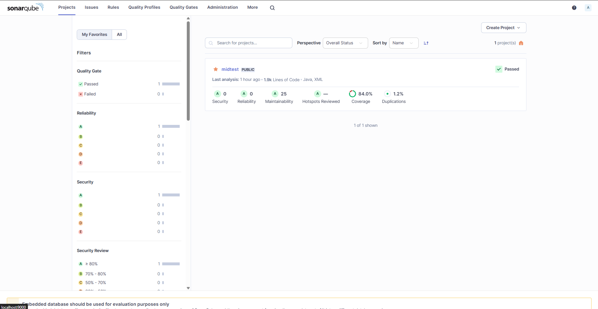
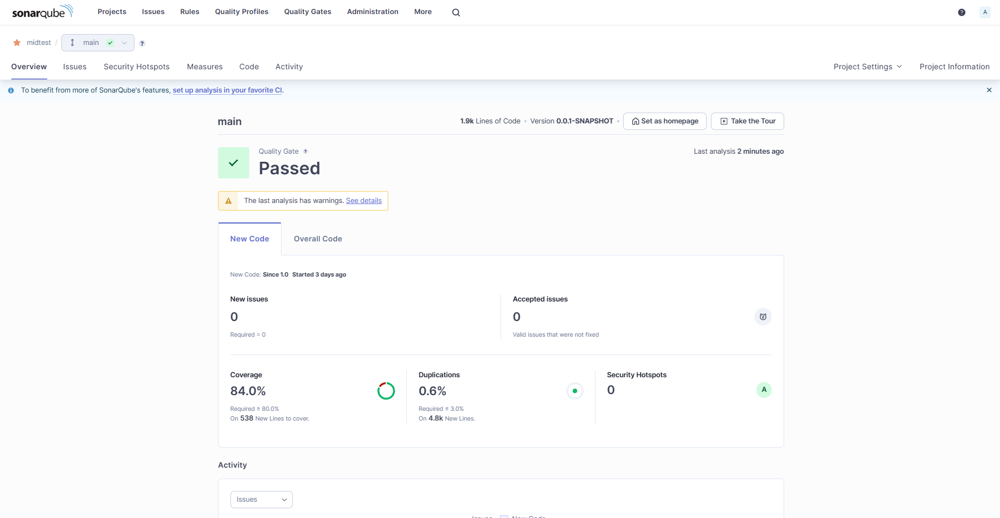
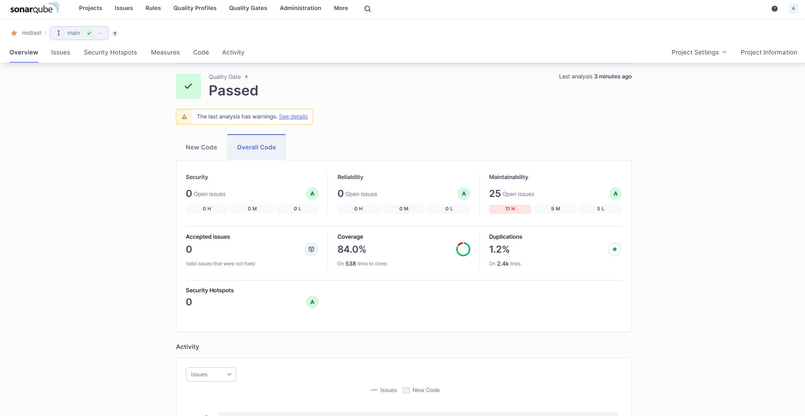
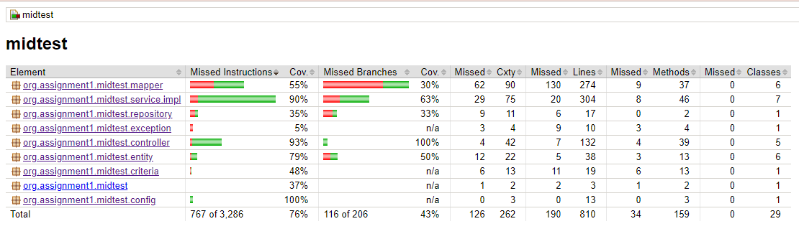
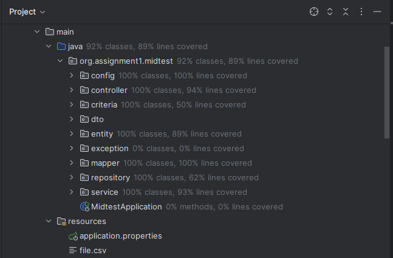

# Unit Test in Java Spring Boot

Unit testing in Java with JUnit involves writing tests for individual units of code 
(usually methods) to ensure they perform as expected. JUnit is a widely used framework 
for this purpose. 

## `JaCoCo`
1. Function:

   - Code Coverage Analysis: JaCoCo (Java Code Coverage) measures how much of your code is covered by tests. It helps identify which parts of your codebase are not being tested, allowing you to improve test coverage and ensure that critical code paths are validated.

2. Key Features:

    - Coverage Metrics: Provides detailed metrics like line coverage, branch coverage, and method coverage.
    - Report Generation: Generates reports that show which parts of the code have been executed by tests and which parts have not.
    - Integration: Can be integrated with build tools like Maven and Gradle, and with CI/CD pipelines to run coverage checks automatically.

<br>

## `Sonar Qube`
1. Function:

    - Code Quality Analysis: SonarQube performs static code analysis to identify code quality issues, such as bugs, code smells, and security vulnerabilities. It also provides metrics on code complexity, duplication, and other quality attributes.

2. Key Features:

    - Quality Gates: Define thresholds for code quality metrics that must be met before code can be promoted or released.
    - Code Smells and Bugs Detection: Identifies and helps fix issues related to code readability, maintainability, and potential bugs.
    - Security Vulnerabilities: Detects potential security issues in your code.
    - Integration: Works with CI/CD pipelines, build tools, and IDEs to provide ongoing feedback and quality checks.

<br>

Here is my setup for the applications properties

```sql
spring.datasource.url=jdbc:h2:mem:testdb
spring.datasource.driverClassName=org.h2.Driver
spring.datasource.username=sa
spring.datasource.password=password
spring.sql.init.platform=h2

# Show SQL statements in the log
spring.jpa.show-sql=true
spring.jpa.properties.hibernate.format_sql=true
```

Here is my setup for the jacoco
```xml
            <plugin>
                <groupId>org.jacoco</groupId>
                <artifactId>jacoco-maven-plugin</artifactId>
                <version>0.8.7</version>
                <executions>
                    <execution>
                        <goals>
                            <goal>prepare-agent</goal>
                        </goals>
                    </execution>
                    <execution>
                        <id>report</id>
                        <phase>prepare-package</phase>
                        <goals>
                            <goal>report</goal>
                        </goals>
                    </execution>
                </executions>
            </plugin>
            <plugin>
                <groupId>org.sonarsource.scanner.maven</groupId>
                <artifactId>sonar-maven-plugin</artifactId>
                <version>3.9.1.2184</version>
            </plugin>
```

```xml
    <properties>
        <java.version>17</java.version>

        <sonar.token>${env.SONAR_TOKEN}</sonar.token>
        <sonar.java.coveragePlugin>jacoco</sonar.java.coveragePlugin>
        <sonar.dynamicAnalysis>reuseReports</sonar.dynamicAnalysis>
        <sonar.jacoco.reportPath>${project.basedir}/../target/jacoco.exec</sonar.jacoco.reportPath>
        <sonar.language>java</sonar.language>
    </properties>
```

On this properties the token will initialize with env that has been saved in my local, 
so this project did not spoil the sonar token.   

## Install SonarLint intellij plugin


<br>

Here is the result of my project in sonarLint in Intellij


<br>

## Install Sonar Qube in Desktop


<br>

Here is the result after running Sonar Qube



### Sonar Qube Preview




<br>

### JCOCO Preview


### Coverage In Intellij Preview



