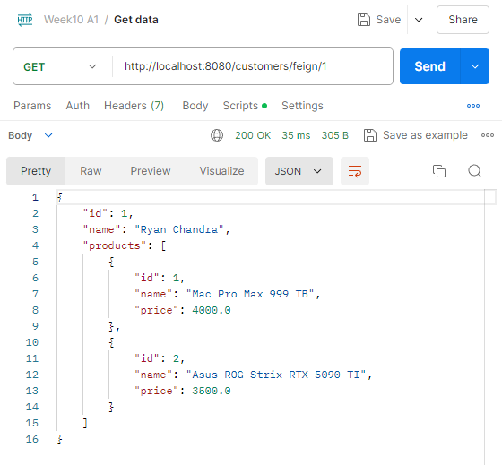
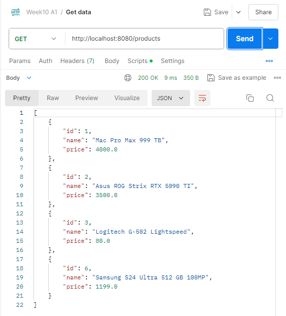
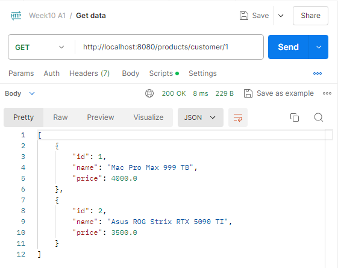
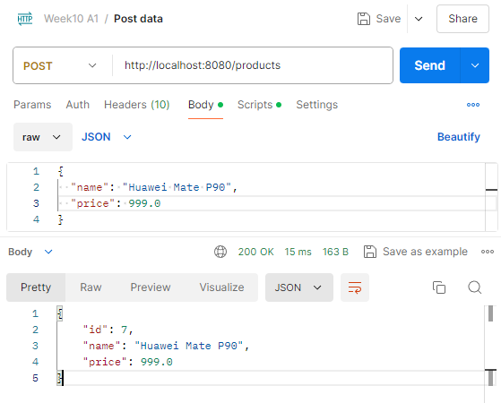
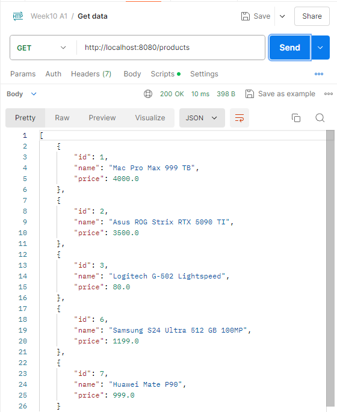
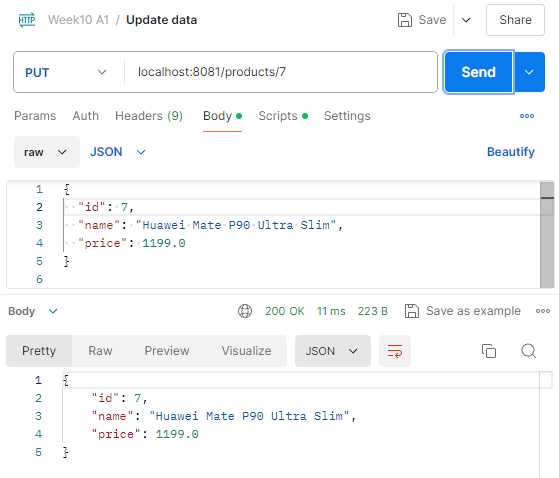
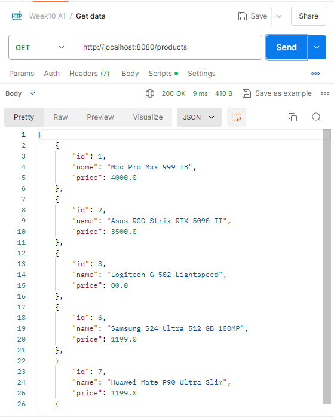
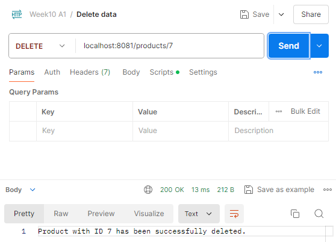

# Gateway Microservices In Spring Boot

`Objective: ` Create a Project with Multiple Service and use Gateway to Centralized the `Endpoint`

## Gateway
Spring Cloud Gateway is a powerful and flexible solution for routing requests to various microservices 
in a Spring Boot application. It acts as an API Gateway, handling the routing 
of incoming requests to the appropriate backend services based on the defined routes.

## Features
1. `Centralized Routing:` Directs incoming requests to the appropriate microservices based on path patterns.
2. `Load Balancing:` Distributes requests across multiple instances of a microservice.
3. `Security:` Provides options for authentication, authorization, and other security measures.
4. `Monitoring:` Integrates with monitoring tools to track the health and performance of your services.
5. `Resilience:` Supports retry policies, timeouts, and circuit breakers to ensure service reliability.

## Architecture
In this setup, the Spring Cloud Gateway routes requests to two different microservices:

- Customer Service: Handles operations related to customers.
- Product Service: Manages product-related operations.

The Gateway is configured to forward requests based on the URL path:
- Requests to /customers/** are routed to the Customer Service.
- Requests to /products/** are routed to the Product Service.

## Configuration
`application.yml` The routing configuration is defined in the application.yml file. 
This file specifies how incoming requests are routed to different services.

```yml
server:
  port: 8080

spring:
  cloud:
    gateway:
      routes:
        - id: customer_service
          uri: http://localhost:8081  # The base URL of the customer service
          predicates:
            - Path=/customers/**
        - id: product_service
          uri: http://localhost:8082  # The base URL of the product service
          predicates:
            - Path=/products/**
```

- Key Configuration Elements
    - server.port: Specifies the port on which the gateway runs. (e.g., 8080)
    - spring.cloud.gateway.routes: Defines the routes that the gateway will handle.
  
- Each route includes:
    - id: A unique identifier for the route.
    - uri: The destination URI where the request should be forwarded.
    - predicates: Conditions that must be met for the route to be selected, such as matching a specific path.

## POSTMAN TEST
We will use the "8080" port to access both base url from customer service "8081" and product service "8082".

### Customers
- Get Customer with certain product using `feign-client`

    

<br>

- Get Customer with certain product using `rest-template`

    

<br>

- Get Customer with certain product using `web-client`

    

<br>

### Products
- Get `All Products`

    

<br>

- Get Product with certain `ID Customer`

    

<br>

- `Post Product`

    

    

<br>

- `Put Product`

    

    

<br>

- `Delete Product`

    

    
