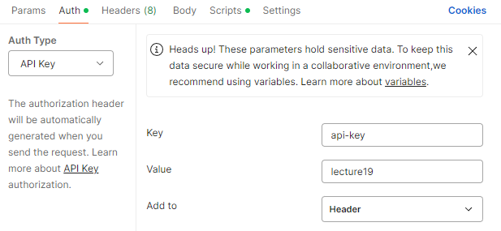
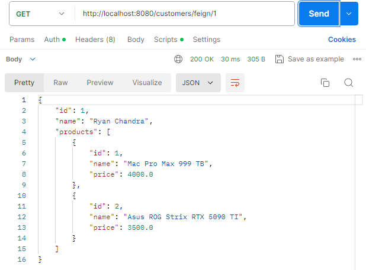
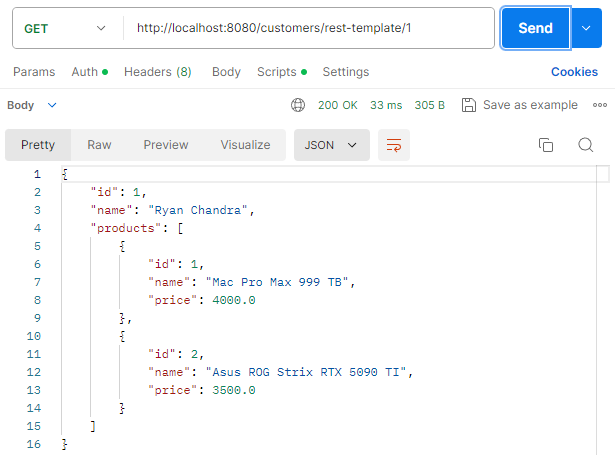
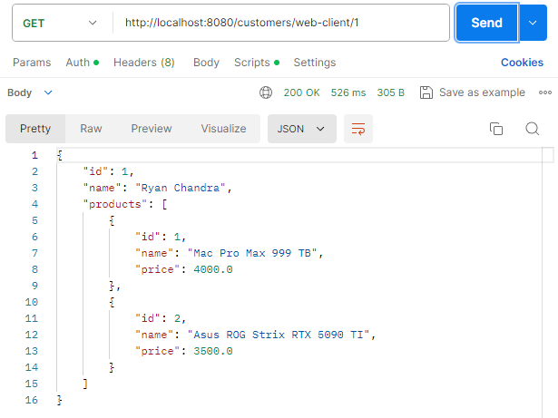
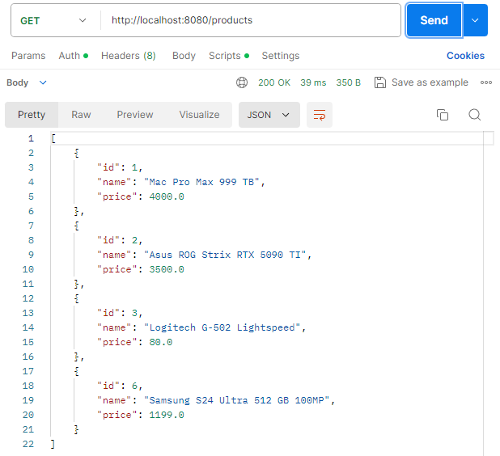
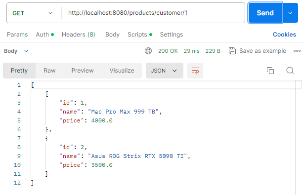
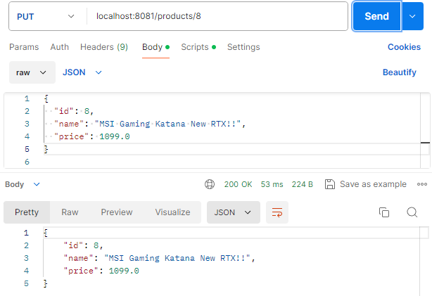
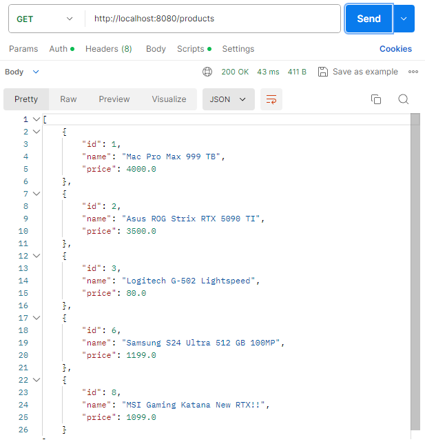
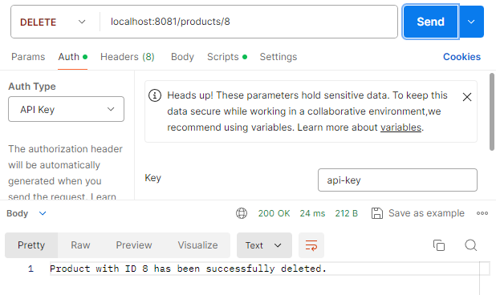
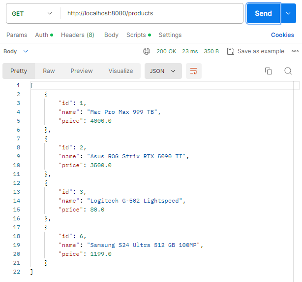

# Gateway with API Key Authentication IN Spring Boot

`Objective: `Create a Project with Multiple Service and use Gateway to Centralized the `Endpoint` 
and Setup the header using Filter to verify the authentications.

This project demonstrates the implementation of an API Gateway using Spring Cloud Gateway with API Key authentication. 
The API Gateway intercepts requests and validates them by forwarding the API Key to an authentication service.

### `Project Structure for the Gateway`

```md
assignment2-gateway/
│
├── src/main/java/org/assignment2/gateway/
│   ├── config/
│   │   └── ApiKeyConfig.java
│   ├── filter/
│   │   └── ApiKeyFilter.java
│   └── GatewayApplication.java
│
├── src/main/resources/
│   └── application.yml
│
└── pom.xml
```

<br>

### `Project Structure for the Authentications`

```md
assignment2-authentication/
│
├── src/main/java/org/assignment2/authentication/
│   ├── controller/
│   │   └── AuthApiKeyController.java
│   ├── entity/
│   │   └── ApiKey.java
│   ├── service/
│   │   ├── AuthApiKeyService.java
│   │   └── impl/
│   │       └── AuthApiKeyServiceImpl.java
│   ├── repository/
│   │   └── ApiKeyRepository.java
│   └── AuthenticationApplication.java
│
├── src/main/resources/
│   └── application.properties
│
└── pom.xml
```

<br>

## Gateway Service Components

1. [ApiKeyConfig.java](gateway%2Fsrc%2Fmain%2Fjava%2Forg%2Fassignment2%2Fgateway%2Fconfig%2FApiKeyConfig.java)
   Contains configuration properties for API Key header name and the URL of the authentication service.
2. [ApiKeyFilter.java](gateway%2Fsrc%2Fmain%2Fjava%2Forg%2Fassignment2%2Fgateway%2Ffilter%2FApiKeyFilter.java)
   A filter that checks if the request contains a valid API Key by calling the authentication service. 
   If the key is valid, the request is allowed to proceed; otherwise, an unauthorized response is returned.
3. ```yml
      server:
      port: 8080
         
      spring:
        cloud:
          gateway:
            routes:
              - id: customer_service
                uri: http://localhost:8082
                predicates:
                  - Path=/customers/**
                filters:
                  - name: ApiKeyFilter
                    args:
                      apiKeyHeaderName: api-key
                      authServiceUrl: http://localhost:8083/auth-api-key/validate
              - id: product_service
                uri: http://localhost:8081
                predicates:
                  - Path=/products/**
                filters:
                  - name: ApiKeyFilter
                    args:
                      apiKeyHeaderName: api-key
                      authServiceUrl: http://localhost:8083/auth-api-key/validate
     ```
     Configures the routes for the API Gateway, including the API Key filter.

     - routes: This section defines the routes that the gateway will handle. Each route has the following elements:
        - id: A unique identifier for the route. In this example, customer_service and product_service are the IDs for the two routes.
        - uri: The destination URI where the request will be forwarded if it matches the route's predicates. For instance:
           - Requests matching the customer_service route will be forwarded to http://localhost:8082.
           - Requests matching the product_service route will be forwarded to http://localhost:8081.
        - predicates: This specifies the conditions under which the route will be selected.
          - The Path=/customers/** predicate matches any request path starting with /customers/.
          - Similarly, Path=/products/** matches paths starting with /products/.
      
        Predicates are like rules or conditions that must be met for the route to be used.

        - filters: Filters are actions that are applied to the request before it is forwarded to the destination URI.
           - name: ApiKeyFilter specifies the custom filter that should be applied. In this case, it refers to the ApiKeyFilter you defined.
           - args: This section passes specific arguments to the filter. Here, you are passing:
             - apiKeyHeaderName: The name of the header that contains the API Key (api-key in this case).
             - authServiceUrl: The URL of the authentication service endpoint that will validate the API Key (http://localhost:8083/auth-api-key/validate).

<br>

## Authentication Service Components

1. [AuthApiKeyServiceImpl.java](authentication%2Fsrc%2Fmain%2Fjava%2Forg%2Fassignment2%2Fauthentication%2Fservice%2Fimpl%2FAuthApiKeyServiceImpl.java)
   Implements the logic to validate an API Key by checking its existence in the database.
2. [AuthApiKeyController.java](authentication%2Fsrc%2Fmain%2Fjava%2Forg%2Fassignment2%2Fauthentication%2Fcontroller%2FAuthApiKeyController.java)
   Exposes an endpoint to validate API Keys.
3. [ApiKey.java](authentication%2Fsrc%2Fmain%2Fjava%2Forg%2Fassignment2%2Fauthentication%2Fentity%2FApiKey.java)
   Implements the modul of ApiKey that will store to the database
4. [application.properties](authentication%2Fsrc%2Fmain%2Fresources%2Fapplication.properties)
   Connect the project to the database

<br>

## POSTMAN TEST
We will use the "8080" port to access both base url from customer service "8081" and product service "8082" and use "8083" for the authentication service.

`Set the api-key on the database as "lecture19"`
```sql
INSERT INTO apikeys (key_api) VALUES ('lecture19');
```



Setup the authorization
- `auth type: `API Key
- `key: `api-key
- `value: `lecture19

### Customers
- Get Customer with certain product using `feign-client`

  

<br>

- Get Customer with certain product using `rest-template`

  

<br>

- Get Customer with certain product using `web-client`

  

<br>

### Products
- Get `All Products`

  

<br>

- Get Product with certain `ID Customer`

  

<br>

- `Post Product`

  

<br>

- `Put Product`

  

  

<br>

- `Delete Product`

  

  


