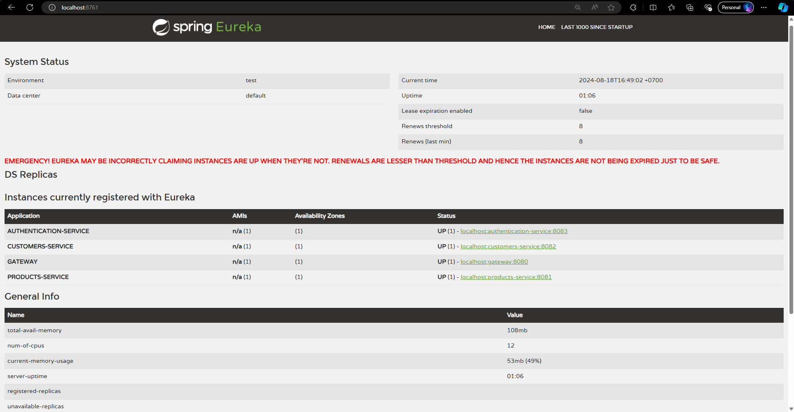

# Spring Boot Discovery 

## Overview

The Discovery service in this project is implemented using **Netflix Eureka**, which is a service registry that allows microservices to register themselves at runtime and discover other services in a distributed system. This enables dynamic service discovery, load balancing, and resilience within the microservices architecture.

<br>

## Components

1. **Eureka Server**: Acts as the service registry where all microservices register themselves.
2. **Eureka Client**: The microservices (e.g., Product Service, Customer Service, Gateway) that register with the Eureka server and discover other services.

<br>

## Eureka Configurations

```properties
spring.application.name=eureka-server
server.port=8761

eureka.client.register-with-eureka=false
eureka.client.fetch-registry=false
logging.level.com.netflix.eureka=DEBUG
logging.level.com.netflix.discovery=DEBUG
```

### Explanations

- eureka.client.register-with-eureka=false:
    - Prevents the Eureka server from trying to register itself as a client in the Eureka registry. Since it is the registry itself, it doesn't need to register.
- eureka.client.fetch-registry=false:
  - Tells the Eureka server not to fetch the registry information from other Eureka servers. This is useful in standalone mode, where there's only one Eureka server instance.
- logging.level.com.netflix.eureka=DEBUG and logging.level.com.netflix.discovery=DEBUG:
  - Sets the logging level for Eureka and Discovery classes to DEBUG. This is useful for troubleshooting and seeing detailed logs during the startup and operation of the Eureka server.

<br>

## Gateway Service Configuration
```yml
spring:
  application:
    name: gateway
  cloud:
    gateway:
      routes:
        - id: customers-service
          uri: lb://customers-service
          predicates:
            - Path=/customers/**
          filters:
            - name: ApiKeyFilter
              args:
                apiKeyHeaderName: api-key
                authServiceUrl: http://localhost:8083/auth-api-key/validate
        - id: products-service
          uri: lb://products-service
          predicates:
            - Path=/products/**
          filters:
            - name: ApiKeyFilter
              args:
                apiKeyHeaderName: api-key
                authServiceUrl: http://localhost:8083/auth-api-key/validate

eureka:
  client:
    service-url:
      defaultZone: http://localhost:8761/eureka
```

### Explanations
`Gateway Routes Configuration:`

- routes:: Defines the routes that the Gateway will manage.

  - id: customers-service:

    - This route is defined with the ID "customers-service."
    - uri: lb://customers-service: The lb:// prefix indicates that the Gateway will use the load balancer to route requests to the "customers-service." The service name "customers-service" is used to locate the service from the Eureka registry.
  - predicates: - Path=/customers/**:
    - This predicate specifies that any request path starting with /customers/ will be routed to the "customers-service."
  - filters::
    - name: ApiKeyFilter: This filter adds an API key header to the request.
      - args::
        - apiKeyHeaderName: api-key: The header name for the API key is specified here.
        - authServiceUrl: http://localhost:8083/auth-api-key/validate: This URL is used to validate the API key through an external authentication service.
  - The same structure is used for the products-service, with routing for requests starting with /products/ to the appropriate microservice.

## Summary Result



1. The Eureka server acts as a service registry, allowing microservices to register and discover each other.
2. The Gateway service routes incoming requests to the appropriate microservices based on the path and other criteria. It uses the Eureka registry to find the instances of the services it needs to route requests to.
3. The Gateway also includes an API key filter for security, ensuring that requests are validated before being processed by the target microservice.
