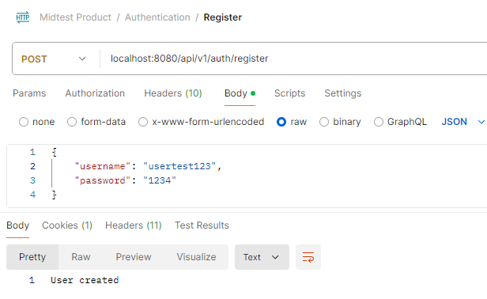
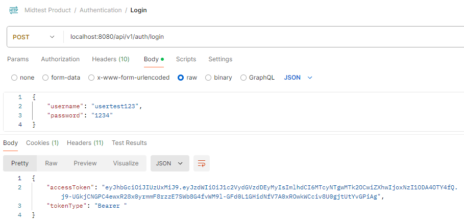
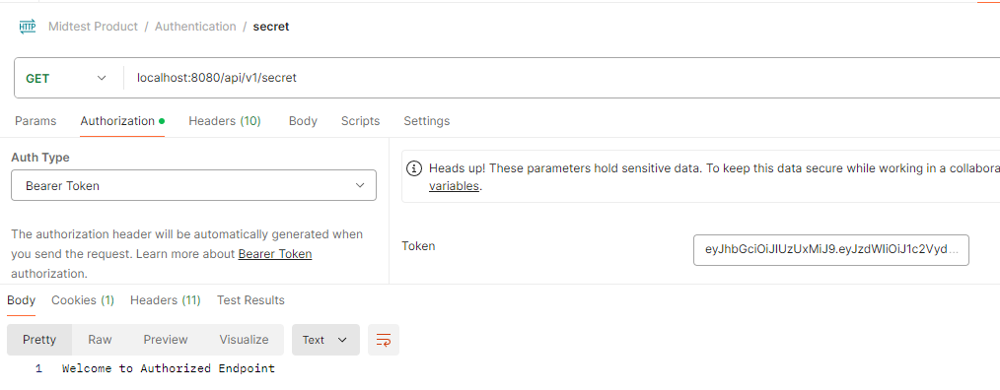
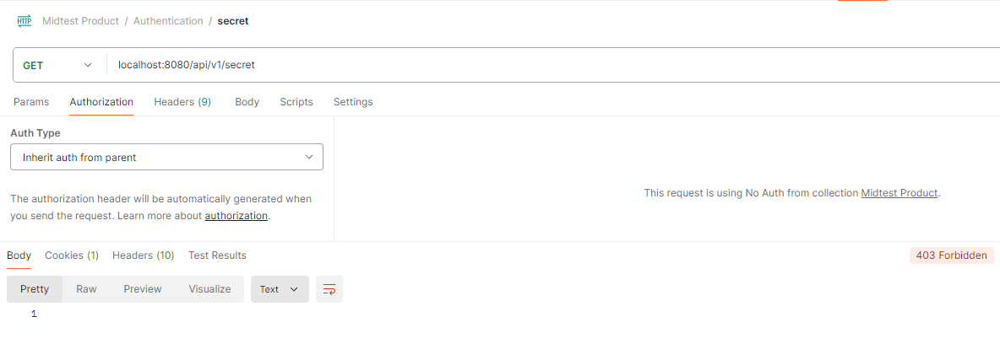
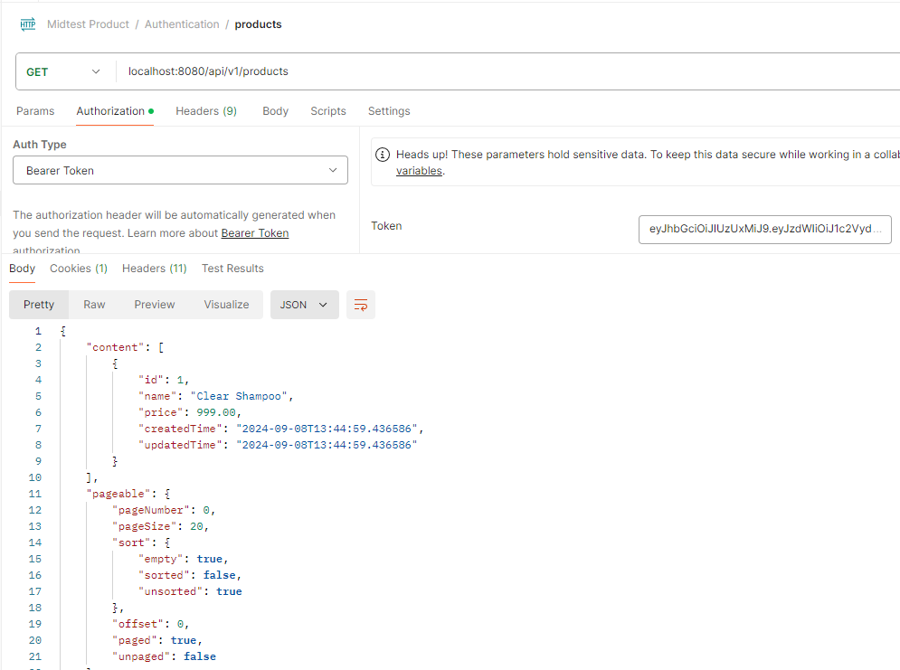
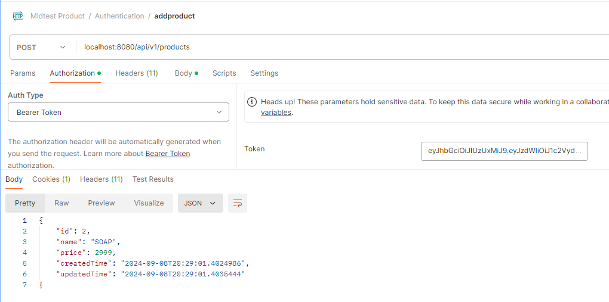
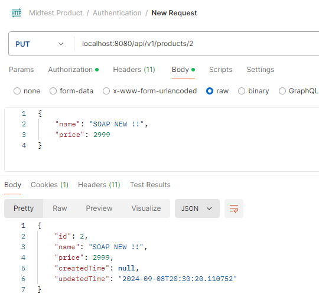
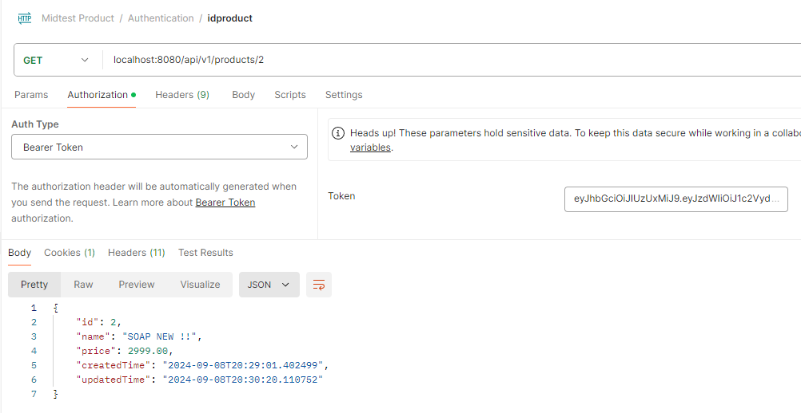

# Spring Security Using JWT

`Objective: `Configure a Spring Security to use JWT Token to access resource.

`Prerequisite file`

- Entity

  - Role.java
  - User.java
  - Product.java

- DTO

  - AuthRespone.java
  - LoginDTO.java
  - ProductDTO.java
  - RegisterDTO.java

- Service

- Mapper

  - ProductMapper.java

- Controller

 

## Security

The `CustomUserDetailsService` class implements the UserDetailsService interface provided by Spring Security

[CustomUserDetailsService](src/main/java/com/assignment1/security/security/CustomUserDetailsService.java)

1. Dependency Injection: The class has a dependency on UserRepository, which is injected via the constructor. This repository is used to fetch user details from the database.

2. Loading User Data: The loadUserByUsername method is overridden from UserDetailsService. When a user attempts to authenticate, Spring Security calls this method with the provided username. It uses the UserRepository to find the UserEntity associated with that username. If no user is found, a UsernameNotFoundException is thrown.

3. Returning User Details: If the user is found, a User object (from Spring Security) is created with the user's username, password, and authorities. The authorities are derived from the user's roles.

4. Mapping Roles to Authorities: The mapRolesToAuthorities method converts the list of roles associated with the user into a collection of GrantedAuthority objects. This conversion is essential because Spring Security uses GrantedAuthority to manage and check user permissions.

 

The `JwtGenerator` class is responsible for generating, parsing, and validating JSON Web Tokens (JWTs) for authentication purposes.

[JwtGenerator](src/main/java/com/assignment1/security/security/JwtGenerator.java)

1. Generate JWTs based on user authentication details.
2. Extract the username from a JWT.
3. Validate the JWT to ensure its authenticity and expiration.

 

The `JwtAuthEntryPoint` class implements the AuthenticationEntryPoint interface from Spring Security. Its purpose is to handle unauthorized access attempts to protected resources when a user is not authenticated or their authentication credentials are invalid.

[JwtAuthEntryPoint](src/main/java/com/assignment1/security/security/JwtAuthEntryPoint.java)

1. The class is annotated with @Component, which makes it a Spring-managed bean eligible for dependency injection and component scanning. It overrides the commence method of the AuthenticationEntryPoint interface. This method is called whenever an authentication error occurs while trying to access a protected resource.

2. Inside the commence method, it receives the HttpServletRequest and HttpServletResponse objects, along with an AuthenticationException that provides details about the authentication failure. The method sets the HTTP response status to SC_UNAUTHORIZED (HTTP status code 401) and sends an error message that is derived from the exception. This informs the client that the request could not be processed due to unauthorized access.

3. In essence, JwtAuthEntryPoint is responsible for responding to requests where the user is not authenticated or their authentication has failed, by sending a 401 Unauthorized error along with a message detailing the issue.

 

The `SecurityConfig` class is a configuration class for setting up Spring Security in a Spring Boot application. It is annotated with @Configuration and @EnableWebSecurity, making it a configuration class that enables and customizes Spring Security's features.

[SecurityConfig](src/main/java/com/assignment1/security/security/SecurityConfig.java)

In summary, this configuration class sets up a security filter chain that disables CSRF protection, uses stateless session management, applies custom exception handling, sets up authorization rules, and integrates JWT-based authentication through custom filters. It also provides beans for AuthenticationManager and PasswordEncoder, essential for managing user authentication and password security.

 
The `JwtAuthenticationFilter` class is a custom filter that extends OncePerRequestFilter from Spring Security. It is responsible for processing JWTs in incoming HTTP requests to authenticate users.

[JwtAuthenticationFilter](src/main/java/com/assignment1/security/security/JwtAuthenticationFilter.java)

In summary, JwtAuthenticationFilter is a custom filter that processes each incoming HTTP request to check for a JWT. It validates the token, loads the user details, creates an authentication token, and sets it in the security context if the token is valid. This ensures that authenticated requests have the necessary security context for access control.

 

## TEST POSTMAN

- POST /REGISTER /LOGIN

  

  

- GET /SECRET

  

  Test Without Authorization

  

- CRUD /PRODUCT

  

  

  

  
